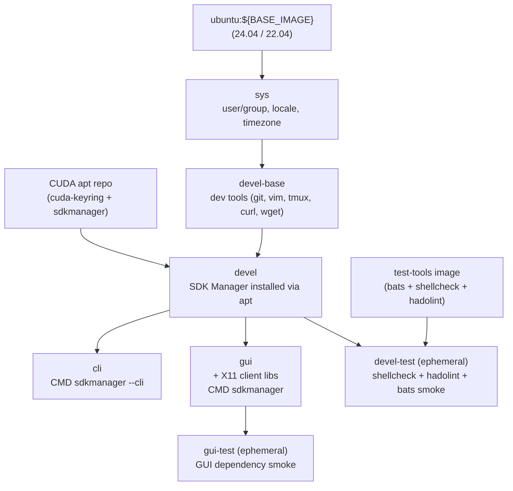

# Jetson SDK Manager Docker Environment

[](https://github.com/ycpss91255-docker/jetson_sdk_manager/actions/workflows/main.yaml) [](./LICENSE)

Containerized NVIDIA SDK Manager for flashing and provisioning Jetson Orin devices (AGX Orin, Orin NX, Orin Nano). CLI and GUI variants, `ubuntu:${BASE_IMAGE}` base with SDK Manager installed via the public CUDA apt repository. Built on [`ycpss91255-docker/base`](https://github.com/ycpss91255-docker/base).

**[English](README.md)** | **[繁體中文](doc/README.zh-TW.md)** | **[简体中文](doc/README.zh-CN.md)** | **[日本語](doc/README.ja.md)**

---

## Table of Contents

- [TL;DR](#tldr)
- [Prerequisites](#prerequisites)
- [Quick Start](#quick-start)
- [Switch Ubuntu Version](#switch-ubuntu-version)
- [Usage](#usage)
- [Persistent Data](#persistent-data)
- [Architecture](#architecture)
- [Smoke Tests](#smoke-tests)
- [Directory Structure](#directory-structure)

---

## TL;DR

```bash
make build && make run -- -t cli
```

## Prerequisites

- **Host OS**: x86_64 Linux
- **Docker Engine** >= v20.10.6
- **Host packages** (required for flashing ARM targets from x86 host):

  ```bash
  sudo apt-get install qemu-user-static binfmt-support
  sudo update-binfmts --enable
  ```

- **USB auto-suspend**: must be disabled on the USB port connected to the Jetson, or flashing may hang

  ```bash
  # Check current setting
  cat /sys/bus/usb/devices/*/power/autosuspend
  # Disable for a specific device (example)
  echo -1 | sudo tee /sys/bus/usb/devices/<device>/power/autosuspend
  ```

- **Jetson device** in recovery mode (for flashing)

## Quick Start

> **First-time only:** run `./script/init_data_dirs.sh` **before** `make run`. Skipping it lets the Docker daemon `mkdir` the `data/` mount points as **root**, and the container's non-root user will then fail to access them.

```bash
./script/init_data_dirs.sh        # first time only — creates data/{nvsdkm,downloads}
make build -- -t cli

# Put Jetson into recovery mode (hold REC button + power cycle)
make run -- -t cli
```

## Switch Ubuntu Version

The container's Ubuntu version must match the JetPack host OS requirement:

| JetPack | L4T | Host Ubuntu (container `BASE_IMAGE`) |
|---------|-----|--------------------------------------|
| 6.x | R36.x | **22.04** or 20.04 |
| 5.x | R35.x | 20.04 or 18.04 |

Default is `ubuntu:22.04`（JetPack 6.x compatible）. To switch to other versions:

```bash
./script/setup.sh set build.arg_4 BASE_IMAGE=ubuntu:22.04
make build -- -t cli
```

> Note: `make setup -- set ...` doesn't work when the value contains `=` ([base#414](https://github.com/ycpss91255-docker/base/issues/414)). Use `./script/setup.sh` directly.

Or use the interactive TUI:

```bash
make setup-tui
```

## Usage

### Build

```bash
make build                       # Build devel (base, not directly used)
make build -- -t cli             # Build CLI variant
make build -- -t gui             # Build GUI variant (X11)
make build test                  # Build with lint + smoke tests
```

### Run

Two variants, picked by stage target:

**CLI mode** (headless, recommended):

```bash
# Interactive CLI — SDK Manager prompts for selections
make run -- -t cli

# Fully automated flash example (Jetson AGX Orin)
make run -- -t cli sdkmanager --cli \
  --action install \
  --login-type devzone \
  --product Jetson \
  --target-os Linux \
  --version 6.1 \
  --target JETSON_AGX_ORIN_TARGETS \
  --flash \
  --license accept \
  --exit-on-finish
```

**GUI mode** (requires X11 display):

```bash
make run -- -t gui               # Launches SDK Manager GUI
```

> GUI mode requires the host to have a running X11 session. The base template's `setup.sh` auto-detects `$DISPLAY` and configures X11 socket forwarding + XAUTHORITY.

### Supported Jetson Targets

| Target ARG | Device |
|------------|--------|
| `JETSON_AGX_ORIN_TARGETS` | Jetson AGX Orin |
| `JETSON_ORIN_NX_TARGETS` | Jetson Orin NX |
| `JETSON_ORIN_NANO_TARGETS` | Jetson Orin Nano |

### Enter Running Container

```bash
make exec
make exec -- -t cli bash
```

### Stop

```bash
make stop
```

## Persistent Data

SDK Manager downloads and login sessions are persisted in `data/` (gitignored):

| Host path | Container path | Purpose |
|-----------|----------------|---------|
| `./data/nvsdkm/` | `${HOME}/.nvsdkm` | Login session cache (login once, reuse) |
| `./data/downloads/` | `${HOME}/Downloads/nvidia/sdkm_downloads` | SDK component downloads (~11 GB) |
| `./data/nvidia_sdk/` | `${HOME}/nvidia/nvidia_sdk` | SDK install folder (~31 GB) |

First-time login creates the session; subsequent runs reuse it via `--stay-logged-in true`.

## Architecture



## Smoke Tests

See [TEST.md](doc/test/TEST.md) for details.

```bash
make build test                  # Run lint + smoke tests during build
```

## Directory Structure

```text
jetson_sdk_manager/
├── compose.yaml                 # Docker Compose (derived, gitignored)
├── Dockerfile                   # Multi-stage: sys → devel-base → devel → cli / gui
├── Makefile -> .base/script/docker/Makefile
├── .base/                       # Shared template (git subtree)
├── data/                       # Persistent SDK Manager data (gitignored)
│   ├── nvsdkm/                  #   Login session cache
│   └── downloads/               #   SDK component downloads
├── config/
│   └── docker/
│       └── setup.conf           # Runtime config (volumes, build args, etc.)
├── doc/
│   └── adr/                     # Architecture Decision Records
│       ├── 0001-apt-install-over-official-docker-image.md
│       └── 0002-cli-gui-as-independent-stages.md
├── doc/
│   ├── README.zh-TW.md
│   ├── README.zh-CN.md
│   ├── README.ja.md
│   ├── changelog/CHANGELOG.md
│   └── test/TEST.md
├── script/
│   ├── build.sh -> ../.base/script/docker/build.sh
│   ├── run.sh -> ../.base/script/docker/run.sh
│   ├── exec.sh -> ../.base/script/docker/exec.sh
│   ├── stop.sh -> ../.base/script/docker/stop.sh
│   ├── setup.sh -> ../.base/script/docker/setup.sh
│   ├── setup_tui.sh -> ../.base/script/docker/setup_tui.sh
│   ├── prune.sh -> ../.base/script/docker/prune.sh
│   └── entrypoint.sh
├── test/smoke/
│   └── orin_install_env.bats    # SDK Manager install verification
├── .github/workflows/
│   └── main.yaml                # CI/CD
└── .gitignore
```
