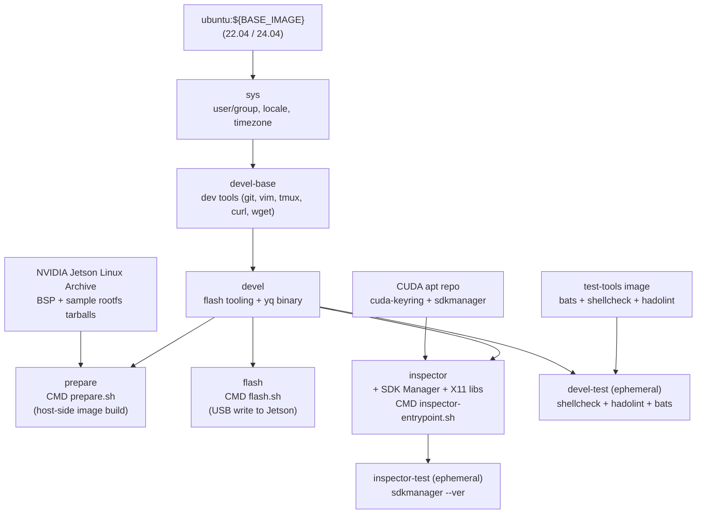

# Jetson Orin Factory-Flash Container

[](https://github.com/ycpss91255-docker/jetson_sdk_manager/actions/workflows/main.yaml) [](./LICENSE)

Containerized NVIDIA Jetson Linux (L4T) factory-flash workflow for Jetson Orin devices (AGX Orin, Orin NX, Orin Nano). Wraps `l4t_initrd_flash.sh --no-flash` / `--flash-only` from the official BSP archive into two reproducible Docker stages. Built on [`ycpss91255-docker/base`](https://github.com/ycpss91255-docker/base).

**[English](README.md)** | **[繁體中文](doc/README.zh-TW.md)** | **[简体中文](doc/README.zh-CN.md)** | **[日本語](doc/README.ja.md)**

---

## Table of Contents

- [TL;DR](#tldr)
- [Why factory flash, not SDK Manager](#why-factory-flash-not-sdk-manager)
- [Prerequisites](#prerequisites)
- [Configure `jetson.yaml`](#configure-jetsonyaml)
- [Quick Start](#quick-start)
- [Stages](#stages)
- [Clean Targets](#clean-targets)
- [Inspector (SDK Manager GUI)](#inspector-sdk-manager-gui)
- [Persistent Data](#persistent-data)
- [Architecture](#architecture)
- [Smoke Tests](#smoke-tests)
- [Directory Structure](#directory-structure)
- [Troubleshooting](#troubleshooting)

---

## TL;DR

```bash
ln -sf config/jetson/agx-orin-emmc.yaml jetson.yaml   # pick a preset

make run -- -t prepare    # Phase 1: download BSP + build flash images (~30 min)
# Put Jetson in APX recovery (hold REC + tap RESET)
make run -- -t flash      # Phase 2: write images to Jetson (~10 min)
```

After first boot, install JetPack components on the Jetson itself:

```bash
sudo apt update && sudo apt install -y nvidia-jetpack
```

## Why factory flash, not SDK Manager

NVIDIA SDK Manager's GUI / `--cli` workflow flashes a Jetson by running an NFS server on the host and exporting the rootfs to the device over a USB device-mode link, while bridging it through the host's network stack via `iptables`. Inside Docker (even with `--privileged --network host`) this combination is broken: NFS server cannot bind reliably, `iptables` rules from inside the container do not always reach the host's nftables, and `usb-gadget` device-mode forwarding fails. The symptom is the well-known [Flashing - 99% stall](https://forums.developer.nvidia.com/t/docker-sdk-manager-flash-nx-struck-at-99/365066) that affects NVIDIA's own Docker image as well.

This repo bypasses that path entirely. The **prepare** stage uses the BSP's own `l4t_initrd_flash.sh --no-flash` to build flash images host-side (no Jetson, no NFS, no `iptables`); the **flash** stage then writes them with `--flash-only` over a plain `tegrarcm_v2` USB link.

SDK Manager is still shipped — in the **`inspector`** stage — as a catalog browser for looking up which `.deb` packages a given JetPack release contains. Its Install button stays broken inside Docker; the entrypoint prints a banner saying so.

## Prerequisites

- **Host OS**: x86_64 Linux.
- **Docker Engine** >= v20.10.6.
- **Host filesystem of the repo: ext4 / xfs / btrfs.** `apply_binaries.sh` produces setuid binaries (`sudo`) and root-owned files inside the rootfs tree. NTFS / exFAT / `fuseblk` / FAT silently strip setuid and ownership during extraction, which yields a flashed Jetson whose `sudo` refuses to start. `prepare.sh` aborts with an action message if the path is on one of these filesystems; move the repo (or bind-mount an ext4 directory over `./data/jetson_l4t/`) before re-running.
- **QEMU binfmt** — required for running ARM64 binaries from the BSP's tools/ during prepare:

  ```bash
  docker run --rm --privileged multiarch/qemu-user-static --reset -p yes
  ```

  Run once per host boot. Registers ARM64 binary translation in the kernel via Docker — no host packages needed.

- **USB host buffer** — `tegrarcm_v2` bulk writes occasionally stall at the default 16 MB. Raise once per host boot:

  ```bash
  echo 2048 | sudo tee /sys/module/usbcore/parameters/usbfs_memory_mb
  ```

- **USB auto-suspend** — disabled on the port connected to the Jetson, or flashing can hang.
- **Jetson in APX recovery** (for the `flash` stage only; `prepare` needs no Jetson connected).

## Configure `jetson.yaml`

The top-level `jetson.yaml` is a symlink to one of the presets under `config/jetson/`. Pick one matching your board + storage target:

| Preset | Board | Storage |
|---|---|---|
| `agx-orin-emmc.yaml` | AGX Orin devkit | eMMC (`mmcblk0p1`) |
| `agx-orin-nvme.yaml` | AGX Orin devkit | NVMe (`nvme0n1p1`) |
| `agx-orin-usb.yaml` | AGX Orin devkit | USB SSD (`sda1`) |
| `orin-nx-nvme.yaml` | Orin NX devkit-super | NVMe |
| `orin-nano-nvme.yaml` | Orin Nano devkit-super | NVMe |
| `orin-nano-sd.yaml` | Orin Nano devkit-super | microSD via USB reader |

Switch presets by re-symlinking:

```bash
ln -sf config/jetson/orin-nx-nvme.yaml jetson.yaml
```

Each preset sets:

- `jetpack.version` — resolved to L4T release + BSP / rootfs URLs via `config/jetson/_l4t_mapping.yaml`.
- `hardware.board` — alias → NVIDIA `--target` name.
- `storage.device` — alias → kernel device path passed to `--external-device`.
- `user.{username,password,hostname,autologin}` — pre-creates the default user via `l4t_create_default_user.sh`, skipping OEM-config on first boot.
- `network` (optional) — DHCP by default; set `method: static` to install a `NetworkManager` system-connection profile.

See `config/jetson/_example.yaml` for the full schema with comments.

**To add a JetPack release** the presets do not yet support: edit `config/jetson/_l4t_mapping.yaml` to add a new entry under `jetpack_to_l4t` (with the `l4t_release` and `bsp_url` / `rootfs_url` from [Jetson Linux Archive](https://developer.nvidia.com/embedded/jetson-linux-archive)), then rebuild the prepare / flash images.

## Quick Start

> **First time only:** run `./script/init_data_dirs.sh` before `make run`. Skipping it lets the Docker daemon `mkdir` the `data/` mount points as root, blocking the container's non-root user.

```bash
./script/init_data_dirs.sh
ln -sf config/jetson/agx-orin-emmc.yaml jetson.yaml

# Phase 1 — host-side image build (no Jetson connected)
make build -- -t prepare
make run -- -t prepare

# Phase 2 — write to Jetson
# Put Jetson into APX recovery: power off, hold REC, reconnect power, release.
# Verify on host: `lsusb | grep 0955` shows e.g. 0955:7023 NVIDIA Corp APX
make build -- -t flash
make run -- -t flash
```

After the Jetson boots into the freshly flashed OS, install the rest of JetPack from NVIDIA's OTA apt repository:

```bash
sudo apt update
sudo apt install -y nvidia-jetpack
```

This installs CUDA, cuDNN, TensorRT, VPI, multimedia APIs, container runtime, etc. — the same component set SDK Manager would push, just pulled directly by the Jetson.

### Resume after interruption

Each phase records progress in `data/jetson_l4t/.../.prepared.yaml`. Re-running `make run -- -t prepare` skips completed steps (BSP download, rootfs extraction, `apply_binaries.sh`, user creation, image generation). A JetPack / board change is detected as a mismatch and aborts with an action message pointing at `./script/clean.sh l4t`.

## Stages

| Stage | Purpose | Jetson required |
|---|---|---|
| `devel` | Flash tooling (`l4t_initrd_flash.sh` dependencies). Default `make build` target. | No |
| `devel-test` | Lint (`shellcheck` + `hadolint`) + bats smoke tests. CI-only. | No |
| `prepare` | Phase 1 — download BSP + sample rootfs, `apply_binaries.sh`, `l4t_create_default_user.sh`, `l4t_initrd_flash --no-flash`. | No |
| `flash` | Phase 2 — `l4t_initrd_flash --flash-only`. | **Yes**, in APX recovery |
| `inspector` | SDK Manager GUI for browsing the JetPack component catalog. Install button does not work — see [Inspector](#inspector-sdk-manager-gui). | No |
| `inspector-test` | `sdkmanager --ver` sanity check. CI-only. | No |

## Clean Targets

`script/clean.sh` operates on `./data/jetson_l4t/` via a transient `alpine:3` container, so no host-side tooling is needed.

| Command | Effect |
|---|---|
| `./script/clean.sh build` | Remove generated flash images (`tools/kernel_flash/images/`) only. |
| `./script/clean.sh rootfs` | Remove `rootfs/`, keep BSP + downloaded tarballs. |
| `./script/clean.sh l4t` | Remove the entire `Linux_for_Tegra/` tree (BSP + rootfs + images). Keep tarballs. |
| `./script/clean.sh all` | l4t + remove `data/downloads/` tarballs. |

Run `./script/clean.sh l4t` to recover from a JetPack version mismatch reported by `prepare.sh`.

## Inspector (SDK Manager GUI)

The `inspector` stage ships NVIDIA SDK Manager as a **catalog browser** — not a flash tool. Use it to look up which `.deb` packages a given JetPack release contains, or to download individual `.deb` files outside of `apt install nvidia-jetpack`.

```bash
make build -- -t inspector
make run -- -t inspector
```

The entrypoint prints a banner explaining why the Install button is broken inside Docker, then (in interactive mode) waits for Enter before launching the GUI. Pass `--no-banner` style flags through to `sdkmanager-gui` via the `make run` positional args if needed.

GUI mode requires an X11 session on the host; the base template auto-detects `$DISPLAY` and forwards the X11 socket + `XAUTHORITY`.

## Persistent Data

Each path under `./data/` is bind-mounted into the container (gitignored).

| Host path | Container path | Purpose |
|---|---|---|
| `./data/jetson_l4t/` | `/srv/jetson_l4t` | BSP + rootfs + generated flash images (factory-flash workflow). **Must be ext4 / xfs / btrfs.** |
| `./data/downloads/` | `${HOME}/Downloads/nvidia/sdkm_downloads` | Cached tarballs (BSP + sample rootfs), shared with SDK Manager. |
| `./data/nvsdkm/` | `${HOME}/.nvsdkm` | SDK Manager login session cache. Inspector stage only. |
| `./data/nvidia_sdk/` | `${HOME}/nvidia/nvidia_sdk` | SDK Manager-managed SDK install folder. Inspector stage only. |
| `./jetson.yaml` | `/etc/jetson.yaml` (read-only) | User config, read by `prepare.sh` / `flash.sh` / `inspector-entrypoint.sh`. |

## Architecture



## Smoke Tests

See [TEST.md](doc/test/TEST.md).

```bash
make build test
```

The `devel-test` stage runs the bats suite against the `devel` image; the two `sdkmanager` assertions are skipped there (they only run when bats is re-executed inside the `inspector` image).

## Directory Structure

```text
jetson_sdk_manager/
├── jetson.yaml -> config/jetson/agx-orin-emmc.yaml   # symlink; switch presets here
├── compose.yaml                 # Docker Compose (derived, gitignored)
├── Dockerfile                   # sys → devel-base → devel → {prepare, flash, inspector}
├── Makefile -> .base/script/docker/wrapper/Makefile
├── .base/                       # Shared template (git subtree)
├── data/                        # Persistent state (gitignored)
│   ├── jetson_l4t/              #   BSP + rootfs + flash images
│   ├── downloads/               #   BSP / rootfs tarballs
│   ├── nvsdkm/                  #   SDK Manager login session (inspector)
│   └── nvidia_sdk/              #   SDK Manager install folder (inspector)
├── config/
│   ├── docker/setup.conf        # Runtime config — source of truth
│   ├── jetson/                  # Flash presets + schema
│   │   ├── _example.yaml        #   Canonical schema with comments
│   │   ├── _l4t_mapping.yaml    #   JetPack → L4T release / URLs (build-time)
│   │   └── *.yaml               #   Per-board / per-storage presets
│   └── packages/                # X11 lib lists for inspector (per Ubuntu codename)
├── doc/
│   ├── adr/                     # Architecture Decision Records
│   ├── changelog/CHANGELOG.md
│   ├── test/TEST.md
│   ├── Flash_Workflow.md        # Deep-dive into the prepare/flash phases
│   ├── README.zh-TW.md
│   ├── README.zh-CN.md
│   └── README.ja.md
├── script/
│   ├── prepare.sh               # Phase 1 entrypoint
│   ├── flash.sh                 # Phase 2 entrypoint
│   ├── clean.sh                 # Volume cleanup targets
│   ├── inspector-entrypoint.sh  # SDK Manager GUI launcher + warning banner
│   ├── lib/                     # yaml / download / volume / errors helpers
│   ├── init_data_dirs.sh        # First-time data/ mkdir as non-root
│   ├── entrypoint.sh            # Container entrypoint (logging tee)
│   ├── build.sh -> ../.base/script/docker/wrapper/build.sh
│   ├── run.sh   -> ../.base/script/docker/wrapper/run.sh
│   ├── exec.sh  -> ../.base/script/docker/wrapper/exec.sh
│   ├── stop.sh  -> ../.base/script/docker/wrapper/stop.sh
│   ├── setup.sh -> ../.base/script/docker/wrapper/setup.sh
│   ├── setup_tui.sh -> ../.base/script/docker/wrapper/setup_tui.sh
│   └── prune.sh -> ../.base/script/docker/wrapper/prune.sh
├── test/smoke/orin_install_env.bats
├── .github/workflows/main.yaml
└── .gitignore
```

## Troubleshooting

### `prepare.sh` aborts: "L4T_ROOT ... is on ntfs/exfat/fuseblk"

`apply_binaries.sh` creates setuid binaries (`sudo`) and root-owned files. NTFS / exFAT / `fuseblk` / FAT silently drop both, which produces a flashed Jetson whose `sudo` refuses to start. Either move the repo to an ext4 / xfs / btrfs partition, or bind-mount an ext4 directory over `./data/jetson_l4t/`:

```bash
sudo mkdir -p /var/lib/jetson_l4t
sudo mount --bind /var/lib/jetson_l4t ./data/jetson_l4t
```

### `prepare.sh` aborts: volume mismatch

The `.prepared.yaml` marker says the volume was prepared for a different JetPack / board than `jetson.yaml` now selects. Wipe and re-run:

```bash
./script/clean.sh l4t
make run -- -t prepare
```

### `chroot: failed to run command 'dpkg': Exec format error`

Host kernel cannot execute ARM64 binaries. Register the QEMU binfmt interpreter:

```bash
docker run --rm --privileged multiarch/qemu-user-static --reset -p yes
```

Run once per host boot.

### `Could not detect a board` / Jetson not in recovery

`flash.sh` checks `lsusb` for NVIDIA VID `0955` + a recovery PID (`7023` / `7223` / `7423` / `7523` / `7e19`) and aborts if none is present.

Recovery mode entry, step-by-step:

1. Disconnect power.
2. Connect USB-C between the Jetson **front panel** (button side) and the host.
3. Hold **REC** (middle button).
4. Connect power (or press Power).
5. Release REC after ~2 seconds.

Verify on the host:

```bash
lsusb | grep 0955
```

| Output | Status |
|---|---|
| `0955:7023 NVIDIA Corp. APX` | AGX Orin in recovery |
| `0955:7223 NVIDIA Corp. APX` | Orin NX / Nano in recovery |
| `0955:xxxx` (other PID) | Normal boot — re-enter recovery |
| (nothing) | Not detected — try a different cable / port / direct connection (no hub) |

Recovery mode runs over USB 2.0 (480 Mbps); this is normal — the USB 3 controller is inactive in APX.

### `ERROR: might be timeout in USB write` / `Return value 3`

Boot ROM communication stalls during USB bulk transfer:

```
Sending bct_br
ERROR: might be timeout in USB write.
Error: Return value 3
```

Stale USB endpoint state from a previous interrupted flash. A **hardware** power cycle is required — `tegrarcm_v2 --reboot recovery` is not enough:

1. Disconnect Jetson power completely.
2. Hold **Recovery**.
3. Reconnect power.
4. Release Recovery after 2–3 seconds.

Also confirm the USB buffer-size bump from [Prerequisites](#prerequisites) was applied this boot.

### `Error: Error opening /dev/sda: No medium found` (microSD via USB reader)

Multi-slot combo readers expose each slot as a separate LUN. The default `--external-device sda1` opens the empty slot:

```bash
$ lsblk -d -o NAME,SIZE,VENDOR,MODEL,TRAN
sda    0B  Generic-  SD/MMC          usb     # empty
sdb  117.8G Generic-  Micro SD/M2    usb     # card actually here
```

Options:

1. Move the card to whichever slot maps to `/dev/sda` (use a microSD-to-SD adapter if needed).
2. Use a single-slot microSD reader — those always enumerate as `sda`.
3. Edit `storage.device` in `jetson.yaml` to the actual device — but the BSP `--external-device` argument accepts `sd*` only by alias; map manually inside `_l4t_mapping.yaml::storage_alias_to_device` if you need a custom path.

### Flash hangs on APP partition (external storage)

Sustained large transfers over USB ethernet sometimes stall during the APP partition extraction step, eventually failing after a ~12 minute timeout. Options:

1. Flash to **eMMC** instead (`storage.device: emmc`), then `sudo apt install nvidia-jetpack` for the SDK components.
2. Use an **NVMe SSD** — direct PCIe is faster than USB-ethernet extraction.
3. Retry after a full power-cycle of the Jetson.
