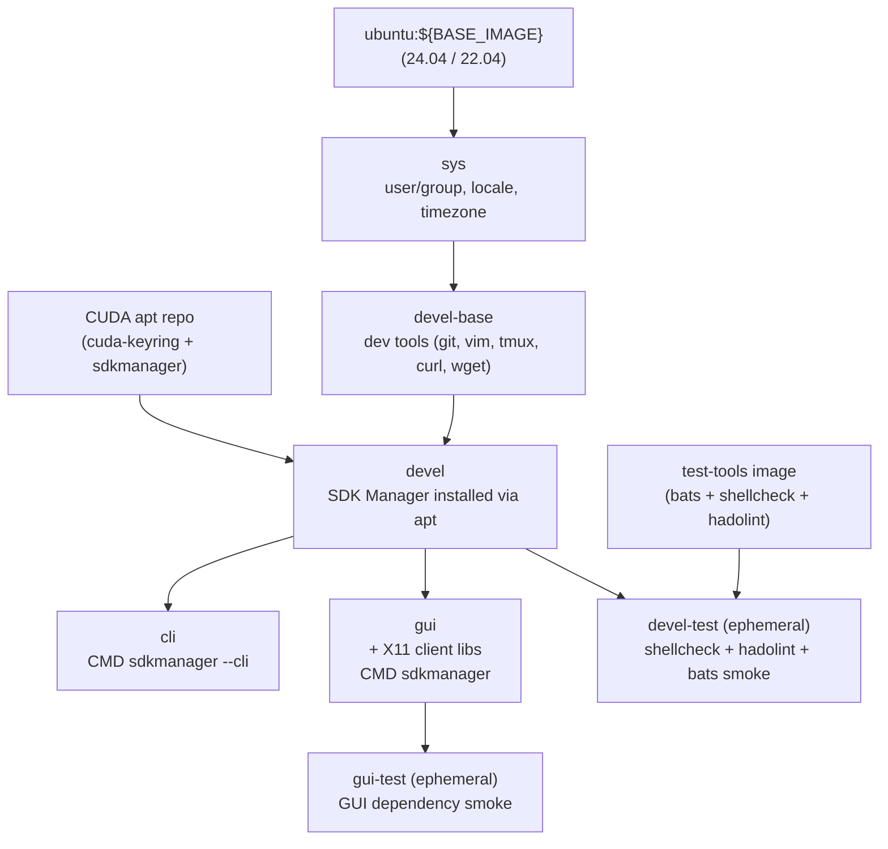

# Jetson SDK Manager Docker Environment

[](https://github.com/ycpss91255-docker/jetson_sdk_manager/actions/workflows/main.yaml) [](./LICENSE)

Containerized NVIDIA SDK Manager for flashing and provisioning Jetson Orin devices (AGX Orin, Orin NX, Orin Nano). CLI and GUI variants, `ubuntu:${BASE_IMAGE}` base with SDK Manager installed via the public CUDA apt repository. Built on [`ycpss91255-docker/base`](https://github.com/ycpss91255-docker/base).

**[English](README.md)** | **[繁體中文](doc/README.zh-TW.md)** | **[简体中文](doc/README.zh-CN.md)** | **[日本語](doc/README.ja.md)**

---

## Table of Contents

- [TL;DR](#tldr)
- [Prerequisites](#prerequisites)
- [Quick Start](#quick-start)
- [Switch Ubuntu Version](#switch-ubuntu-version)
- [Usage](#usage)
- [Persistent Data](#persistent-data)
- [Architecture](#architecture)
- [Smoke Tests](#smoke-tests)
- [Directory Structure](#directory-structure)

---

## TL;DR

```bash
make build && make run -- -t cli
```

## Prerequisites

- **Host OS**: x86_64 Linux
- **Docker Engine** >= v20.10.6
- **QEMU binfmt** (required for flashing ARM targets from x86 host):

  ```bash
  docker run --rm --privileged multiarch/qemu-user-static --reset -p yes
  ```

  > Run once per host boot. Registers ARM64 binary translation in the kernel via Docker — no host packages needed.

- **USB auto-suspend**: must be disabled on the USB port connected to the Jetson, or flashing may hang

  ```bash
  # Check current setting
  cat /sys/bus/usb/devices/*/power/autosuspend
  # Disable for a specific device (example)
  echo -1 | sudo tee /sys/bus/usb/devices/<device>/power/autosuspend
  ```

- **Jetson device** in recovery mode (for flashing)

## Quick Start

> **First-time only:** run `./script/init_data_dirs.sh` **before** `make run`. Skipping it lets the Docker daemon `mkdir` the `data/` mount points as **root**, and the container's non-root user will then fail to access them.

```bash
./script/init_data_dirs.sh        # first time only — creates data/{nvsdkm,downloads}
make build -- -t cli

# Put Jetson into recovery mode (hold REC button + power cycle)
make run -- -t cli
```

## Switch Ubuntu Version

The container's Ubuntu version must match the JetPack host OS requirement:

| JetPack | L4T | Host Ubuntu (container `BASE_IMAGE`) |
|---------|-----|--------------------------------------|
| 6.x | R36.x | **22.04** or 20.04 |
| 5.x | R35.x | 20.04 or 18.04 |

Default is `ubuntu:22.04`（JetPack 6.x compatible）. To switch to other versions:

```bash
./script/setup.sh set build.arg_4 BASE_IMAGE=ubuntu:22.04
make build -- -t cli
```

> Note: `make setup -- set ...` doesn't work when the value contains `=` ([base#414](https://github.com/ycpss91255-docker/base/issues/414)). Use `./script/setup.sh` directly.

Or use the interactive TUI:

```bash
make setup-tui
```

## Usage

### Build

```bash
make build                       # Build devel (base, not directly used)
make build -- -t cli             # Build CLI variant
make build -- -t gui             # Build GUI variant (X11)
make build test                  # Build with lint + smoke tests
```

### Run

Two variants, picked by stage target:

**GUI mode** (requires X11 display):

```bash
make run -- -t gui               # Launches SDK Manager GUI
```

> GUI mode requires the host to have a running X11 session. The base template's `setup.sh` auto-detects `$DISPLAY` and configures X11 socket forwarding + XAUTHORITY.

**CLI mode** (headless):

```bash
# Interactive CLI — SDK Manager prompts for selections
make run -- -t cli
```

### CLI Examples

**1. Download only** — download JetPack components without installing:

```bash
make run -- -t cli sdkmanager --cli \
  --action install \
  --login-type devzone \
  --product Jetson \
  --target-os Linux \
  --version 6.2 \
  --target JETSON_AGX_ORIN_TARGETS \
  --license accept \
  --stay-logged-in true \
  --download-only \
  --exit-on-finish
```

**2. Install (flash)** — if already downloaded, skips download and flashes directly:

```bash
make run -- -t cli sdkmanager --cli \
  --action install \
  --login-type devzone \
  --product Jetson \
  --target-os Linux \
  --version 6.2 \
  --target JETSON_AGX_ORIN_TARGETS \
  --flash \
  --license accept \
  --stay-logged-in true \
  --exit-on-finish
```

**3. Full automated** — download + flash + install SDK components in one go:

```bash
make run -- -t cli sdkmanager --cli \
  --action install \
  --login-type devzone \
  --product Jetson \
  --target-os Linux \
  --version 6.2 \
  --target JETSON_AGX_ORIN_TARGETS \
  --flash \
  --license accept \
  --stay-logged-in true \
  --collect-usage-data enable \
  --exit-on-finish
```

> Replace `--target` with `JETSON_ORIN_NX_TARGETS` or `JETSON_ORIN_NANO_TARGETS` for other devices. Replace `--version` with the desired JetPack version.

### CLI Parameter Reference

| Parameter | Values | Description |
|-----------|--------|-------------|
| `--cli` | | Enable CLI mode |
| `--action` | `install` / `uninstall` / `downloadonly` | Action to perform |
| `--login-type` | `devzone` / `nvonline` / `offline` | Authentication method |
| `--product` | `Jetson` | Target product family |
| `--version` | e.g. `6.2` | JetPack version |
| `--target-os` | `Linux` | Target OS |
| `--target` | see table below | Target board |
| `--flash` | | Flash the device (omit to skip flash) |
| `--host` | | Also install host components |
| `--select` | `section_or_group` | Add component to install list (repeatable) |
| `--deselect` | `section_or_group` | Remove component from install list (repeatable) |
| `--additional-sdk` | `sdk_title` | Install additional SDKs (e.g. DeepStream) |
| `--download-only` | | Download without installing |
| `--download-folder` | path | Custom download folder |
| `--target-image-folder` | path | Custom SDK install folder |
| `--license` | `accept` / `reject` | Accept license automatically |
| `--stay-logged-in` | `true` / `false` | Persist login session |
| `--exit-on-finish` | | Exit when done |
| `--auto` | | Auto-complete all prompts with defaults |
| `--query` | `interactive` / `non-interactive` | List available options |
| `--show-all-versions` | | Show all available versions (including non-primary) |
| `--archived-versions` | | Show only archived SDK versions |
| `--list-connected` | `all` / `Jetson` | List connected devices |
| `--usb-port` | e.g. `1-2` | Select USB port (multiple boards) |
| `--response-file` | path | Run from a response file (fully unattended) |
| `--export-response-file` | path | Export current selections as response file |
| `--export-logs` | path | Export logs to folder |
| `--collect-usage-data` | `enable` / `disable` | Usage data collection |

### Supported Jetson Targets

| Target ARG | Device |
|------------|--------|
| `JETSON_AGX_ORIN_TARGETS` | Jetson AGX Orin |
| `JETSON_ORIN_NX_TARGETS` | Jetson Orin NX |
| `JETSON_ORIN_NANO_TARGETS` | Jetson Orin Nano |

### Enter Running Container

```bash
make exec
make exec -- -t cli bash
```

### Stop

```bash
make stop
```

## Persistent Data

SDK Manager downloads and login sessions are persisted in `data/` (gitignored):

| Host path | Container path | Purpose |
|-----------|----------------|---------|
| `./data/nvsdkm/` | `${HOME}/.nvsdkm` | Login session cache (login once, reuse) |
| `./data/downloads/` | `${HOME}/Downloads/nvidia/sdkm_downloads` | SDK component downloads (~11 GB) |
| `./data/nvidia_sdk/` | `${HOME}/nvidia/nvidia_sdk` | SDK install folder (~31 GB) |

First-time login creates the session; subsequent runs reuse it via `--stay-logged-in true`.

## Architecture



## Smoke Tests

See [TEST.md](doc/test/TEST.md) for details.

```bash
make build test                  # Run lint + smoke tests during build
```

## Directory Structure

```text
jetson_sdk_manager/
├── compose.yaml                 # Docker Compose (derived, gitignored)
├── Dockerfile                   # Multi-stage: sys → devel-base → devel → cli / gui
├── Makefile -> .base/script/docker/Makefile
├── .base/                       # Shared template (git subtree)
├── data/                       # Persistent SDK Manager data (gitignored)
│   ├── nvsdkm/                  #   Login session cache
│   └── downloads/               #   SDK component downloads
├── config/
│   └── docker/
│       └── setup.conf           # Runtime config (volumes, build args, etc.)
├── doc/
│   └── adr/                     # Architecture Decision Records
│       ├── 0001-apt-install-over-official-docker-image.md
│       └── 0002-cli-gui-as-independent-stages.md
├── doc/
│   ├── README.zh-TW.md
│   ├── README.zh-CN.md
│   ├── README.ja.md
│   ├── changelog/CHANGELOG.md
│   └── test/TEST.md
├── script/
│   ├── build.sh -> ../.base/script/docker/build.sh
│   ├── run.sh -> ../.base/script/docker/run.sh
│   ├── exec.sh -> ../.base/script/docker/exec.sh
│   ├── stop.sh -> ../.base/script/docker/stop.sh
│   ├── setup.sh -> ../.base/script/docker/setup.sh
│   ├── setup_tui.sh -> ../.base/script/docker/setup_tui.sh
│   ├── prune.sh -> ../.base/script/docker/prune.sh
│   └── entrypoint.sh
├── test/smoke/
│   └── orin_install_env.bats    # SDK Manager install verification
├── .github/workflows/
│   └── main.yaml                # CI/CD
└── .gitignore
```

## Troubleshooting

### `chroot: failed to run command 'dpkg': Exec format error`

The host kernel cannot execute ARM64 binaries. Register the QEMU binfmt interpreter:

```bash
docker run --rm --privileged multiarch/qemu-user-static --reset -p yes
```

This must be run once per host boot.

### `mknod: .../rootfs/dev/random: File exists`

A previous failed flash left a partial rootfs in `data/nvidia_sdk/`. SDK Manager's install script is not idempotent — it cannot overwrite existing device nodes. Clean the rootfs and retry:

```bash
sudo rm -rf data/nvidia_sdk/JetPack_*_TARGETS/Linux_for_Tegra/rootfs/
```

### `Could not detect a board` / Jetson not detected

SDK Manager cannot find the Jetson device. Check the following:

1. **Recovery mode** — the Jetson must be in Force Recovery mode before connecting:
   - Disconnect power
   - Connect USB-C cable between the Jetson **front panel** (button side) and the host
   - Hold the **REC (middle) button**
   - Connect power (or press Power button)
   - Wait 2 seconds, then release REC

2. **Verify recovery mode on host**:

   ```bash
   lsusb | grep 0955
   ```

   | Output | Status |
   |--------|--------|
   | `0955:7023 NVIDIA Corp. APX` | Recovery mode (AGX Orin) |
   | `0955:7223 NVIDIA Corp. APX` | Recovery mode (Orin NX/Nano) |
   | `0955:xxxx` (other product ID) | Normal mode — re-enter recovery |
   | (no output) | Not detected — check cable/port |

   > Note: Recovery mode uses USB 2.0 (480 Mbps) — this is normal. The USB 3.0 controller is not active in APX mode.

   If nothing appears:

   - **USB-C cable** — some cables are charge-only with no data lines. Use a data-capable cable
   - **USB port** — connect directly to the host, not through a USB hub (hubs may not support USB device mode)
   - **Wrong port** — use the front panel USB-C (button side), not the rear USB-C (power side)

### `The connected Jetson device is not ready for flash`

USB connection instability. Try the following in order:

1. Click **Reset USB Controller** in the SDK Manager dialog
2. Unplug USB-C → unplug Jetson power → replug USB-C → replug power → re-enter recovery mode
3. Try a different USB-C cable
4. Try a different USB port on the host (avoid hubs)
5. Reboot the host machine

### `tar: lbzip2: Cannot exec: No such file or directory`

The container is missing `lbzip2`. Rebuild with the latest Dockerfile:

```bash
git pull && make build -- -t gui
```

### `root is not in the sudoers file`

The container image is missing the root sudoers rule. Rebuild with the latest Dockerfile:

```bash
git pull && make build -- -t gui
```

### `/bin/sh: 1: file: not found`

The container is missing the `file` command. Rebuild with the latest Dockerfile:

```bash
git pull && make build -- -t gui
```

### `ERROR: might be timeout in USB write` / `Return value 3`

`flash.sh` fails during Boot ROM communication with a USB bulk transfer timeout:

```
Sending bct_br
ERROR: might be timeout in USB write.
Error: Return value 3
```

This is caused by a stale USB endpoint state on the Jetson — typically after a previous failed or interrupted flash attempt. The fix is a **full hardware power cycle**:

1. Disconnect the Jetson power completely
2. Hold the **Recovery** button
3. Reconnect power
4. Release Recovery after 2–3 seconds

A software reboot (`tegrarcm_v2 --reboot recovery`) is **not sufficient** — the USB endpoint must be hardware-reset.

Also ensure the USB buffer size is set on the host (once per boot):

```bash
echo 2048 | sudo tee /sys/module/usbcore/parameters/usbfs_memory_mb
```

### `command is failed` during recovery ramdisk generation

`flash.sh` fails after `_BASE_KERNEL_VERSION=...` with a generic `command is failed` error. This is caused by a missing `ssh-keygen` command (`openssh-client` package). Rebuild with the latest Dockerfile:

```bash
git pull && make build -- -t gui
```
