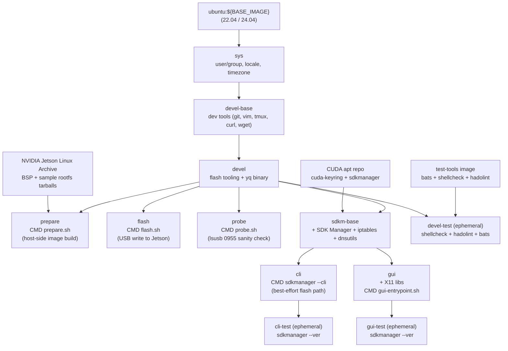

# Architecture

How the repo is put together. For *using* it, see the [README](../README.md).

## Under the hood: the commands `./jetson` runs

`./jetson` is a thin dispatcher (`script/jetson.sh`); every step is an existing script or `make` target you can run yourself.

| `./jetson …` | Runs |
|---|---|
| `status` | `lib/status.sh` checks + `lsusb -d 0955:` (same PID list as `script/probe.sh`) + `lib/nfs_export.sh::nfs_export_status` (host `rpc.mountd` vs. the L4T exports) |
| `prepare` | preflight (a Jetson in recovery, unless `--no-board`) → `sudo -v` → `./script/host_setup.sh` → `./script/init_data_dirs.sh` → `make run -- -t prepare` (auto-builds the image) |
| `wait-rec` | polls `lsusb` for a recovery PID |
| `flash` | preflight (recovery PID, `images` phase in `.prepared.yaml`) → `sudo -v` → `lib/nfs_export.sh::nfs_export_on` (host NFS export of the L4T tree, re-done every flash — [#101](https://github.com/ycpss91255-docker/jetson_sdk_manager/issues/101)) → `./script/nm_flash_guard.sh auto` → `./script/usb_ss_guard.sh auto` → `make run -- -t flash` |
| `teardown` | `./script/host_teardown.sh` (incl. the host NFS unexport, `nm_flash_guard.sh enable` + `usb_ss_guard.sh enable`) |
| `purge` | `./script/clean.sh purge [--keep-downloads]` |

Other useful manual commands:

```bash
make build -- -t <stage>      # rebuild one stage image (one -t per invocation)
make run -- -t probe          # the recovery check on its own (or: bash ./script/probe.sh on the host)
./script/nm_flash_guard.sh status|disable|enable|auto|watch
./script/usb_ss_guard.sh status|disable|enable|auto
./script/clean.sh build|rootfs|l4t|all|purge
```

### `host_setup.sh`, step by step

Everything here touches the host kernel or Docker and cannot be done from inside the container. It is idempotent and boot-scoped (re-run after a reboot; `host_teardown.sh` reverses it in the same boot):

0. **L4T data store** — on an NTFS / exFAT checkout, create `data/jetson_l4t.img` (sparse ext4, `L4T_STORE_SIZE=40G`) and loop-mount it over `data/jetson_l4t/`; record it in `data/.l4t_store`. `L4T_STORE_DIR=/path/on/ext4` bind-mounts a directory instead. Native ext4 / xfs / btrfs checkouts: no-op.
1. **QEMU binfmt** — `docker run --privileged multiarch/qemu-user-static --reset -p yes`, so `prepare` can chroot into the ARM64 rootfs.
2. **`nfsd`** — `modprobe nfsd`; `flash` serves the payload to the Jetson's initrd over a local NFS export. Persist with `echo nfsd | sudo tee /etc/modules-load.d/nfsd.conf`.
3. **USB autosuspend off** — `/sys/module/usbcore/parameters/autosuspend = -1`.
4. **usbfs buffer** — `/sys/module/usbcore/parameters/usbfs_memory_mb = 2048`; stops `tegrarcm_v2` bulk writes stalling.
5. **`/srv/jetson_l4t` bridge** — bind-mount `data/jetson_l4t` to the same path the container sees, because the kernel `nfsd` resolves the export in the *host* mount namespace.
6. **Host NFS export** ([#101](https://github.com/ycpss91255-docker/jetson_sdk_manager/issues/101)) — when the host has `exportfs` (nfs-kernel-server), export the prepared tree's `rootfs`, `tools/kernel_flash/images` and `tools/kernel_flash/tmp` (host paths under the bridge) to `fc00:1:1::/48` with NVIDIA's `rw,nohide,insecure,no_subtree_check,async,no_root_squash`, then `exportfs -f`. Otherwise the *host's* `rpc.mountd` answers the shared kernel `nfsd` with an empty `/etc/exports` and the board's `mount.nfs` hangs. Skipped with a message when no tree is prepared yet or `rootfs` / `images` are missing (prepare runs this script first, also after `clean.sh build`); `./jetson flash` repeats it before every flash so a regenerated `images/` never serves a stale file handle. Done whenever the host *has* `exportfs`, mountd running or not. No `exportfs`: no-op, the container's own server suffices. Trust model: production uses only literals (`/usr/sbin/exportfs`, `/var/lib/nfs/etab`, `/srv/jetson_l4t`, client, options) and confines every path handed to `sudo` on the canonical filesystem (`readlink -f`, no `..`, symlink escapes refused — export and unexport side alike, including entries read from `/var/lib/nfs/etab`) under `/srv/jetson_l4t`; the bats suites use `NFS_EXPORT_TEST_ROOT=<dir>` (exportfs = `<dir>/bin/exportfs`, etab = `<dir>/etab`, export dir = `<dir>/srv/jetson_l4t`, no sudo, prints `[test mode]`). `lib/nfs_export.sh`; `host_teardown.sh` unexports first — every table entry under `/srv/jetson_l4t` (an exported directory pins the bridge mount).

### `nm_flash_guard.sh`

On a NetworkManager host, NM DHCP-probes the Jetson's USB gadget interface mid-flash and tears the link down (the "Flashing 99 %" stall, [#48](https://github.com/ycpss91255-docker/jetson_sdk_manager/issues/48)). `auto` marks the interface unmanaged for the flash and re-enables NM the moment the board re-enumerates as booted (`0955:7020`), so the host picks up `192.168.55.x` and you can SSH in. Subcommands: `status`, `disable`, `enable`, `auto [timeout]`, `watch`, `around <cmd>`, `install-autohook` / `uninstall-autohook` (a root helper so the detached re-enable works without a tty).

### `usb_ss_guard.sh`

The flash initrd's USB gadget (`0955:7035`) only needs USB 2, but it also tries to train a SuperSpeed link on the same connector; on some hosts that never succeeds and each retry tears the working high-speed device down (`Waiting for target to boot-up...` until timeout, [#100](https://github.com/ycpss91255-docker/jetson_sdk_manager/issues/100)). A USB-C / USB 3 connector is two `usb_port`s on two xHCI root hubs that share one ACPI `location`; `disable` finds the recovery device's root-hub port from its sysfs name (`3-1` → `usb3/3-0:1.0/usb3-port1`), requires the device to be at high speed, pairs the port with the *one* port on a SuperSpeed root hub (`speed` ≥ 5000) carrying the same non-zero `location`, and writes `1` to that port's `disable`. What was disabled is recorded as `port=` / `token=` in `/run/usb-ss-guard/state` — a root-owned directory nobody else can pre-create, because `enable` writes to the recorded path as root. That path is re-validated before every write (`lib/usb.sh` `usb_ss_port_ok`: `usbN/N-0:1.0/usbN-portM` under the sysfs root, no symlink in the tail, canonical path checked); anything else is refused. The sysfs root and the state directory are literal constants — nothing in the caller's environment can redirect a privileged write; the bats suite uses the one explicit override, `USB_SS_GUARD_TEST_ROOT=<dir>` (sysfs `<dir>/sys`, state `<dir>/run`, no sudo, announced with a `[test mode]` line). Timeouts from the command line and from `USB_SS_GUARD_TIMEOUT` / `USB_SS_GUARD_POLL_INTERVAL` are validated before anything is touched. `auto` starts the watcher as root (`sudo -n`) while the credential is fresh, the watcher writes its own pidfile and carries the token so a superseded watcher never undoes a newer guard, and only a PID `/proc` confirms to be a watcher is ever killed. No SuperSpeed sibling, behind a hub, ambiguous location or no `disable` attribute → message, exit 0. Subcommands: `status`, `disable`, `enable`, `auto [timeout]`.

## Stages

| Stage | Purpose | Jetson required |
|---|---|---|
| `devel` | Flash tooling (`l4t_initrd_flash.sh` dependencies). Default `make build` target. | No |
| `devel-test` | Lint (`shellcheck` + `hadolint`) + bats smoke tests. CI-only. | No |
| `prepare` | Phase 1 — download BSP + sample rootfs, `apply_binaries.sh`, `l4t_create_default_user.sh`, `l4t_initrd_flash --no-flash`. | **Yes, in recovery** — the last step reads the board spec from the EEPROM (unless `BOARDID FAB BOARDSKU BOARDREV` are exported) |
| `flash` | Phase 2 — `l4t_initrd_flash --flash-only`. | **Yes**, in APX recovery |
| `probe` | Diagnostic. Scans USB for NVIDIA vendor `0955`, annotates each device with recovery vs not, exits non-zero unless at least one Jetson is in APX. Run before flash to confirm the link without committing to a full flash. | Recommended |
| `sdkm-base` | Shared SDK Manager layer (`sdkmanager` + `iptables` + `dnsutils`) for `cli` / `gui`. Not run directly. Keeps `devel` slim. | No |
| `cli` | SDK Manager **headless CLI** — a best-effort alternative flash path (`sdkmanager --cli`). The factory `prepare`/`flash` stages remain the supported default. | For flashing |
| `cli-test` | `sdkmanager --ver` sanity check. CI-only. | No |
| `gui` | SDK Manager **GUI** — best-effort flash + JetPack catalog browser. See [SDK Manager (cli / gui)](#sdk-manager-cli--gui). | For flashing |
| `gui-test` | `sdkmanager --ver` sanity check. CI-only. | No |

## Two flashing paths

This repo ships two ways to flash a Jetson. **Factory flash is the documented default**; SDK Manager is a best-effort alternative.

| | **Factory flash** (`prepare` / `flash` / `probe`) | **SDK Manager** (`cli` / `gui`) |
|---|---|---|
| Status | **Default**. CI proves build + lint + bats only (NO real flash); end-to-end verified on hardware for `agx-orin-emmc` (see [TEST.md](test/TEST.md#verification-status-per-preset)) | Best-effort. CI only builds + smokes `sdkmanager --ver`; a real SDK Manager flash is **never** CI-verified |
| NVIDIA login | Not needed | **Required** (session persists in `data/nvsdkm`) |
| Mode | Scriptable / headless / offline-cacheable | Interactive component selection + host dev tools |
| Mechanism | `l4t_initrd_flash.sh` over a `tegrarcm_v2` USB link — no device-mode forwarding | SDK Manager's NFS + `iptables` + USB device-mode forwarding |

The **prepare** stage uses the BSP's own `l4t_initrd_flash.sh --no-flash` to build flash images host-side (no Jetson, no NVIDIA login); the **flash** stage writes them with `--flash-only` — the Jetson boots a minimal initrd over the `tegrarcm_v2` USB link and pulls the images from a local NFS export on that same link. That needs the host's `nfsd` module loaded (see [README → Prerequisites](../README.md#prerequisites)), but no `iptables` or `usb-gadget` device-mode forwarding.

**SDK Manager is _not_ "broken inside Docker"** — an earlier claim this repo has since dropped. The well-known [Flashing-99% stall](https://forums.developer.nvidia.com/t/docker-sdk-manager-flash-nx-struck-at-99/365066) was the **host's NetworkManager** DHCP-probing the USB gadget link and tearing it down ([#48](https://github.com/ycpss91255-docker/jetson_sdk_manager/issues/48)), fixed by [`nm_flash_guard.sh`](../script/nm_flash_guard.sh); the *"Device mode forwarding host setup failed"* step was just missing `iptables` + `dnsutils`, now in `sdkm-base`. With the [shared host prep](../README.md#prerequisites) (`host_setup.sh`, `nm_flash_guard.sh auto`) and an NVIDIA login, SDK Manager flashes — see [SDK Manager (cli / gui)](#sdk-manager-cli--gui). Factory flash stays the default because it needs no login and is scriptable/offline.

## SDK Manager (cli / gui)

The factory `prepare` / `flash` stages are the supported default. SDK Manager is shipped as two **best-effort** stages for users who prefer NVIDIA's own tool or want to browse the JetPack `.deb` catalog: `cli` (`sdkmanager --cli`) and `gui` (the graphical client). Both build on `sdkm-base`, which adds the `iptables` + `dnsutils` that SDK Manager's in-Docker device-mode forwarding needs.

```bash
make build -- -t gui    # or: -t cli
make run -- -t gui      # or: -t cli
```

Best-effort means: CI builds the stages and smokes `sdkmanager --ver`, but a real SDK Manager flash is manual and may drift with NVIDIA upstream. For a GUI/CLI flash to succeed, set up the same host prerequisites as the factory path first — `./script/host_setup.sh` and `./script/nm_flash_guard.sh auto` — and sign in with your NVIDIA Developer account. The `gui` entrypoint prints a banner with these steps, then (interactively) waits for Enter before launching; extra positional args after `-t gui` are forwarded to `sdkmanager-gui` (after `--no-sandbox`). GUI mode needs an X11 session on the host (auto-forwarded by the base template).

## Persistent Data

Each path under `./data/` is bind-mounted into the container (gitignored).

| Host path | Container path | Purpose |
|---|---|---|
| `./data/jetson_l4t/` | `/srv/jetson_l4t` | BSP + rootfs + generated flash images (factory-flash workflow). **Must be ext4 / xfs / btrfs** — on an NTFS / exFAT checkout `host_setup.sh` loop-mounts `./data/jetson_l4t.img` here (marker: `./data/.l4t_store`). |
| `./data/downloads/` | `${HOME}/Downloads/nvidia/sdkm_downloads` | Cached tarballs (BSP + sample rootfs), shared with SDK Manager. |
| `./data/nvsdkm/` | `${HOME}/.nvsdkm` | SDK Manager login session cache + its SSH key. `cli` / `gui` stages only. **Must be ext4 / xfs / btrfs** — a non-unix FS forces the SSH key to 0777 and ssh refuses it, stalling the on-device install. |
| `./data/nvidia_sdk/` | `${HOME}/nvidia/nvidia_sdk` | SDK Manager-managed SDK install folder (extracted setuid rootfs). `cli` / `gui` stages only. **Must be ext4 / xfs / btrfs.** |
| `./jetson.yaml` | `/etc/jetson.yaml` (read-only) | User config, read by `prepare.sh` / `flash.sh` / `gui-entrypoint.sh`. |

## Architecture



## Directory Structure

```text
jetson_sdk_manager/
├── jetson -> script/jetson.sh   # the one command: status / prepare / wait-rec / flash / all / teardown / purge
├── jetson.yaml -> config/jetson/agx-orin-emmc.yaml   # symlink; switch presets here
├── compose.yaml                 # Docker Compose (derived, gitignored)
├── Dockerfile                   # sys → devel-base → devel → {prepare, flash, probe, sdkm-base → cli/gui}
├── Makefile -> .base/script/docker/Makefile
├── .base/                       # Shared template (git subtree)
├── data/                        # Persistent state (gitignored)
│   ├── jetson_l4t/              #   BSP + rootfs + flash images
│   ├── jetson_l4t.img           #   ext4 image loop-mounted over jetson_l4t/ (NTFS checkouts only)
│   ├── .l4t_store               #   store marker: backend / repo_id / image path
│   ├── downloads/               #   BSP / rootfs tarballs
│   ├── nvsdkm/                  #   SDK Manager login session (cli/gui)
│   └── nvidia_sdk/              #   SDK Manager install folder (cli/gui)
├── config/
│   ├── docker/setup.conf        # Runtime config — source of truth
│   ├── jetson/                  # Flash presets + schema
│   │   ├── _example.yaml        #   Canonical schema with comments
│   │   ├── _l4t_mapping.yaml    #   JetPack → L4T release / URLs (build-time)
│   │   └── *.yaml               #   Per-board / per-storage presets
│   └── packages/                # X11 lib lists for the gui stage (per Ubuntu codename)
├── doc/
│   ├── adr/                     # Architecture Decision Records
│   ├── changelog/CHANGELOG.md
│   ├── test/TEST.md
│   ├── ARCHITECTURE.md          # this file
│   ├── TROUBLESHOOTING.md       # every known failure, with the fix
│   ├── README.zh-TW.md
│   ├── README.zh-CN.md
│   └── README.ja.md
├── script/
│   ├── prepare.sh               # Phase 1 entrypoint
│   ├── flash.sh                 # Phase 2 entrypoint
│   ├── clean.sh                 # Volume cleanup targets
│   ├── gui-entrypoint.sh        # SDK Manager GUI launcher + best-effort banner
│   ├── jetson.sh                # ./jetson dispatcher
│   ├── lib/                     # yaml / download / volume / store / status / nfs_export / usb / errors helpers
│   ├── nm_flash_guard.sh        # Flash-scoped NetworkManager guard (#48)
│   ├── usb_ss_guard.sh          # Flash-scoped SuperSpeed-port guard (#100)
│   ├── host_setup.sh            # One-shot per-boot host prereqs (store/qemu/nfsd/USB/NFS export)
│   ├── host_teardown.sh         # Reverse host_setup.sh in the same boot
│   ├── init_data_dirs.sh        # First-time data/ mkdir as non-root
│   ├── entrypoint.sh            # Container entrypoint (logging tee)
│   ├── build.sh -> ../.base/script/docker/wrapper/build.sh
│   ├── run.sh   -> ../.base/script/docker/wrapper/run.sh
│   ├── exec.sh  -> ../.base/script/docker/wrapper/exec.sh
│   ├── stop.sh  -> ../.base/script/docker/wrapper/stop.sh
│   ├── setup.sh -> ../.base/script/docker/wrapper/setup.sh
│   ├── setup_tui.sh -> ../.base/script/docker/wrapper/setup_tui.sh
│   └── prune.sh -> ../.base/script/docker/wrapper/prune.sh
├── test/smoke/*.bats            # unit + integration (bats, stubs on PATH)
├── test/system/store_loop_system.sh   # system + acceptance: real loop mount in CI
├── .github/workflows/main.yaml
└── .gitignore
```
