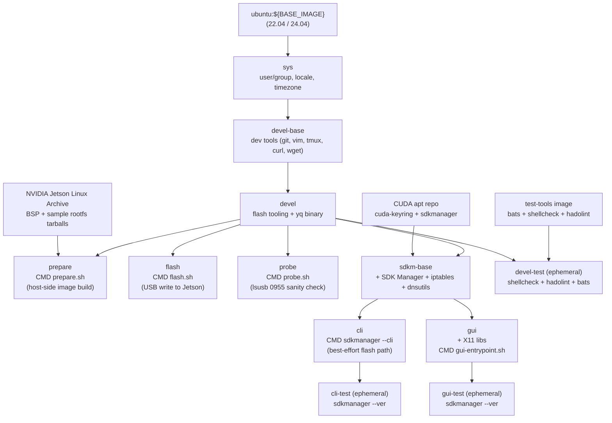

# Jetson Orin ファクトリーフラッシュコンテナ

[](https://github.com/ycpss91255-docker/jetson_sdk_manager/actions/workflows/main.yaml) [](../LICENSE)

コンテナ化された NVIDIA Jetson Linux（L4T）ファクトリーフラッシュワークフロー。Jetson Orin シリーズ（AGX Orin、Orin NX、Orin Nano）に対応。公式 BSP archive の `l4t_initrd_flash.sh --no-flash` / `--flash-only` を再現可能な 2 つの Docker stage にラップ。[`ycpss91255-docker/base`](https://github.com/ycpss91255-docker/base) 上に構築。この repo（および URL や badge で使われる正規の slug）は **`jetson_sdk_manager`** です。

**[English](../README.md)** | **[繁體中文](README.zh-TW.md)** | **[简体中文](README.zh-CN.md)** | **[日本語](README.ja.md)**

> この日本語訳は英語版から翻訳したものです。内容に差異がある場合は英語版（[README.md](../README.md)）が正本です。

---

## Supported versions

現時点でこの repo がサポートする JetPack / L4T release は **ちょうど 1 つ** です：

| JetPack | L4T release | Status |
|---|---|---|
| 6.2.2 | R36.5.0 (`r36_release_v5.0`) | Supported (only) |

他の JetPack バージョンはまだ組み込まれて**いません**。追加は単一ファイルの編集で済みます：[`config/jetson/_l4t_mapping.yaml`](config/jetson/_l4t_mapping.yaml) の `jetpack_to_l4t` の下にエントリ（L4T release + [Jetson Linux Archive](https://developer.nvidia.com/embedded/jetson-linux-archive) からの BSP / rootfs URL）を追加して、再 build します。[`jetson.yaml` の設定](#jetsonyaml-の設定) 参照。

---

## 目次

- [Supported versions](#supported-versions)
- [Before you start](#before-you-start)
- [TL;DR](#tldr)
- [前提条件](#前提条件)
- [`jetson.yaml` の設定](#jetsonyaml-の設定)
- [クイックスタート](#クイックスタート)
- [Verification status](#verification-status)
- [2 つのフラッシュ経路](#2-つのフラッシュ経路)
- [Stages](#stages)
- [Clean コマンド](#clean-コマンド)
- [SDK Manager（cli / gui）](#sdk-managercli--gui)
- [永続データ](#永続データ)
- [アーキテクチャ](#アーキテクチャ)
- [Smoke Tests](#smoke-tests)
- [ディレクトリ構成](#ディレクトリ構成)
- [トラブルシューティング](#トラブルシューティング)

---

## Before you start

> **初回フラッシュが前提とすること（一度だけ読んでください）：**
> - **Host**：x86_64 の **Linux** マシン（Mac 上の VM や、フラッシュ段階での WSL は不可）。
> - **データディレクトリのファイルシステム**：`./data/jetson_l4t/` は **ext4 / xfs / btrfs** 上にある必要があります。repo ルートで `df -T .` を実行して確認；`Type` が `ntfs` / `exfat` / `fuseblk` / `vfat` の場合は、bind-mount による修正について [前提条件](#前提条件) を参照。
> - **USB-C ケーブル 1 本** を host と Jetson のフロントパネルポートの間に。
> - **所要時間**：端から端まで約 **40 分**（`prepare` 約 30 分 + `flash` 約 10 分）、加えて初回の BSP ダウンロード。
>
> **初心者ゲート — 最初のコマンドの前に両方を確認：**
> 1. **ZIP ダウンロードではなく、本物の `git clone` を使う。** この repo は共有テンプレートを `.base/` 配下の Git subtree として持ちます；GitHub の「Download ZIP」はこれを省くため build が壊れます。`git` で clone してください。
> 2. **`sudo` なしで `docker` を実行できる。** `docker run --rm hello-world` で確認。`sudo` が必要な場合は、自分を `docker` グループに追加（`sudo usermod -aG docker "$USER"`、その後ログアウト・ログインし直す）。
>
> **以下で使う用語：**
> - **APX / recovery (REC)** — Jetson の Boot ROM USB フラッシュモード。**REC** ボタンを押しながら電源を入れて入ります；その後 host はボードを USB `0955:7xxx` として認識します。「APX recovery」と「recovery mode (REC)」は本 README 全体を通じて同じ意味です。
> - **NetworkManager** の host（ほとんどのラップトップ / デスクトップ）では、`./script/nm_flash_guard.sh auto` は事実上**必須**です — これがないと NM がフラッシュの途中で USB 転送を破壊します。クイックスタートの [NetworkManager の注記](#クイックスタート) 参照。

## TL;DR

eMMC へフラッシュする AGX Orin devkit のハッピーパス。（他の preset も同じ手順です；[`jetson.yaml` の設定](#jetsonyaml-の設定) 参照。）

```bash
./script/host_setup.sh                                # boot ごとに 1 回:qemu + nfsd + USB 調整(host 上で実行)
./script/init_data_dirs.sh                            # 初回のみ：data/ マウント点を非 root の自分で先に作成
ln -sf config/jetson/agx-orin-emmc.yaml jetson.yaml   # preset を 1 つ選ぶ

make run -- -t prepare    # フェーズ 1：BSP ダウンロード + フラッシュイメージ生成（約 30 分）
# Jetson を APX recovery (REC) に入れる：電源オフ、REC を押し続ける、電源を再接続、離す
./script/nm_flash_guard.sh auto   # NetworkManager が USB 転送を破壊するのを防ぐ；ボード起動時に自動復帰
make run -- -t flash      # フェーズ 2：Jetson に書き込み（約 10 分）

# ...または Jetson を APX recovery (REC) に入れた状態で、1 コマンドで両フェーズを実行:
make run -- -t prepare && ./script/nm_flash_guard.sh auto && make run -- -t flash
```

> `./script/host_setup.sh` は boot ごとの host 前提を一括実行します（[前提条件](#前提条件) 参照）；`make run` は初回に不足している stage image を自動 build します。解説付きの完全な手順——各 stage の `make build`、初回起動後の `nvidia-jetpack` インストール、headless 接続、中断後の再開——は [クイックスタート](#クイックスタート) を参照。2 つのフラッシュ機構の違いは [2 つのフラッシュ経路](#2-つのフラッシュ経路) を参照。

## 前提条件

- **Host OS**：x86_64 Linux。
- **Docker Engine** >= v20.10.6。
- **repo を置く host のファイルシステムは ext4 / xfs / btrfs であること。** `apply_binaries.sh` は rootfs ツリーに setuid バイナリ（`sudo`）と root 所有のファイルを生成します。NTFS / exFAT / `fuseblk` / FAT は展開時に setuid と ownership を黙って落とすため、フラッシュ後の Jetson は起動後に `sudo` が起動を拒否します。`prepare.sh` はパスがこれらのファイルシステム上にあるとアクションメッセージ付きで中止します；repo を移すか（または ext4 ディレクトリを `./data/jetson_l4t/` に bind-mount してから）再実行してください。
- **boot ごとの host セットアップ — `./script/host_setup.sh`。** Jetson を接続する前に host 上で実行。1 コマンドで **QEMU binfmt** を登録（`prepare` で BSP の ARM64 ツールを実行）、**`nfsd`** モジュールをロード（`flash` stage がローカル NFS エクスポートで payload を Jetson の initrd に渡す — `iptables` / `usb-gadget` forwarding なし）、**USB オートサスペンド**を無効化、**`usbfs` buffer** を 2048 MB に引き上げ（後の 2 つは `tegrarcm_v2` / NFS の bulk write が途中で止まるのを防止）、そして**フラッシュエクスポートパス `/srv/jetson_l4t` を host の mount namespace にブリッジ**します（カーネル `nfsd` は host namespace からエクスポートを提供しますが、そこにはコンテナ専用の bind mount が無いため）。これらは再起動でリセットされるため、boot ごとに再実行します。スクリプトが**やらない**こと 2 つ:
  - **`nfsd` の永続化**(次回 boot でロード不要にする):`echo nfsd | sudo tee /etc/modules-load.d/nfsd.conf`。
  - **per-device オートサスペンド上書き**、特定の port がまだデバイスを park する場合(Jetson が APX に入った後 `lsusb -t` でパスを探す):`echo on | sudo tee /sys/bus/usb/devices/<bus>-<port>/power/control`。

  スキップ時の症状:QEMU なし → `prepare` で `chroot: ... Exec format error`;`nfsd` なし → `flash` で `RPC: Program not registered` / `Return value 114`;`/srv/jetson_l4t` ブリッジなし → Jetson の initrd の `mount.nfs` が `No such file or directory` で失敗。`prepare` は QEMU のステップだけが必要です。

  **2 種類の「Error 114」原因 — 混同しないこと。** (a) **`flash` のごく開始時点**で、`RPC: Program not registered` / `NFS server is not running` を伴う `Error 114` は、host の `nfsd` モジュールがロードされていないことを意味します — `host_setup.sh`（または `sudo modprobe nfsd`）で修正。 (b) **転送の途中**で、`Error 114` / `NFS server` 失敗として現れる停止は、ほぼ常に `nfsd` ではなく **NetworkManager** が USB リンクを破壊しているのが原因です — `./script/nm_flash_guard.sh auto` で修正。対応する 2 つの [トラブルシューティング](#トラブルシューティング) 項目を参照。
- **NetworkManager の host では `./script/nm_flash_guard.sh auto` — 事実上必須。** ほとんどのラップトップ / デスクトップは NetworkManager を実行しており、これが Jetson の USB gadget インターフェースを DHCP プローブしてフラッシュの途中でリンクを破壊します。`make run -- -t flash` の前に `nm_flash_guard.sh auto` を実行してください；これはフラッシュの間そのインターフェースを unmanaged にマークし、ボード起動時に NM を自動復元します。host が NetworkManager を実行していないことを確認している場合のみスキップしてください。
- **Jetson が APX recovery (REC) に入っていること**（`flash` stage のみ；`prepare` は Jetson 接続不要）。

## `jetson.yaml` の設定

トップレベルの `jetson.yaml` は `config/jetson/` 配下の preset への symlink です。ボード + ストレージターゲットに合うものを 1 つ選びます：

| Preset | ボード | ストレージ |
|---|---|---|
| `agx-orin-emmc.yaml` | AGX Orin devkit | eMMC (`mmcblk0p1`) |
| `agx-orin-nvme.yaml` | AGX Orin devkit | NVMe (`nvme0n1p1`) |
| `agx-orin-usb.yaml` | AGX Orin devkit | USB SSD (`sda1`) |
| `orin-nx-nvme.yaml` | Orin NX devkit-super | NVMe |
| `orin-nano-nvme.yaml` | Orin Nano devkit-super | NVMe |
| `orin-nano-sd.yaml` | Orin Nano devkit-super | microSD（USB リーダー経由） |

preset の切り替えは symlink を張り直すだけ：

```bash
ln -sf config/jetson/orin-nx-nvme.yaml jetson.yaml
```

各 preset が設定する項目：

- `jetpack.version` — `config/jetson/_l4t_mapping.yaml` 経由で L4T release バージョン + BSP / rootfs ダウンロード URL に解決されます。
- `hardware.board` — alias が NVIDIA の `--target` 名にマップされます。
- `storage.device` — alias が storage mode（eMMC は `internal`、NVMe / USB / SD は `external`）と、Jetson recovery initrd が書き込みを指示されるデフォルトの kernel device パスにマップされます。
- `user.{username,password,hostname,autologin}` — `l4t_create_default_user.sh` でデフォルト user を事前作成し、初回起動の OEM-config をスキップします。preset はデフォルトの `jetson` / `jetson` 認証情報を同梱します；**初回ログイン後にパスワードを変更**し（device 上で `passwd`）、ボードがネットワーク到達可能になる場合はフラッシュ前にここで別のものを設定してください。
- `network`（任意）— デフォルトは DHCP；`method: static` を設定すると `NetworkManager` system-connection profile をインストールします。

**マルチスロット USB リーダー / 非デフォルトの device 番号。** USB SSD や microSD リーダーが非デフォルトの LUN に出る場合（典型的には空スロットが `sda` として enumerate され、カードが `sdb` に来る）、`storage.device_path` を追加して alias 解決の kernel device を上書きします：

```yaml
storage:
  device: usb
  device_path: sdb1      # usb alias デフォルトの sda1 を上書き
```

正しい値の見つけ方：先にストレージを host に接続して `lsblk -d -o NAME,SIZE,VENDOR,MODEL,TRAN` を実行。Jetson recovery initrd の enumeration は多くの場合 host と一致します。初回フラッシュが `Error opening /dev/sd*: No medium found` で中止する場合は、次の文字を試します（`sdb1` → `sdc1`）— [トラブルシューティング](#error-error-opening-devsda-no-medium-foundmicrosd-usb-リーダー経由) 参照。`device_path` を `storage.device: emmc`（internal mode）と同時に設定すると、検証段階で拒否されます。

完全なスキーマとコメントは `config/jetson/_example.yaml` を参照。

**JetPack バージョンを追加するには**（preset がまだ対応していない場合）：`config/jetson/_l4t_mapping.yaml` を編集し、`jetpack_to_l4t` の下に項目を追加（[Jetson Linux Archive](https://developer.nvidia.com/embedded/jetson-linux-archive) から `l4t_release` と `bsp_url` / `rootfs_url` を取得）して、prepare / flash image を再 build します。

## クイックスタート

> **`make run` の前に：** boot ごとに `./script/host_setup.sh` を 1 回実行（QEMU binfmt、`nfsd`、USB 調整 — [前提条件](#前提条件) 参照）、初回は `./script/init_data_dirs.sh` も実行（さもないと Docker daemon が `data/` マウント点を root で作成し、コンテナ内の非 root ユーザーがアクセスできなくなります）。

```bash
./script/host_setup.sh      # boot ごとに 1 回:QEMU binfmt + nfsd + USB 調整(host 上で実行)
./script/init_data_dirs.sh  # 初回のみ
ln -sf config/jetson/agx-orin-emmc.yaml jetson.yaml

# フェーズ 1 — host 側でイメージ生成（Jetson 接続不要）
make build -- -t prepare
make run -- -t prepare

# フェーズ 2 — Jetson へ書き込み
# Jetson を APX recovery に：電源オフ、REC を押しながら、電源を再接続、離す。
make build -- -t probe   # 一度に build できる stage は 1 つ（最後の -t が有効）、分けて build
make build -- -t flash
make run -- -t probe     # Jetson が APX にあるか確認（成功時 exit 0）
./script/nm_flash_guard.sh auto   # 下の「NetworkManager」の注記参照
make run -- -t flash
```

NetworkManager を実行している host（ほとんどのラップトップ / デスクトップ）では、フラッシュが途中で停止し、紛らわしい `NFS server` / `Error 114` 失敗になることがあります：NM が Jetson の USB gadget インターフェースを DHCP しようとしてタイムアウトし、転送の途中でアドレスを削除するためです。`./script/nm_flash_guard.sh auto` はフラッシュの間そのインターフェースを unmanaged にマークし、その後**ボードが起動デバイス（`0955:7020`）として再 enumerate された瞬間に NM を自動で再有効化**します — host はすぐに `192.168.55.x` を取得し、手動の `enable` ステップなしで SSH できます。タイムアウト（デフォルト 1800 秒、第 1 引数で上書き可）により、フラッシュが中止しても NM が復元されます。`disable` / `enable` / `around` / `status` サブコマンドは [`nm_flash_guard.sh`](script/nm_flash_guard.sh) を参照。

Jetson が新しくフラッシュした OS で起動したら、NVIDIA の OTA apt repository から残りの JetPack コンポーネントをインストール：

```bash
sudo apt update
sudo apt install -y nvidia-jetpack
```

CUDA、cuDNN、TensorRT、VPI、マルチメディア API、container runtime などをインストールします。SDK Manager が push するコンポーネント集合と同じで、Jetson が自分で取得するだけの違いです。

### 初回接続（USB、ネットワーク設定不要）

フラッシュした L4T rootfs には NVIDIA の USB device-mode サービスが含まれるため、Jetson はフラッシュに使ったのと同じ USB-C ケーブル上で固定の **`192.168.55.1`** に到達できます。`jetson.yaml` の `network:` 設定は**不要**です：

```bash
ssh <username>@192.168.55.1     # ユーザー名 / パスワードは jetson.yaml の user.* ブロックから
```

> デフォルトの `jetson` / `jetson` 認証情報でフラッシュした場合は、**今すぐ** device 上で `passwd` を実行してパスワードを変更してください — デフォルトは広く知られており、ボードは USB（および設定済みのネットワーク）経由で到達可能です。

host 側は USB ネットワークインターフェースに `192.168.55.x` を自動設定します（`ip a` で確認）。このリンクは任意の [`network:`](#jetsonyaml-の設定) ブロック（Jetson のイーサネット / Wi-Fi を NetworkManager で設定）とは独立しており、両立します。`192.168.55.1` は L4T に固定で組み込まれており、本 repo からは変更できません。

### 中断後の再開

各フェーズは進捗を `data/jetson_l4t/.../.prepared.yaml` に記録します。`make run -- -t prepare` を再実行すると完了済みステップ（BSP ダウンロード、rootfs 展開、`apply_binaries.sh`、user 作成、image 生成）をスキップします。JetPack / board の変更は mismatch として検出され、`./script/clean.sh l4t` を示すアクションメッセージ付きで中止します。

## Verification status

実際にフラッシュ済みのものと、build / 検証が通ることだけが分かっているものを、正直に区別します。

**CI が証明すること（そしてこれだけ）：** 全 stage の image build、`shellcheck` + `hadolint` の lint、`bats` smoke suite、`sdkmanager --ver`。**CI は実フラッシュを実行しません** — CI には Jetson ハードウェアが接続されていないため、エンドツーエンドのフラッシュ、NFS serve、eMMC 書き込みはそこでは行われません。ハードウェア・イン・ザ・ループのテストでのみカバーできるステップは [TEST.md の HITL-ONLY パス](test/TEST.md) を参照。

preset ごとのステータス：

| Preset | Status |
|---|---|
| `agx-orin-emmc.yaml` | verified on hardware 2026-06, JetPack 6.2.2 |
| `agx-orin-nvme.yaml` | config-validated only |
| `agx-orin-usb.yaml` | config-validated only |
| `orin-nx-nvme.yaml` | config-validated only |
| `orin-nano-nvme.yaml` | config-validated only |
| `orin-nano-sd.yaml` | config-validated only |

「config-validated only」とは、preset がパースされ、alias を解決し、フラッシュイメージを build することは確認済みだが、そのボード + ストレージへの完全な `flash` stage はまだ実ハードウェアで確認されていない、という意味です。機構は preset 間で同一なので、config-validated の preset は動作が見込まれますが、エンドツーエンドのサインオフはまだです。

## 2 つのフラッシュ経路

本 repo は Jetson をフラッシュする 2 つの方法を同梱しています。**ファクトリーフラッシュがドキュメント化されたデフォルト**で、SDK Manager は best-effort の代替手段です。

| | **ファクトリーフラッシュ**（`prepare` / `flash` / `probe`） | **SDK Manager**（`cli` / `gui`） |
|---|---|---|
| Status | **デフォルト**。CI は build + lint + bats のみ証明（実フラッシュなし）；`agx-orin-emmc` ではハードウェアでエンドツーエンドに検証済み（[Verification status](#verification-status) 参照） | best-effort。CI は build + `sdkmanager --ver` の smoke のみ；実際の SDK Manager フラッシュは**決して** CI 検証されない |
| NVIDIA ログイン | 不要 | **必要**（セッションは `data/nvsdkm` に永続化） |
| モード | スクリプト可能 / headless / オフラインキャッシュ可能 | 対話的なコンポーネント選択 + host 開発ツール |
| 仕組み | `tegrarcm_v2` USB リンク上の `l4t_initrd_flash.sh` — device-mode forwarding なし | SDK Manager の NFS + `iptables` + USB device-mode forwarding |

**prepare** stage は BSP 同梱の `l4t_initrd_flash.sh --no-flash` で host 側にフラッシュイメージを生成（Jetson 不要、NVIDIA ログイン不要）；**flash** stage は `--flash-only` で書き込みます — Jetson は `tegrarcm_v2` USB リンク上で最小限の initrd を起動し、その同じリンク上のローカル NFS エクスポートから image を取得します。これには host の `nfsd` モジュールのロードが必要ですが（[前提条件](#前提条件) 参照）、`iptables` も `usb-gadget` device-mode forwarding も不要です。

**SDK Manager は「Docker 内で壊れている」わけでは _ありません_** — 本 repo はかつてそう主張していましたが、現在は撤回しています。よく知られた [Flashing-99% での停止](https://forums.developer.nvidia.com/t/docker-sdk-manager-flash-nx-struck-at-99/365066) は、**host の NetworkManager** が USB gadget リンクを DHCP プローブして破壊していたことが原因で（[#48](https://github.com/ycpss91255-docker/jetson_sdk_manager/issues/48)）、[`nm_flash_guard.sh`](script/nm_flash_guard.sh) で修正しました；*「Device mode forwarding host setup failed」* ステップは単に `iptables` + `dnsutils` が欠けていただけで、現在は `sdkm-base` に含まれています。[共有 host 準備](#前提条件)（`host_setup.sh`、`nm_flash_guard.sh auto`）と NVIDIA ログインがあれば、SDK Manager でもフラッシュできます — [SDK Manager（cli / gui）](#sdk-managercli--gui) 参照。ファクトリーフラッシュは、ログイン不要でスクリプト可能 / オフライン対応のため、引き続きデフォルトです。

## Stages

| Stage | 用途 | Jetson 接続必要 |
|---|---|---|
| `devel` | フラッシュツール（`l4t_initrd_flash.sh` の依存）。`make build` のデフォルト target。 | いいえ |
| `devel-test` | Lint（`shellcheck` + `hadolint`）+ bats smoke tests。CI のみ。 | いいえ |
| `prepare` | フェーズ 1 — BSP + sample rootfs ダウンロード、`apply_binaries.sh`、`l4t_create_default_user.sh`、`l4t_initrd_flash --no-flash`。 | いいえ |
| `flash` | フェーズ 2 — `l4t_initrd_flash --flash-only`。 | **はい**、APX recovery |
| `probe` | 診断。USB をスキャンして NVIDIA vendor `0955` を探し、各デバイスが recovery 範囲にあるか注記し、APX の Jetson が無ければ exit 非 0。flash 前に接続確認のため実行でき、フラッシュ全体を走らせる必要がありません。 | 推奨 |
| `sdkm-base` | `cli` / `gui` 共通の SDK Manager レイヤー（`sdkmanager` + `iptables` + `dnsutils`）。直接実行しません。`devel` を slim に保ちます。 | いいえ |
| `cli` | SDK Manager **headless CLI** — best-effort な代替フラッシュ経路（`sdkmanager --cli`）。ファクトリーの `prepare`/`flash` stage が引き続きサポート対象のデフォルトです。 | フラッシュ時 |
| `cli-test` | `sdkmanager --ver` の sanity check。CI のみ。 | いいえ |
| `gui` | SDK Manager **GUI** — best-effort フラッシュ + JetPack カタログブラウザ。[SDK Manager（cli / gui）](#sdk-managercli--gui) 参照。 | フラッシュ時 |
| `gui-test` | `sdkmanager --ver` の sanity check。CI のみ。 | いいえ |

## Clean コマンド

`script/clean.sh` は使い捨ての `alpine:3` コンテナ経由で `./data/jetson_l4t/` を操作するため、host 側のツールは不要です。

| コマンド | 効果 |
|---|---|
| `./script/clean.sh build` | 生成されたフラッシュイメージのみ削除（`tools/kernel_flash/images/`）。 |
| `./script/clean.sh rootfs` | `rootfs/` のみ削除、BSP とダウンロード済み tarball は保持。 |
| `./script/clean.sh l4t` | `Linux_for_Tegra/` ツリー全体を削除（BSP + rootfs + image）。tarball は保持。 |
| `./script/clean.sh all` | l4t + `data/downloads/` の tarball も削除。 |

`prepare.sh` が JetPack バージョンの mismatch を報告したら、`./script/clean.sh l4t` でリセットします。

## SDK Manager（cli / gui）

ファクトリーの `prepare` / `flash` stage がサポート対象のデフォルトです。SDK Manager は、NVIDIA 自身のツールを使いたい、または JetPack の `.deb` カタログを閲覧したいユーザー向けに、2 つの **best-effort** stage として同梱されています：`cli`（`sdkmanager --cli`）と `gui`（グラフィカルクライアント）。どちらも `sdkm-base` 上に構築されており、SDK Manager の Docker 内 device-mode forwarding に必要な `iptables` + `dnsutils` を追加します。

```bash
make build -- -t gui    # または: -t cli
make run -- -t gui      # または: -t cli
```

best-effort とは：CI が stage を build し `sdkmanager --ver` を smoke しますが、実際の SDK Manager フラッシュは手動で、NVIDIA の upstream に伴いずれる可能性があるという意味です。GUI/CLI フラッシュを成功させるには、まずファクトリー経路と同じ host 前提をセットアップし（`./script/host_setup.sh` と `./script/nm_flash_guard.sh auto`）、NVIDIA Developer アカウントでサインインします。`gui` の entrypoint はこれらのステップを示す banner を表示し、（対話モードでは）起動前に Enter を待ちます；`-t gui` の後に続く余分な位置引数は（`--no-sandbox` の後で）`sdkmanager-gui` に転送されます。GUI モードは host の X11 セッションが必要です（base template が自動転送）。

GUI モードは host の X11 セッションが必要です；base template が `$DISPLAY` を自動検出し、X11 socket と `XAUTHORITY` を転送します。

## 永続データ

`./data/` 配下の各パスがコンテナに bind-mount されます（gitignored）。

| Host パス | コンテナパス | 用途 |
|---|---|---|
| `./data/jetson_l4t/` | `/srv/jetson_l4t` | BSP + rootfs + 生成されたフラッシュイメージ（ファクトリーフラッシュ）。**ext4 / xfs / btrfs であること。** |
| `./data/downloads/` | `${HOME}/Downloads/nvidia/sdkm_downloads` | キャッシュした tarball（BSP + sample rootfs）、SDK Manager と共用。 |
| `./data/nvsdkm/` | `${HOME}/.nvsdkm` | SDK Manager ログインセッションキャッシュ。`cli` / `gui` stage のみ。 |
| `./data/nvidia_sdk/` | `${HOME}/nvidia/nvidia_sdk` | SDK Manager 管理の SDK インストールフォルダ。`cli` / `gui` stage のみ。 |
| `./jetson.yaml` | `/etc/jetson.yaml`（読み取り専用） | ユーザー設定、`prepare.sh` / `flash.sh` / `gui-entrypoint.sh` が読み取り。 |

## アーキテクチャ



## Smoke Tests

詳細は [TEST.md](test/TEST.md) を参照。

```bash
make build test
```

`devel-test` stage は `devel` image に対して bats テストを実行します；2 つの `sdkmanager` アサーションはここでは skip されます（`cli` / `gui` image 内で bats を再実行したときのみ実行）。

## ディレクトリ構成

```text
jetson_sdk_manager/
├── jetson.yaml -> config/jetson/agx-orin-emmc.yaml   # symlink；preset 切り替え
├── compose.yaml                 # Docker Compose（派生、gitignored）
├── Dockerfile                   # sys → devel-base → devel → {prepare, flash, probe, sdkm-base → cli/gui}
├── Makefile -> .base/script/docker/Makefile
├── .base/                       # 共有テンプレート（git subtree）
├── data/                        # 永続状態（gitignored）
│   ├── jetson_l4t/              #   BSP + rootfs + フラッシュイメージ
│   ├── downloads/               #   BSP / rootfs tarball
│   ├── nvsdkm/                  #   SDK Manager ログインセッション（cli/gui）
│   └── nvidia_sdk/              #   SDK Manager インストールフォルダ（cli/gui）
├── config/
│   ├── docker/setup.conf        # ランタイム設定 — source of truth
│   ├── jetson/                  # フラッシュ preset と schema
│   │   ├── _example.yaml        #   コメント付き canonical schema
│   │   ├── _l4t_mapping.yaml    #   JetPack → L4T release / URL（build-time）
│   │   └── *.yaml               #   board / storage ごとの preset
│   └── packages/                # gui stage の X11 lib リスト（Ubuntu codename ごと）
├── doc/
│   ├── adr/                     # アーキテクチャ決定記録
│   ├── changelog/CHANGELOG.md
│   ├── test/TEST.md
│   ├── Flash_Workflow.md        # prepare/flash フェーズの詳細解説
│   ├── README.zh-TW.md
│   ├── README.zh-CN.md
│   └── README.ja.md
├── script/
│   ├── prepare.sh               # フェーズ 1 entrypoint
│   ├── flash.sh                 # フェーズ 2 entrypoint
│   ├── clean.sh                 # Volume クリーンアップコマンド
│   ├── gui-entrypoint.sh        # SDK Manager GUI ランチャー + best-effort banner
│   ├── lib/                     # yaml / download / volume / errors helpers
│   ├── host_setup.sh            # 一括 per-boot host 前提(qemu/nfsd/USB)
│   ├── init_data_dirs.sh        # 初回に非 root で data/ を作成
│   ├── entrypoint.sh            # コンテナ entrypoint（logging tee）
│   ├── build.sh -> ../.base/script/docker/wrapper/build.sh
│   ├── run.sh   -> ../.base/script/docker/wrapper/run.sh
│   ├── exec.sh  -> ../.base/script/docker/wrapper/exec.sh
│   ├── stop.sh  -> ../.base/script/docker/wrapper/stop.sh
│   ├── setup.sh -> ../.base/script/docker/wrapper/setup.sh
│   ├── setup_tui.sh -> ../.base/script/docker/wrapper/setup_tui.sh
│   └── prune.sh -> ../.base/script/docker/wrapper/prune.sh
├── test/smoke/orin_install_env.bats
├── .github/workflows/main.yaml
└── .gitignore
```

## トラブルシューティング

### `prepare.sh` 中止：「L4T_ROOT ... is on ntfs/exfat/fuseblk」

`apply_binaries.sh` は setuid バイナリ（`sudo`）と root 所有のファイルを生成します。NTFS / exFAT / `fuseblk` / FAT はこの両方を黙って落とすため、生成された Jetson は起動後に `sudo` が起動を拒否します。repo を ext4 / xfs / btrfs パーティションに移すか、ext4 ディレクトリを `./data/jetson_l4t/` に bind-mount してください：

```bash
sudo mkdir -p /var/lib/jetson_l4t
sudo mount --bind /var/lib/jetson_l4t ./data/jetson_l4t
```

bind-mount のターゲットはシステムディスク上である必要はありません — ext4 / xfs / btrfs パーティション内のディレクトリならどこでもよく、2 台目の SSD やマウント済みのデータドライブも可。空き容量が十分なもの（1 回の完全な prepare で約 15 GB）を選びます：

```bash
sudo mkdir -p /media/<ext4-mount>/jetson_l4t
sudo mount --bind /media/<ext4-mount>/jetson_l4t ./data/jetson_l4t
```

どちらの bind mount も永続しません；再起動後 `make run -- -t prepare` の前に再 mount してください。

診断目的のみ、`JETSON_ALLOW_NON_UNIX_FS=1` で abort を警告に降格できます：

```bash
JETSON_ALLOW_NON_UNIX_FS=1 make run -- -t prepare
```

**この flag は非 unix ファイルシステムでは使えるフラッシュを生成できません**。NVIDIA の `apply_binaries.sh` 自体が `find rootfs/etc/passwd -user root -group root` で rootfs の ownership を確認し、sample rootfs が誤った owner で展開されると 7/10 ステップ目で自ら abort します。この escape hatch は、maintainer がそのステップまで走らせて失敗モードを実証するためだけのもので、filesystem 制約を回避する手段ではありません。

### `prepare.sh` 中止：volume mismatch

`.prepared.yaml` marker が示す volume は別の JetPack / board 用に準備されており、現在の `jetson.yaml` の選択と異なります。クリアして再実行：

```bash
./script/clean.sh l4t
make run -- -t prepare
```

### `chroot: failed to run command 'dpkg': Exec format error`

host kernel が ARM64 バイナリを実行できません。QEMU binfmt interpreter を登録：

```bash
docker run --rm --privileged multiarch/qemu-user-static --reset -p yes
```

boot ごとに 1 回実行。

### `Could not detect a board` / Jetson が recovery に入っていない

`flash.sh` は `lsusb` に NVIDIA VID `0955` + recovery PID（`7023` / `7223` / `7423` / `7523` / `7e19`）が出るか確認し、無ければ中止します。`probe` stage を単独で実行すると同じ確認ができます — 別のケーブル / port を試すときに毎回 prepare stage の状態を失わずに済みます：

```bash
make run -- -t probe
```

bus 上の全 NVIDIA-vendor デバイスを列挙し、どれが recovery 範囲かを注記し、少なくとも 1 つが recovery のときのみ exit 0 になります。

recovery モードへの入り方：

1. 電源を切る。
2. USB-C ケーブルで Jetson の**フロントパネル**（ボタン側）と host を接続。
3. **REC**（中央のボタン）を押し続ける。
4. 電源を接続（または Power を押す）。
5. 約 2 秒後に REC を離す。

host で確認：

```bash
lsusb | grep -i 'NVIDIA Corp'
```

| 出力 | 状態 |
|---|---|
| `0955:7023` / `7223` / `7423` / `7523` / `7e19` NVIDIA Corp. APX | Jetson が recovery（flash 開始可能） |
| `0955:<その他 PID>` | OS で起動済み — recovery に入り直す |
| （出力なし） | 未検出 — ケーブル / port を変える / 直結（hub を使わない） |

recovery モードは USB 2.0（480 Mbps）で動作します。これは正常です — APX モードでは USB 3 コントローラは無効です。

### `clnt_create: RPC: Program not registered` / `NFS server is not running` / `Error 114`

`flash` 段階の `l4t_initrd_flash.sh` はローカル NFS エクスポートで Jetson の initrd に payload を渡しますが、コンテナは host とカーネルを共有しており、host が `nfsd` モジュールをロードしていません:

```
 * Not starting NFS kernel daemon: no support in current kernel.
clnt_create: RPC: Program not registered
NFS server is not running
make: *** [Makefile:41: run] Error 114
```

host 側で（コンテナ内ではなく）ロードしてから flash を再実行：

```bash
sudo modprobe nfsd
make run -- -t flash
```

`echo nfsd | sudo tee /etc/modules-load.d/nfsd.conf` で再起動後も有効にできます。[前提条件](#前提条件) 参照。`flash.sh` は現在これを事前チェックし、同じ案内付きで早期に中止します。

### フラッシュが転送途中で停止 / 「Flashing - 99%」 / `mount.nfs: No such file or directory`

コンテナ内フラッシュ（どちらの経路でも）が途中で停止するのは、ほぼ常に **host の NetworkManager** が Jetson の USB gadget インターフェースを DHCP プローブし、タイムアウトして、転送の途中でアドレスを削除していることが原因です — [#48](https://github.com/ycpss91255-docker/jetson_sdk_manager/issues/48) で突き止めた根本原因です。フラッシュ前に `./script/nm_flash_guard.sh auto` を実行してください（インターフェースを unmanaged にマークし、ボード起動時に NM を再有効化します）。代わりに `mount.nfs: ... No such file or directory` が出る場合は、host の `/srv/jetson_l4t` ブリッジが欠けています — `./script/host_setup.sh` がそれをセットアップします（step 5/5）。

### SDK Manager：「Device mode forwarding host setup failed」

これは Docker の根本的な制約では**ありません**（以前の README はそう主張していましたが、それは誤りでした）。SDK Manager の `device_mode_host_setup.sh` は `iptables`（NAT MASQUERADE）と `dig`（DNS 到達性プローブ）を必要とします；どちらも現在は `sdkm-base` レイヤーに含まれているため、`cli` / `gui` stage はこのステップをクリアします。それでも失敗する場合は、`./script/host_setup.sh` + `./script/nm_flash_guard.sh auto` を実行したか、NVIDIA Developer アカウントでサインインしているかを確認してください。詳細：[#48](https://github.com/ycpss91255-docker/jetson_sdk_manager/issues/48)。

### SDK Manager GUI：コンポーネントのインストールがハングする（あるステップが特定の % で停止）

SDK Manager のオンデバイス SDK コンポーネントのインストールは、デバイス側のステップが実際には完了しボードにネットワークがある（ボード上で `ping 8.8.8.8` が成功する）にもかかわらず、GUI でハングすることがあります —— あるステップ（多くは「Additional Setups」や任意のパッケージ）が特定の割合で止まり、「taking longer than expected」ダイアログが繰り返し表示されます。これは SDK Manager（上流）側の進捗追跡の不安定さであり、**flash の失敗ではありません**：OS はすでに書き込まれ、ボードは起動します。

コンポーネントのインストールを SDK Manager に完了させる必要はありません。書き込まれたボードには NVIDIA L4T apt source がすでに設定されているため、JetPack SDK 一式をボード上で直接インストールできます —— SDK Manager が push するのと同じパッケージで、factory パスがまさに行っていることです：

```bash
ssh <user>@192.168.55.1
sudo apt update && sudo apt install -y nvidia-jetpack
```

これは factory `prepare` / `flash` パスがドキュメントのデフォルトである、もう一つの理由です：起動後のボードに apt で SDK コンポーネントをインストールするため、ハングする GUI ステップがありません。

### `ERROR: might be timeout in USB write` / `Return value 3`

Boot ROM 通信が USB bulk transfer 中に停止：

```
Sending bct_br
ERROR: might be timeout in USB write.
Error: Return value 3
```

前回の中断したフラッシュが残した USB endpoint の状態です。**ハードウェア** power-cycle で APX recovery に入り直す必要があります——電源オフ、REC を押し続ける、電源を再接続、離す(`tegrarcm_v2 --reboot recovery` では不十分)。

あわせて、この boot で `./script/host_setup.sh` を実行したか確認してください——USB buffer を引き上げ、オートサスペンドを無効化します([前提条件](#前提条件) 参照)。

### `Error: Error opening /dev/sda: No medium found`（microSD USB リーダー経由）

マルチスロットのコンボリーダーは各スロットを別々の LUN として出し、`usb` alias はデフォルトで `sda1` にマップされます。空スロットが `sda` として enumerate され、カードが `sdb` に来る場合、フラッシュはカードに触れる前に中止します：

```bash
$ lsblk -d -o NAME,SIZE,VENDOR,MODEL,TRAN
sda    0B  Generic-  SD/MMC          usb     # 空スロット
sdb  117.8G Generic-  Micro SD/M2    usb     # カードはここ
```

**正しい `device_path` の見つけ方**（host の enumeration は多くの場合 Jetson recovery initrd と一致しますが、保証はされません）：

1. フラッシュ時と同じ USB 構成でストレージを host に接続。
2. `lsblk -d -o NAME,SIZE,VENDOR,MODEL,TRAN` を実行；`SIZE` がカード / SSD に一致するものがターゲット device。
3. `jetson.yaml` に `storage.device_path: <name>1`（例 `sdb1`）を設定 — パーティション `1` が `l4t_initrd_flash.sh` の想定です。

初回試行が同じように失敗する場合、Jetson initrd の bus enumeration が host と異なります；次の文字を試します（`sdb1` → `sdc1`）。完全な上書きセマンティクスは [`jetson.yaml` の設定](#jetsonyaml-の設定) 参照。

その他の回避策（おおよその推奨順）：

1. シングルスロットの microSD リーダーを使う — 常に `sda` として enumerate され、alias デフォルトに合致。
2. カードを `/dev/sda` にマップされるスロットへ移す（必要なら microSD-to-SD アダプタを使用）。

### APP partition でフラッシュが停止（external storage）

USB ethernet 経由の大容量連続転送は、APP partition 展開ステップで止まることがあり、約 12 分の timeout 後に失敗します。選択肢：

1. **eMMC** にフラッシュ（`storage.device: emmc`）し、Jetson 上で `sudo apt install nvidia-jetpack`。
2. **NVMe SSD** を使う — PCIe 直結は USB-ethernet 展開より高速。
3. Jetson を完全に power-cycle してから再試行。
