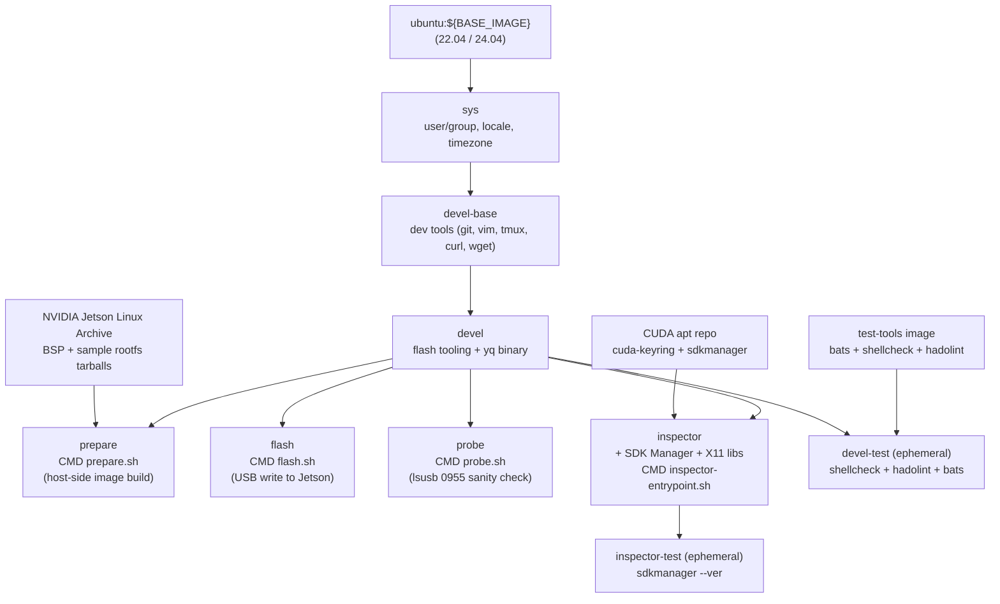

# Jetson Orin 工厂烧录容器

[](https://github.com/ycpss91255-docker/jetson_sdk_manager/actions/workflows/main.yaml) [](../LICENSE)

容器化的 NVIDIA Jetson Linux（L4T）工厂烧录流程，支持 Jetson Orin 系列设备（AGX Orin、Orin NX、Orin Nano）。将官方 BSP archive 中的 `l4t_initrd_flash.sh --no-flash` / `--flash-only` 包装为两个可重现的 Docker stage。构建于 [`ycpss91255-docker/base`](https://github.com/ycpss91255-docker/base) 之上。

**[English](../README.md)** | **[繁體中文](README.zh-TW.md)** | **[简体中文](README.zh-CN.md)** | **[日本語](README.ja.md)**

---

## 目录

- [TL;DR](#tldr)
- [为什么用工厂烧录而非 SDK Manager](#为什么用工厂烧录而非-sdk-manager)
- [前置要求](#前置要求)
- [配置 `jetson.yaml`](#配置-jetsonyaml)
- [快速开始](#快速开始)
- [Stages](#stages)
- [Clean 命令](#clean-命令)
- [Inspector（SDK Manager GUI）](#inspectorsdk-manager-gui)
- [持久化数据](#持久化数据)
- [架构](#架构)
- [Smoke Tests](#smoke-tests)
- [目录结构](#目录结构)
- [疑难排解](#疑难排解)

---

## TL;DR

```bash
./script/host_setup.sh                                # 每次开机一次:qemu + nfsd + USB 调整(在 host 上跑)
./script/init_data_dirs.sh                            # 首次才需要：以你的身份(非 root)预建 data/ 挂载点
ln -sf config/jetson/agx-orin-emmc.yaml jetson.yaml   # 选一个 preset

make run -- -t prepare    # 阶段 1：下载 BSP + 生成烧录 image（约 30 分钟）
# 将 Jetson 进入 APX recovery（按住 REC + 点 RESET）
make run -- -t flash      # 阶段 2：写入 Jetson（约 10 分钟）

# ...或在 Jetson 已进入 APX recovery 的情况下,一条命令跑完两阶段:
make run -- -t prepare && make run -- -t flash
```

> `./script/host_setup.sh` 一次跑完每次开机要做的 host 前置(见 [前置要求](#前置要求));`make run` 首次会自动 build 缺少的 stage image。想看有解说的完整流程——各 stage 的 `make build`、首次开机装 `nvidia-jetpack`、headless 连接、中断续跑——见 [快速开始](#快速开始)。

## 为什么用工厂烧录而非 SDK Manager

NVIDIA SDK Manager 的 GUI 与 `--cli` 流程，是通过在 host 上跑 NFS server、将 rootfs 经由 USB device-mode 导出至设备，并用 `iptables` 桥接 host 网络堆栈来完成烧录。在 Docker 内（即使加上 `--privileged --network host`）这个组合无法可靠运作：NFS server 绑定不稳、容器内 `iptables` 规则不一定能影响 host nftables、`usb-gadget` device-mode forwarding 失败。典型症状就是 [Flashing - 99% 卡死](https://forums.developer.nvidia.com/t/docker-sdk-manager-flash-nx-struck-at-99/365066)，NVIDIA 官方 Docker image 也有同样问题。

本 repo 直接绕过此路径：**prepare** stage 使用 BSP 自带的 `l4t_initrd_flash.sh --no-flash` 在 host 端生成烧录 image（不需 Jetson、不需 NFS、不需 `iptables`）；**flash** stage 以 `--flash-only` 写入：Jetson 通过 `tegrarcm_v2` USB 连接开机进一个精简 initrd,再从这条链路上的本地 NFS export 拉取 image。这个 export 仍需 host 载入 `nfsd` kernel 模块(见 [前置要求](#前置要求)),但与 SDK Manager 不同的是**不需** `iptables` 操作、**不需** `usb-gadget` device-mode forwarding,所以在 privileged 容器内能稳定运作。

SDK Manager 仍保留于 **`inspector`** stage，用途是浏览 JetPack 的组件目录、查询有哪些 `.deb` 包。其 Install 按钮在 Docker 内仍然失效；entrypoint 会打印 banner 提醒这点。

## 前置要求

- **Host OS**：x86_64 Linux。
- **Docker Engine** >= v20.10.6。
- **Repo 所在的 host 文件系统须为 ext4 / xfs / btrfs。** `apply_binaries.sh` 会在 rootfs 树中生成 setuid binary（`sudo`）和 root 拥有的文件。NTFS / exFAT / `fuseblk` / FAT 会在解压时静默丢掉 setuid 与 ownership，烧录完成的 Jetson 开机后 `sudo` 拒绝启动。`prepare.sh` 检测到非 unix FS 会以 action 消息中止；请将 repo 移到 ext4 / xfs / btrfs 分区，或 bind-mount 一个 ext4 目录覆盖 `./data/jetson_l4t/`。
- **每次开机的 host 设定 — `./script/host_setup.sh`。** 在连接 Jetson 前于 host 上执行。一条命令会注册 **QEMU binfmt**(`prepare` 跑 BSP 的 ARM64 工具)、载入 **`nfsd`** 模块(`flash` 通过本地 NFS export 把 payload 喂给 Jetson 的 initrd —— 无 `iptables` / `usb-gadget` forwarding)、关闭 **USB autosuspend**、把 **`usbfs` buffer** 拉到 2048 MB(后两者避免 `tegrarcm_v2` / NFS bulk write 烧到一半卡住)。这些重开机后都会重置,所以每次开机要再跑一次。两件它**不会**帮你做的:
  - **持久化 `nfsd`**(下次开机免再载):`echo nfsd | sudo tee /etc/modules-load.d/nfsd.conf`。
  - **per-device autosuspend 覆盖**,若某个 port 仍把设备 park(Jetson 进 APX 后用 `lsusb -t` 找路径):`echo on | sudo tee /sys/bus/usb/devices/<bus>-<port>/power/control`。

  漏跑的症状:没 QEMU → `prepare` 出现 `chroot: ... Exec format error`;没 `nfsd` → `flash` 出现 `RPC: Program not registered` / `Return value 114`。`prepare` 只需要 QEMU 那一步。
- **Jetson 进入 APX recovery**（仅 `flash` 阶段需要；`prepare` 不需连 Jetson）。

## 配置 `jetson.yaml`

顶层的 `jetson.yaml` 是指向 `config/jetson/` 下某个 preset 的 symlink。挑一个符合你的 board + 存储目标：

| Preset | 板子 | 存储 |
|---|---|---|
| `agx-orin-emmc.yaml` | AGX Orin devkit | eMMC (`mmcblk0p1`) |
| `agx-orin-nvme.yaml` | AGX Orin devkit | NVMe (`nvme0n1p1`) |
| `agx-orin-usb.yaml` | AGX Orin devkit | USB SSD (`sda1`) |
| `orin-nx-nvme.yaml` | Orin NX devkit-super | NVMe |
| `orin-nano-nvme.yaml` | Orin Nano devkit-super | NVMe |
| `orin-nano-sd.yaml` | Orin Nano devkit-super | microSD（通过 USB reader） |

切换 preset 重新建立 symlink 即可：

```bash
ln -sf config/jetson/orin-nx-nvme.yaml jetson.yaml
```

每个 preset 设定：

- `jetpack.version` — 通过 `config/jetson/_l4t_mapping.yaml` 解析为 L4T release 版本及 BSP / rootfs 下载 URL。
- `hardware.board` — alias 对应到 NVIDIA `--target` 名称。
- `storage.device` — alias 对应到 storage mode（eMMC 为 `internal`，NVMe / USB / SD 为 `external`）以及 external mode 下 Jetson recovery initrd 看到的默认 kernel device 路径。
- `user.{username,password,hostname,autologin}` — 通过 `l4t_create_default_user.sh` 预先建立默认 user，首次开机跳过 OEM-config。
- `network`（可选）— 默认 DHCP；设定 `method: static` 会在 rootfs 内安装 `NetworkManager` system-connection profile。

**多卡槽 USB reader / 非默认 device 编号。** USB SSD 或 microSD reader 在非默认 LUN 上暴露（典型是空卡槽 enumerate 为 `sda`，卡实际落在 `sdb`）时，加上 `storage.device_path` 覆盖 alias 解析出的 kernel device：

```yaml
storage:
  device: usb
  device_path: sdb1      # 覆盖 usb alias 默认的 sda1
```

要找对 device_path 值：先把存储设备接上 host，跑 `lsblk -d -o NAME,SIZE,VENDOR,MODEL,TRAN`。Jetson recovery initrd 多数情况下 enumeration 与 host 一致。若第一次烧录仍以 `Error opening /dev/sd*: No medium found` 中止，换下一个字母（`sdb1` → `sdc1`）— 见 [疑难排解](#error-error-opening-devsda-no-medium-foundmicrosd-通过-usb-reader)。把 `device_path` 与 `storage.device: emmc`（internal mode）同时设定会在验证阶段被拒绝。

完整 schema 与注释见 `config/jetson/_example.yaml`。

**要新增 JetPack 版本**：编辑 `config/jetson/_l4t_mapping.yaml`，在 `jetpack_to_l4t` 下新增条目（从 [Jetson Linux Archive](https://developer.nvidia.com/embedded/jetson-linux-archive) 取得 `l4t_release` 及 `bsp_url` / `rootfs_url`），然后重建 prepare / flash image。

## 快速开始

> **`make run` 之前：** 每次开机先跑一次 `./script/host_setup.sh`(QEMU binfmt、`nfsd`、USB 调整 —— 见 [前置要求](#前置要求)),首次再跑 `./script/init_data_dirs.sh`(否则 Docker daemon 会以 root 建立 `data/` 挂载目录,容器内的非 root 用户将无法访问)。

```bash
./script/host_setup.sh      # 每次开机一次:QEMU binfmt + nfsd + USB 调整(在 host 上跑)
./script/init_data_dirs.sh  # 首次才需要
ln -sf config/jetson/agx-orin-emmc.yaml jetson.yaml

# 阶段 1 — host 端生成 image（不需连 Jetson）
make build -- -t prepare
make run -- -t prepare

# 阶段 2 — 写入 Jetson
# Jetson 进入 APX recovery：断电、按住 REC、接电、放开。
make build -- -t probe   # 一次只能 build 一个 stage（最后的 -t 生效），分开 build
make build -- -t flash
make run -- -t probe     # 确认 Jetson 在 APX (exit 0 = ready to flash)
make run -- -t flash
```

Jetson 从新烧录的 OS 开机后，从 NVIDIA OTA apt repository 安装 JetPack 其他组件：

```bash
sudo apt update
sudo apt install -y nvidia-jetpack
```

安装 CUDA、cuDNN、TensorRT、VPI、多媒体 API、container runtime 等。与 SDK Manager 推送的包集相同，只是改由 Jetson 自行拉取。

### 首次连接（USB，免配置网络）

烧录进去的 L4T rootfs 内置 NVIDIA 的 USB device-mode 服务，所以 Jetson 会在烧录用的同一条 USB-C 线上固定以 **`192.168.55.1`** 对外，**不需要** `jetson.yaml` 的 `network:` 配置：

```bash
ssh <username>@192.168.55.1     # 账号 / 密码来自 jetson.yaml 的 user.* 区块
```

Host 端会自动在 USB 网络接口配上 `192.168.55.x`（用 `ip a` 确认）。这条链路与可选的 [`network:`](#配置-jetsonyaml) 区块（配置 Jetson 的以太 / Wi-Fi，走 NetworkManager）相互独立、可并存。`192.168.55.1` 是 L4T 内置写死的，无法从本 repo 更改。

### 中断后续跑

每个阶段会将进度记录在 `data/jetson_l4t/.../.prepared.yaml`。重新执行 `make run -- -t prepare` 会跳过已完成步骤（BSP 下载、rootfs 解压、`apply_binaries.sh`、user 建立、image 生成）。若 JetPack / board 改变，会被检测为 mismatch 并以 action 消息中止，提示执行 `./script/clean.sh l4t`。

## Stages

| Stage | 用途 | 需连 Jetson |
|---|---|---|
| `devel` | 烧录工具（`l4t_initrd_flash.sh` 依赖）。`make build` 默认 target。 | 否 |
| `devel-test` | Lint（`shellcheck` + `hadolint`）+ bats smoke tests。仅 CI。 | 否 |
| `prepare` | 阶段 1 — 下载 BSP + sample rootfs、`apply_binaries.sh`、`l4t_create_default_user.sh`、`l4t_initrd_flash --no-flash`。 | 否 |
| `flash` | 阶段 2 — `l4t_initrd_flash --flash-only`。 | **是**，APX recovery |
| `probe` | 诊断。扫 USB 找 NVIDIA vendor `0955`，标注每个设备是否在 recovery 范围，没有 Jetson 在 APX 时 exit 非 0。flash 前跑一下确认连接, 不用承担整个 flash 流程。 | 建议 |
| `inspector` | SDK Manager GUI，用于浏览 JetPack 组件目录。Install 按钮在 Docker 内无作用 — 见 [Inspector](#inspectorsdk-manager-gui)。 | 否 |
| `inspector-test` | `sdkmanager --ver` sanity check。仅 CI。 | 否 |

## Clean 命令

`script/clean.sh` 通过一次性 `alpine:3` 容器操作 `./data/jetson_l4t/`，不需 host 端工具。

| 命令 | 效果 |
|---|---|
| `./script/clean.sh build` | 只移除生成的烧录 image（`tools/kernel_flash/images/`）。 |
| `./script/clean.sh rootfs` | 只移除 `rootfs/`，保留 BSP 与已下载的 tarball。 |
| `./script/clean.sh l4t` | 移除整个 `Linux_for_Tegra/` 树（BSP + rootfs + image）。保留 tarball。 |
| `./script/clean.sh all` | l4t + 移除 `data/downloads/` tarball。 |

当 `prepare.sh` 报 JetPack 版本 mismatch 时，执行 `./script/clean.sh l4t` 重置。

## Inspector（SDK Manager GUI）

`inspector` stage 内含 NVIDIA SDK Manager，但用途是**目录浏览器**，不是烧录工具。可查 JetPack 各版本含哪些 `.deb` 包，或在不执行 `apt install nvidia-jetpack` 的情况下单独下载某个 `.deb`。

```bash
make build -- -t inspector
make run -- -t inspector
```

Entrypoint 打印 banner 说明 Install 按钮为何在 Docker 内失效，交互模式下会等待按 Enter 才启动 GUI。如需传递参数给 `sdkmanager-gui`，通过 `make run` 的位置参数即可。

GUI 模式需要 host 上的 X11 session；base template 会自动检测 `$DISPLAY` 并转发 X11 socket 与 `XAUTHORITY`。

## 持久化数据

`./data/` 下的每个路径都会 bind-mount 进容器（gitignored）。

| Host 路径 | 容器路径 | 用途 |
|---|---|---|
| `./data/jetson_l4t/` | `/srv/jetson_l4t` | BSP + rootfs + 生成的烧录 image（工厂烧录流程）。**必须是 ext4 / xfs / btrfs。** |
| `./data/downloads/` | `${HOME}/Downloads/nvidia/sdkm_downloads` | 缓存的 tarball（BSP + sample rootfs），与 SDK Manager 共用。 |
| `./data/nvsdkm/` | `${HOME}/.nvsdkm` | SDK Manager 登录 session 缓存。仅 inspector stage。 |
| `./data/nvidia_sdk/` | `${HOME}/nvidia/nvidia_sdk` | SDK Manager 管理的 SDK 安装目录。仅 inspector stage。 |
| `./jetson.yaml` | `/etc/jetson.yaml`（只读） | 用户配置，被 `prepare.sh` / `flash.sh` / `inspector-entrypoint.sh` 读取。 |

## 架构



## Smoke Tests

详见 [TEST.md](test/TEST.md)。

```bash
make build test
```

`devel-test` stage 对 `devel` image 跑 bats 测试；两个 `sdkmanager` 断言会在此被 skip（只在 `inspector` image 内重跑 bats 时才会执行）。

## 目录结构

```text
jetson_sdk_manager/
├── jetson.yaml -> config/jetson/agx-orin-emmc.yaml   # symlink；切换 preset
├── compose.yaml                 # Docker Compose（衍生，gitignored）
├── Dockerfile                   # sys → devel-base → devel → {prepare, flash, inspector}
├── Makefile -> .base/script/docker/Makefile
├── .base/                       # 共用模板（git subtree）
├── data/                        # 持久化状态（gitignored）
│   ├── jetson_l4t/              #   BSP + rootfs + 烧录 image
│   ├── downloads/               #   BSP / rootfs tarball
│   ├── nvsdkm/                  #   SDK Manager 登录 session（inspector）
│   └── nvidia_sdk/              #   SDK Manager 安装目录（inspector）
├── config/
│   ├── docker/setup.conf        # 运行期配置 — source of truth
│   ├── jetson/                  # 烧录 preset 与 schema
│   │   ├── _example.yaml        #   含注释的 canonical schema
│   │   ├── _l4t_mapping.yaml    #   JetPack → L4T release / URL（build-time）
│   │   └── *.yaml               #   各 board / storage 的 preset
│   └── packages/                # inspector 的 X11 lib 清单（按 Ubuntu codename）
├── doc/
│   ├── adr/                     # 架构决策记录
│   ├── changelog/CHANGELOG.md
│   ├── test/TEST.md
│   ├── Flash_Workflow.md        # prepare/flash 阶段深入说明
│   ├── README.zh-TW.md
│   ├── README.zh-CN.md
│   └── README.ja.md
├── script/
│   ├── prepare.sh               # 阶段 1 entrypoint
│   ├── flash.sh                 # 阶段 2 entrypoint
│   ├── clean.sh                 # Volume 清理命令
│   ├── inspector-entrypoint.sh  # SDK Manager GUI 启动器 + 警示 banner
│   ├── lib/                     # yaml / download / volume / errors helpers
│   ├── host_setup.sh            # 一次性 per-boot host 前置(qemu/nfsd/USB)
│   ├── init_data_dirs.sh        # 首次以非 root 建立 data/
│   ├── entrypoint.sh            # 容器 entrypoint（logging tee）
│   ├── build.sh -> ../.base/script/docker/wrapper/build.sh
│   ├── run.sh   -> ../.base/script/docker/wrapper/run.sh
│   ├── exec.sh  -> ../.base/script/docker/wrapper/exec.sh
│   ├── stop.sh  -> ../.base/script/docker/wrapper/stop.sh
│   ├── setup.sh -> ../.base/script/docker/wrapper/setup.sh
│   ├── setup_tui.sh -> ../.base/script/docker/wrapper/setup_tui.sh
│   └── prune.sh -> ../.base/script/docker/wrapper/prune.sh
├── test/smoke/orin_install_env.bats
├── .github/workflows/main.yaml
└── .gitignore
```

## 疑难排解

### `prepare.sh` 中止：「L4T_ROOT ... is on ntfs/exfat/fuseblk」

`apply_binaries.sh` 会生成 setuid binary（`sudo`）和 root 拥有的文件。NTFS / exFAT / `fuseblk` / FAT 会静默丢掉这两者，生成的 Jetson 开机后 `sudo` 拒绝启动。请将 repo 移到 ext4 / xfs / btrfs 分区，或 bind-mount 一个 ext4 目录覆盖 `./data/jetson_l4t/`：

```bash
sudo mkdir -p /var/lib/jetson_l4t
sudo mount --bind /var/lib/jetson_l4t ./data/jetson_l4t
```

Bind-mount target 不必在系统盘上 — 任何 ext4 / xfs / btrfs 分区内的目录都可以，包含第二块 SSD 或已挂载的数据盘。选一个剩余空间够的（一次完整 prepare 约需 15 GB）：

```bash
sudo mkdir -p /media/<ext4-mount>/jetson_l4t
sudo mount --bind /media/<ext4-mount>/jetson_l4t ./data/jetson_l4t
```

两种 bind mount 都不会 persistent；重开机后跑 `make run -- -t prepare` 前要再 mount 一次。

仅供诊断用途，`JETSON_ALLOW_NON_UNIX_FS=1` 把 abort 降为警告：

```bash
JETSON_ALLOW_NON_UNIX_FS=1 make run -- -t prepare
```

**此 flag 不能在非 unix 文件系统上产出可用的 flash**。NVIDIA `apply_binaries.sh` 自己会用 `find rootfs/etc/passwd -user root -group root` 检查 rootfs ownership，sample rootfs 解压到错误的 owner 之后它会在第 7/10 步自行 abort。这道 escape hatch 只是让 maintainer 能跑到那一步实证失败模式，不是绕过 filesystem 限制的方法。

### `prepare.sh` 中止：volume mismatch

`.prepared.yaml` marker 显示 volume 是为其他 JetPack / board 准备的，与当前 `jetson.yaml` 选择的不同。清掉重跑：

```bash
./script/clean.sh l4t
make run -- -t prepare
```

### `chroot: failed to run command 'dpkg': Exec format error`

Host kernel 无法执行 ARM64 binary。注册 QEMU binfmt interpreter：

```bash
docker run --rm --privileged multiarch/qemu-user-static --reset -p yes
```

每次开机执行一次。

### `Could not detect a board` / Jetson 未进入 recovery

`flash.sh` 会检查 `lsusb` 是否出现 NVIDIA VID `0955` + recovery PID（`7023` / `7223` / `7423` / `7523` / `7e19`），若无则中止。可以单独跑 `probe` stage 做同样检查 — 测试不同线材 / port 时不用每次都跑完整 flash 流程：

```bash
make run -- -t probe
```

它会列出 bus 上所有 NVIDIA-vendor 设备, 标注哪些在 recovery 范围, 且只有至少一个在 recovery 时才 exit 0。

进入 recovery mode 步骤：

1. 断电。
2. 用 USB-C 线连接 Jetson **前面板**（按钮侧）与 host。
3. 按住 **REC**（中间按钮）。
4. 接电（或按 Power）。
5. 约 2 秒后放开 REC。

在 host 验证：

```bash
lsusb | grep -i 'NVIDIA Corp'
```

| 输出 | 状态 |
|---|---|
| `0955:7023` / `7223` / `7423` / `7523` / `7e19` NVIDIA Corp. APX | Jetson 进入 recovery（可以开始 flash） |
| `0955:<其他 PID>` | 已开机进 OS — 重新进入 recovery |
| （无输出） | 未检测到 — 换线 / 换 port / 直连（不要用 hub） |

Recovery mode 走 USB 2.0（480 Mbps），这是正常的 — APX 模式下 USB 3 controller 不启用。

### `clnt_create: RPC: Program not registered` / `NFS server is not running` / `Error 114`

`flash` 阶段的 `l4t_initrd_flash.sh` 通过本地 NFS export 把烧录 payload 喂给 Jetson 的 initrd,但容器与 host 共用 kernel,而 host 没载入 `nfsd` 模块:

```
 * Not starting NFS kernel daemon: no support in current kernel.
clnt_create: RPC: Program not registered
NFS server is not running
make: *** [Makefile:41: run] Error 114
```

在 host 上(不是容器内)载入它,再重跑 flash:

```bash
sudo modprobe nfsd
make run -- -t flash
```

用 `echo nfsd | sudo tee /etc/modules-load.d/nfsd.conf` 让它重开机后仍生效。见 [前置要求](#前置要求)。`flash.sh` 现在会先检查并以相同指引提早中止。

### `ERROR: might be timeout in USB write` / `Return value 3`

Boot ROM 通讯在 USB bulk transfer 时卡住：

```
Sending bct_br
ERROR: might be timeout in USB write.
Error: Return value 3
```

前次烧录中断遗留的 USB endpoint 状态。需要**硬件** power-cycle 重新进入 APX recovery——断电、按住 REC、接电、放开(`tegrarcm_v2 --reboot recovery` 不够)。

同时确认本次开机已跑过 `./script/host_setup.sh`——它会拉高 USB buffer 并关闭 autosuspend(见 [前置要求](#前置要求))。

### `Error: Error opening /dev/sda: No medium found`（microSD 通过 USB reader）

多卡槽 combo reader 会把每个卡槽当作独立 LUN，而 `usb` alias 默认对到 `sda1`。空卡槽 enumerate 为 `sda` 而卡实际在 `sdb` 时，烧录在还没碰到卡之前就中止：

```bash
$ lsblk -d -o NAME,SIZE,VENDOR,MODEL,TRAN
sda    0B  Generic-  SD/MMC          usb     # 空槽
sdb  117.8G Generic-  Micro SD/M2    usb     # 卡实际在这
```

**找对 `device_path`**（host enumeration 多数情况下与 Jetson recovery initrd 一致，但不保证）：

1. 把存储设备按烧录时的 USB 接法接上 host。
2. 跑 `lsblk -d -o NAME,SIZE,VENDOR,MODEL,TRAN`；`SIZE` 对应你的卡 / SSD 那一个就是目标 device。
3. 在 `jetson.yaml` 设 `storage.device_path: <name>1`（例如 `sdb1`）— partition `1` 是 `l4t_initrd_flash.sh` 预期的。

若第一次尝试仍同样失败，Jetson initrd 在 bus 上 enumerate 的顺序与 host 不同；换下一个字母（`sdb1` → `sdc1`）。完整 override 语义见 [配置 `jetson.yaml`](#配置-jetsonyaml)。

其他变通方案（按推荐度排序）：

1. 用单槽 microSD reader — 永远 enumerate 为 `sda`，符合 alias 默认。
2. 把卡移到对应 `/dev/sda` 的槽（必要时用 microSD-to-SD 转接卡）。

### 烧录到 APP partition 卡住（external storage）

USB ethernet 在大量持续传输时偶尔会在 APP partition 解压阶段卡住，~12 分钟后 timeout 失败。解法：

1. 改烧到 **eMMC**（`storage.device: emmc`），然后在 Jetson 上 `sudo apt install nvidia-jetpack`。
2. 用 **NVMe SSD** — PCIe 直写比 USB-ethernet 解压快。
3. Jetson 完全 power-cycle 后重试。
