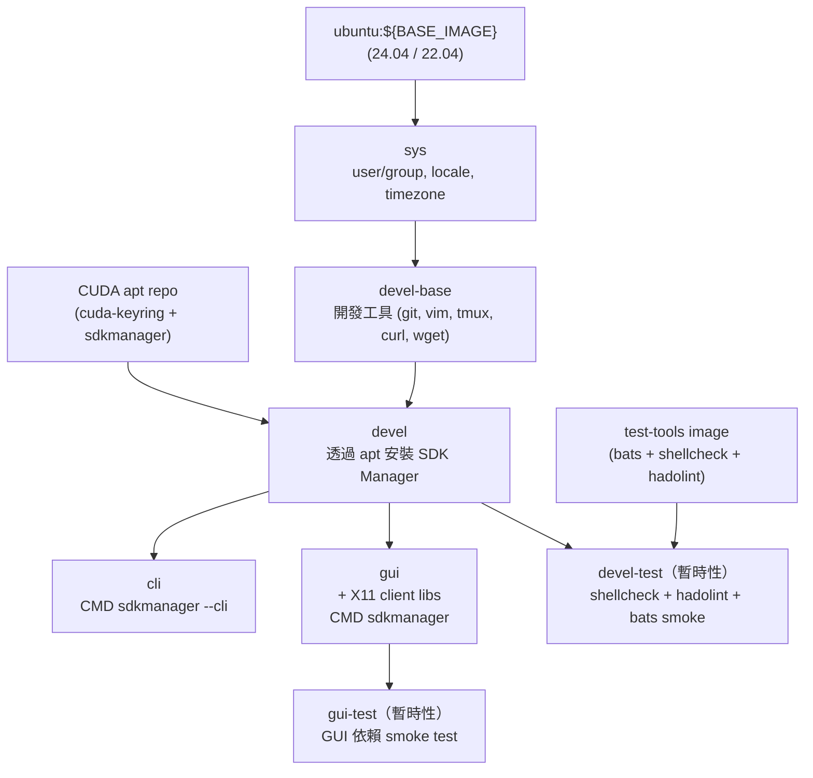

# Jetson SDK Manager Docker Environment

[](https://github.com/ycpss91255-docker/jetson_sdk_manager/actions/workflows/main.yaml) [](../LICENSE)

容器化 NVIDIA SDK Manager，用於燒錄與配置 Jetson Orin 系列裝置（AGX Orin、Orin NX、Orin Nano）。提供 CLI 與 GUI 兩種 variant，以 `ubuntu:${BASE_IMAGE}` 為 base，透過公開的 CUDA apt repo 安裝 SDK Manager。建構於 [`ycpss91255-docker/base`](https://github.com/ycpss91255-docker/base) 之上。

**[English](../README.md)** | **[繁體中文](README.zh-TW.md)** | **[简体中文](README.zh-CN.md)** | **[日本語](README.ja.md)**

---

## 目錄

- [TL;DR](#tldr)
- [前置需求](#前置需求)
- [快速開始](#快速開始)
- [切換 Ubuntu 版本](#切換-ubuntu-版本)
- [使用方式](#使用方式)
- [持久化資料](#持久化資料)
- [架構](#架構)
- [Smoke Tests](#smoke-tests)
- [目錄結構](#目錄結構)

---

## TL;DR

```bash
make build && make run -- -t cli
```

## 前置需求

- **Host OS**：x86_64 Linux
- **Docker Engine** >= v20.10.6
- **Host 套件**（x86 host 燒錄 ARM target 必須）：

  ```bash
  sudo apt-get install qemu-user-static binfmt-support
  sudo update-binfmts --enable
  ```

- **USB auto-suspend**：連接 Jetson 的 USB port 必須關閉 auto-suspend，否則燒錄可能卡住

  ```bash
  # 檢查當前設定
  cat /sys/bus/usb/devices/*/power/autosuspend
  # 對特定裝置關閉（範例）
  echo -1 | sudo tee /sys/bus/usb/devices/<device>/power/autosuspend
  ```

- **Jetson 裝置**須進入 recovery mode（燒錄時）

## 快速開始

> **首次使用：** 在 `make run` 之前先執行 `./script/init_data_dirs.sh`。略過此步驟會讓 Docker daemon 以 **root** 建立 `data/` 掛載目錄，容器內的非 root 使用者將無法存取。

```bash
./script/init_data_dirs.sh        # 首次使用 — 建立 data/{nvsdkm,downloads}
make build -- -t cli

# 把 Jetson 進入 recovery mode（按住 REC 按鈕 + 重新上電）
make run -- -t cli
```

## 切換 Ubuntu 版本

容器內的 Ubuntu 版本必須符合 JetPack 的 host OS 要求：

| JetPack | L4T | Host Ubuntu（容器 `BASE_IMAGE`） |
|---------|-----|----------------------------------|
| 6.x | R36.x | **22.04** 或 20.04 |
| 5.x | R35.x | 20.04 或 18.04 |

預設為 `ubuntu:22.04`（相容 JetPack 6.x）。切換其他版本：

```bash
./script/setup.sh set build.arg_4 BASE_IMAGE=ubuntu:22.04
make build -- -t cli
```

> 注意：`make setup -- set ...` 在值包含 `=` 時無法正常運作（[base#414](https://github.com/ycpss91255-docker/base/issues/414)）。請直接使用 `./script/setup.sh`。

或使用互動式 TUI：

```bash
make setup-tui
```

## 使用方式

### 建置

```bash
make build                       # 建置 devel（base，不直接使用）
make build -- -t cli             # 建置 CLI variant
make build -- -t gui             # 建置 GUI variant（X11）
make build test                  # 建置含 lint + smoke test
```

### 執行

依 stage target 分兩種 variant：

**GUI 模式**（需要 X11 display）：

```bash
make run -- -t gui               # 啟動 SDK Manager GUI
```

> GUI 模式需要 host 有 X11 session 執行中。base template 的 `setup.sh` 會自動偵測 `$DISPLAY` 並設定 X11 socket forwarding + XAUTHORITY。

**CLI 模式**（無頭模式）：

```bash
# 互動式 CLI — SDK Manager 會逐步提示選擇
make run -- -t cli
```

### CLI 範例

**1. 僅下載** — 下載 JetPack 元件，不安裝：

```bash
make run -- -t cli sdkmanager --cli \
  --action install \
  --login-type devzone \
  --product Jetson \
  --target-os Linux \
  --version 6.2 \
  --target JETSON_AGX_ORIN_TARGETS \
  --license accept \
  --stay-logged-in true \
  --download-only \
  --exit-on-finish
```

**2. 安裝（燒錄）** — 如果已下載過，跳過下載直接燒錄：

```bash
make run -- -t cli sdkmanager --cli \
  --action install \
  --login-type devzone \
  --product Jetson \
  --target-os Linux \
  --version 6.2 \
  --target JETSON_AGX_ORIN_TARGETS \
  --flash \
  --license accept \
  --stay-logged-in true \
  --exit-on-finish
```

**3. 全自動** — 下載 + 燒錄 + 安裝 SDK 元件一次完成：

```bash
make run -- -t cli sdkmanager --cli \
  --action install \
  --login-type devzone \
  --product Jetson \
  --target-os Linux \
  --version 6.2 \
  --target JETSON_AGX_ORIN_TARGETS \
  --flash \
  --license accept \
  --stay-logged-in true \
  --collect-usage-data enable \
  --exit-on-finish
```

> 其他裝置請替換 `--target`：`JETSON_ORIN_NX_TARGETS`（Orin NX）或 `JETSON_ORIN_NANO_TARGETS`（Orin Nano）。JetPack 版本替換 `--version`。

### 支援的 Jetson Target

| Target 參數 | 裝置 |
|------------|------|
| `JETSON_AGX_ORIN_TARGETS` | Jetson AGX Orin |
| `JETSON_ORIN_NX_TARGETS` | Jetson Orin NX |
| `JETSON_ORIN_NANO_TARGETS` | Jetson Orin Nano |

### 進入已啟動的容器

```bash
make exec
make exec -- -t cli bash
```

### 停止

```bash
make stop
```

## 持久化資料

SDK Manager 的下載檔案和登入 session 持久化在 `data/`（已 gitignore）：

| Host 路徑 | 容器路徑 | 用途 |
|-----------|---------|------|
| `./data/nvsdkm/` | `${HOME}/.nvsdkm` | 登入 session 快取（登入一次，重複使用） |
| `./data/downloads/` | `${HOME}/Downloads/nvidia/sdkm_downloads` | SDK 元件下載（~11 GB） |
| `./data/nvidia_sdk/` | `${HOME}/nvidia/nvidia_sdk` | SDK 安裝目錄（~31 GB） |

首次登入會建立 session；後續執行可透過 `--stay-logged-in true` 重複使用。

## 架構



## Smoke Tests

詳見 [TEST.md](test/TEST.md)。

```bash
make build test                  # 建置時執行 lint + smoke test
```

## 目錄結構

```text
jetson_sdk_manager/
├── compose.yaml                 # Docker Compose（衍生產物，gitignored）
├── Dockerfile                   # 多階段建置：sys → devel-base → devel → cli / gui
├── Makefile -> .base/script/docker/Makefile
├── .base/                       # 共用 template（git subtree）
├── data/                       # 持久化 SDK Manager 資料（gitignored）
│   ├── nvsdkm/                  #   登入 session 快取
│   └── downloads/               #   SDK 元件下載
├── config/
│   └── docker/
│       └── setup.conf           # Runtime 設定（volumes、build args 等）
├── doc/
│   └── adr/                     # 架構決策紀錄
│       ├── 0001-apt-install-over-official-docker-image.md
│       └── 0002-cli-gui-as-independent-stages.md
├── doc/
│   ├── README.zh-TW.md
│   ├── README.zh-CN.md
│   ├── README.ja.md
│   ├── changelog/CHANGELOG.md
│   └── test/TEST.md
├── script/
│   ├── build.sh -> ../.base/script/docker/build.sh
│   ├── run.sh -> ../.base/script/docker/run.sh
│   ├── exec.sh -> ../.base/script/docker/exec.sh
│   ├── stop.sh -> ../.base/script/docker/stop.sh
│   ├── setup.sh -> ../.base/script/docker/setup.sh
│   ├── setup_tui.sh -> ../.base/script/docker/setup_tui.sh
│   ├── prune.sh -> ../.base/script/docker/prune.sh
│   └── entrypoint.sh
├── test/smoke/
│   └── orin_install_env.bats    # SDK Manager 安裝驗證
├── .github/workflows/
│   └── main.yaml                # CI/CD
└── .gitignore
```
