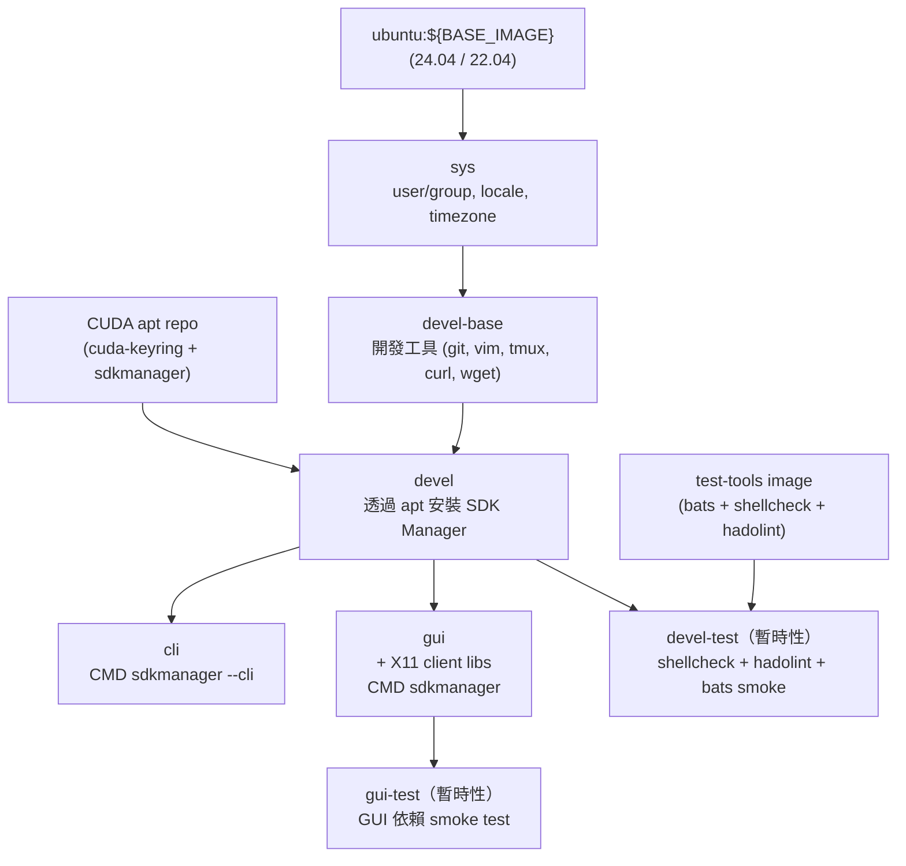

# Jetson SDK Manager Docker Environment

[](https://github.com/ycpss91255-docker/jetson_sdk_manager/actions/workflows/main.yaml) [](../LICENSE)

容器化 NVIDIA SDK Manager，用於燒錄與配置 Jetson Orin 系列裝置（AGX Orin、Orin NX、Orin Nano）。提供 CLI 與 GUI 兩種 variant，以 `ubuntu:${BASE_IMAGE}` 為 base，透過公開的 CUDA apt repo 安裝 SDK Manager。建構於 [`ycpss91255-docker/base`](https://github.com/ycpss91255-docker/base) 之上。

**[English](../README.md)** | **[繁體中文](README.zh-TW.md)** | **[简体中文](README.zh-CN.md)** | **[日本語](README.ja.md)**

---

## 目錄

- [TL;DR](#tldr)
- [前置需求](#前置需求)
- [快速開始](#快速開始)
- [切換 Ubuntu 版本](#切換-ubuntu-版本)
- [使用方式](#使用方式)
- [持久化資料](#持久化資料)
- [架構](#架構)
- [Smoke Tests](#smoke-tests)
- [目錄結構](#目錄結構)

---

## TL;DR

```bash
make build && make run -- -t cli
```

## 前置需求

- **Host OS**：x86_64 Linux
- **Docker Engine** >= v20.10.6
- **QEMU binfmt**（x86 host 燒錄 ARM target 必須）：

  ```bash
  docker run --rm --privileged multiarch/qemu-user-static --reset -p yes
  ```

  > 每次開機後執行一次即可。透過 Docker 註冊 ARM64 binary 翻譯至 kernel，不需安裝 host 套件。

- **USB auto-suspend**：連接 Jetson 的 USB port 必須關閉 auto-suspend，否則燒錄可能卡住

  ```bash
  # 檢查當前設定
  cat /sys/bus/usb/devices/*/power/autosuspend
  # 對特定裝置關閉（範例）
  echo -1 | sudo tee /sys/bus/usb/devices/<device>/power/autosuspend
  ```

- **Jetson 裝置**須進入 recovery mode（燒錄時）

## 快速開始

> **首次使用：** 在 `make run` 之前先執行 `./script/init_data_dirs.sh`。略過此步驟會讓 Docker daemon 以 **root** 建立 `data/` 掛載目錄，容器內的非 root 使用者將無法存取。

```bash
./script/init_data_dirs.sh        # 首次使用 — 建立 data/{nvsdkm,downloads}
make build -- -t cli

# 把 Jetson 進入 recovery mode（按住 REC 按鈕 + 重新上電）
make run -- -t cli
```

## 燒錄流程（建議）

從 Docker 燒錄是**兩階段流程**。SDK Manager 內建的燒錄後 SDK 安裝依賴 NFS，在容器內無法正常運作（[已知問題](https://forums.developer.nvidia.com/t/docker-sdk-manager-flash-nx-struck-at-99/365066) — 官方 NVIDIA Docker image 也有同樣問題）。建議使用以下流程：

### 階段 1 — 從 Docker 燒錄

使用 SDK Manager GUI 或 CLI 燒錄基本的 Jetson Linux（L4T）OS image：

```bash
make run -- -t gui
```

在 GUI 中按正常流程操作 STEP 1–3。燒錄本身（寫入 OS 到 eMMC）會成功完成。當進度到達 **「Flashing - 99%」** 並卡住時，燒錄已經完成 — SDK Manager 是在嘗試透過 NFS 安裝 SDK 元件時卡住。可以安全關閉。

> **重要：** 燒錄前 Jetson 必須處於**乾淨的 recovery mode** — 完全斷電後，按住 Recovery 按鈕再接上電源。軟體重開機到 recovery 是不夠的（見[疑難排解](#error-might-be-timeout-in-usb-write--return-value-3)）。

### 階段 2 — 在 Jetson 上安裝 SDK 元件

Jetson 從新燒錄的 OS 開機後，連上網路並執行：

```bash
sudo apt update
sudo apt install nvidia-jetpack
```

這會透過 NVIDIA 官方 OTA apt repository 安裝所有 JetPack 元件（CUDA、cuDNN、TensorRT、VPI、多媒體 API、Container Runtime 等）。安裝的套件與 SDK Manager 推送的完全相同 — 只是改由 Jetson 自行從網路拉取，而非透過 NFS 推送。

## 切換 Ubuntu 版本

容器內的 Ubuntu 版本必須符合 JetPack 的 host OS 要求：

| JetPack | L4T | Host Ubuntu（容器 `BASE_IMAGE`） |
|---------|-----|----------------------------------|
| 6.x | R36.x | **22.04** 或 20.04 |
| 5.x | R35.x | 20.04 或 18.04 |

預設為 `ubuntu:22.04`（相容 JetPack 6.x）。切換其他版本：

```bash
./script/setup.sh set build.arg_4 BASE_IMAGE=ubuntu:22.04
make build -- -t cli
```

> 注意：`make setup -- set ...` 在值包含 `=` 時無法正常運作（[base#414](https://github.com/ycpss91255-docker/base/issues/414)）。請直接使用 `./script/setup.sh`。

或使用互動式 TUI：

```bash
make setup-tui
```

## 使用方式

### 建置

```bash
make build                       # 建置 devel（base，不直接使用）
make build -- -t cli             # 建置 CLI variant
make build -- -t gui             # 建置 GUI variant（X11）
make build test                  # 建置含 lint + smoke test
```

### 執行

依 stage target 分兩種 variant：

**GUI 模式**（需要 X11 display）：

```bash
make run -- -t gui               # 啟動 SDK Manager GUI
```

> GUI 模式需要 host 有 X11 session 執行中。base template 的 `setup.sh` 會自動偵測 `$DISPLAY` 並設定 X11 socket forwarding + XAUTHORITY。

**CLI 模式**（無頭模式）：

```bash
# 互動式 CLI — SDK Manager 會逐步提示選擇
make run -- -t cli
```

### CLI 範例

**1. 僅下載** — 下載 JetPack 元件，不安裝：

```bash
make run -- -t cli sdkmanager --cli \
  --action install \
  --login-type devzone \
  --product Jetson \
  --target-os Linux \
  --version 6.2 \
  --target JETSON_AGX_ORIN_TARGETS \
  --license accept \
  --stay-logged-in true \
  --download-only \
  --exit-on-finish
```

**2. 安裝（燒錄）** — 如果已下載過，跳過下載直接燒錄：

```bash
make run -- -t cli sdkmanager --cli \
  --action install \
  --login-type devzone \
  --product Jetson \
  --target-os Linux \
  --version 6.2 \
  --target JETSON_AGX_ORIN_TARGETS \
  --flash \
  --license accept \
  --stay-logged-in true \
  --exit-on-finish
```

**3. 全自動** — 下載 + 燒錄 + 安裝 SDK 元件一次完成：

```bash
make run -- -t cli sdkmanager --cli \
  --action install \
  --login-type devzone \
  --product Jetson \
  --target-os Linux \
  --version 6.2 \
  --target JETSON_AGX_ORIN_TARGETS \
  --flash \
  --license accept \
  --stay-logged-in true \
  --collect-usage-data enable \
  --exit-on-finish
```

> 其他裝置請替換 `--target`：`JETSON_ORIN_NX_TARGETS`（Orin NX）或 `JETSON_ORIN_NANO_TARGETS`（Orin Nano）。JetPack 版本替換 `--version`。

### CLI 參數一覽

| 參數 | 值 | 說明 |
|------|---|------|
| `--cli` | | 啟用 CLI 模式 |
| `--action` | `install` / `uninstall` / `downloadonly` | 執行的動作 |
| `--login-type` | `devzone` / `nvonline` / `offline` | 認證方式 |
| `--product` | `Jetson` | 目標產品系列 |
| `--version` | 例如 `6.2` | JetPack 版本 |
| `--target-os` | `Linux` | 目標 OS |
| `--target` | 見下表 | 目標板 |
| `--flash` | | 燒錄裝置（省略則跳過燒錄） |
| `--host` | | 同時安裝 host 元件 |
| `--select` | `section_or_group` | 加入安裝清單（可重複） |
| `--deselect` | `section_or_group` | 從安裝清單移除（可重複） |
| `--additional-sdk` | `sdk_title` | 安裝額外 SDK（例如 DeepStream） |
| `--download-only` | | 僅下載不安裝 |
| `--download-folder` | 路徑 | 自訂下載目錄 |
| `--target-image-folder` | 路徑 | 自訂 SDK 安裝目錄 |
| `--license` | `accept` / `reject` | 自動接受授權 |
| `--stay-logged-in` | `true` / `false` | 持久化登入 session |
| `--exit-on-finish` | | 完成後自動退出 |
| `--auto` | | 所有提示自動以預設值完成 |
| `--query` | `interactive` / `non-interactive` | 列出可選項目 |
| `--show-all-versions` | | 顯示所有可用版本（含非主要版本） |
| `--archived-versions` | | 僅顯示已封存的 SDK 版本 |
| `--list-connected` | `all` / `Jetson` | 列出已連接的裝置 |
| `--usb-port` | 例如 `1-2` | 指定 USB port（多板連接時） |
| `--response-file` | 路徑 | 從 response file 執行（全自動） |
| `--export-response-file` | 路徑 | 匯出目前選擇為 response file |
| `--export-logs` | 路徑 | 匯出 log 到指定目錄 |
| `--collect-usage-data` | `enable` / `disable` | 使用資料收集 |

### 支援的 Jetson Target

| Target 參數 | 裝置 |
|------------|------|
| `JETSON_AGX_ORIN_TARGETS` | Jetson AGX Orin |
| `JETSON_ORIN_NX_TARGETS` | Jetson Orin NX |
| `JETSON_ORIN_NANO_TARGETS` | Jetson Orin Nano |

### 進入已啟動的容器

```bash
make exec
make exec -- -t cli bash
```

### 停止

```bash
make stop
```

## 持久化資料

SDK Manager 的下載檔案和登入 session 持久化在 `data/`（已 gitignore）：

| Host 路徑 | 容器路徑 | 用途 |
|-----------|---------|------|
| `./data/nvsdkm/` | `${HOME}/.nvsdkm` | 登入 session 快取（登入一次，重複使用） |
| `./data/downloads/` | `${HOME}/Downloads/nvidia/sdkm_downloads` | SDK 元件下載（~11 GB） |
| `./data/nvidia_sdk/` | `${HOME}/nvidia/nvidia_sdk` | SDK 安裝目錄（~31 GB） |

首次登入會建立 session；後續執行可透過 `--stay-logged-in true` 重複使用。

## 架構



## Smoke Tests

詳見 [TEST.md](test/TEST.md)。

```bash
make build test                  # 建置時執行 lint + smoke test
```

## 目錄結構

```text
jetson_sdk_manager/
├── compose.yaml                 # Docker Compose（衍生產物，gitignored）
├── Dockerfile                   # 多階段建置：sys → devel-base → devel → cli / gui
├── Makefile -> .base/script/docker/Makefile
├── .base/                       # 共用 template（git subtree）
├── data/                       # 持久化 SDK Manager 資料（gitignored）
│   ├── nvsdkm/                  #   登入 session 快取
│   └── downloads/               #   SDK 元件下載
├── config/
│   └── docker/
│       └── setup.conf           # Runtime 設定（volumes、build args 等）
├── doc/
│   └── adr/                     # 架構決策紀錄
│       ├── 0001-apt-install-over-official-docker-image.md
│       └── 0002-cli-gui-as-independent-stages.md
├── doc/
│   ├── README.zh-TW.md
│   ├── README.zh-CN.md
│   ├── README.ja.md
│   ├── changelog/CHANGELOG.md
│   └── test/TEST.md
├── script/
│   ├── build.sh -> ../.base/script/docker/build.sh
│   ├── run.sh -> ../.base/script/docker/run.sh
│   ├── exec.sh -> ../.base/script/docker/exec.sh
│   ├── stop.sh -> ../.base/script/docker/stop.sh
│   ├── setup.sh -> ../.base/script/docker/setup.sh
│   ├── setup_tui.sh -> ../.base/script/docker/setup_tui.sh
│   ├── prune.sh -> ../.base/script/docker/prune.sh
│   └── entrypoint.sh
├── test/smoke/
│   └── orin_install_env.bats    # SDK Manager 安裝驗證
├── .github/workflows/
│   └── main.yaml                # CI/CD
└── .gitignore
```

## 疑難排解

### `chroot: failed to run command 'dpkg': Exec format error`

Host kernel 無法執行 ARM64 binary。註冊 QEMU binfmt 翻譯器：

```bash
docker run --rm --privileged multiarch/qemu-user-static --reset -p yes
```

每次開機後執行一次。

### `mknod: .../rootfs/dev/random: File exists`

上次失敗的燒錄殘留了不完整的 rootfs 在 `data/nvidia_sdk/`。SDK Manager 的安裝腳本不具冪等性，無法覆蓋已存在的 device node。清除 rootfs 後重試：

```bash
sudo rm -rf data/nvidia_sdk/JetPack_*_TARGETS/Linux_for_Tegra/rootfs/
```

### `Could not detect a board` / 偵測不到 Jetson

SDK Manager 找不到 Jetson 裝置。檢查以下項目：

1. **Recovery mode** — 連接前 Jetson 必須進入 Force Recovery 模式：
   - 拔掉電源
   - 用 USB-C 線連接 Jetson **前面板**（按鈕側）與 host
   - 按住 **REC（中間）按鈕**不放
   - 接上電源（或按 Power 按鈕）
   - 等 2 秒後放開 REC

2. **在 host 端確認 recovery mode**：

   ```bash
   lsusb | grep 0955
   ```

   | 輸出 | 狀態 |
   |------|------|
   | `0955:7023 NVIDIA Corp. APX` | Recovery mode（AGX Orin） |
   | `0955:7223 NVIDIA Corp. APX` | Recovery mode（Orin NX/Nano） |
   | `0955:xxxx`（其他 product ID） | 正常模式 — 需重新進入 recovery |
   | （無輸出） | 未偵測到 — 檢查線材/port |

   > 注意：Recovery mode 使用 USB 2.0（480 Mbps），這是正常的。APX 模式下 USB 3.0 controller 未啟用。

   如果沒有出現：

   - **USB-C 線** — 部分線材僅支援充電，無資料線。請使用支援資料傳輸的線材
   - **USB port** — 直接接到 host，不要經過 USB hub（hub 可能不支援 USB device mode）
   - **接錯 port** — 使用前面板 USB-C（按鈕側），不是後面板 USB-C（電源側）

### `The connected Jetson device is not ready for flash`

USB 連線不穩定。依序嘗試以下步驟：

1. 在 SDK Manager 對話框中按 **Reset USB Controller**
2. 拔 USB-C → 拔 Jetson 電源 → 重新接 USB-C → 重新接電源 → 重新進入 recovery mode
3. 換一條 USB-C 線
4. 換 host 上的另一個 USB port（避免使用 hub）
5. 重新開機 host

### `tar: lbzip2: Cannot exec: No such file or directory`

容器缺少 `lbzip2`。用最新的 Dockerfile 重新建置：

```bash
git pull && make build -- -t gui
```

### `root is not in the sudoers file`

容器 image 缺少 root 的 sudoers 規則。用最新的 Dockerfile 重新建置：

```bash
git pull && make build -- -t gui
```

### `/bin/sh: 1: file: not found`

容器缺少 `file` 指令。用最新的 Dockerfile 重新建置：

```bash
git pull && make build -- -t gui
```

### `ERROR: might be timeout in USB write` / `Return value 3`

`flash.sh` 在 Boot ROM 通訊階段因 USB bulk transfer 超時而失敗：

```
Sending bct_br
ERROR: might be timeout in USB write.
Error: Return value 3
```

原因是 Jetson 的 USB endpoint 處於異常狀態 — 通常發生在之前的燒錄失敗或中斷之後。解決方法是**完整的硬體斷電重啟**：

1. 完全拔除 Jetson 電源
2. 按住 **Recovery** 按鈕
3. 重新接上電源
4. 等待 2–3 秒後鬆開 Recovery

軟體重開機（`tegrarcm_v2 --reboot recovery`）**無法**解決此問題 — 必須透過硬體斷電來重置 USB endpoint。

同時確認 host 已設定 USB buffer size（每次開機後執行一次）：

```bash
echo 2048 | sudo tee /sys/module/usbcore/parameters/usbfs_memory_mb
```

### `command is failed`（recovery ramdisk 生成階段）

`flash.sh` 在 `_BASE_KERNEL_VERSION=...` 之後出現 `command is failed` 錯誤。原因是缺少 `ssh-keygen`（`openssh-client` 套件）。用最新的 Dockerfile 重新建置：

```bash
git pull && make build -- -t gui
```

### `Error: Error opening /dev/sda: No medium found`（SD card / USB flash）

`l4t_initrd_flash.sh` 回報外部儲存裝置為空，但 microSD 卡實際上有插在 USB 讀卡機中。常見於**多 slot 複合讀卡機**，每個 slot 對應到獨立的 LUN：

```bash
$ lsblk -d -o NAME,SIZE,VENDOR,MODEL,TRAN
sda    0B  Generic-  SD/MMC          usb     # 空的 SD/MMC slot
sdb  117.8G Generic-  Micro SD/M2    usb     # microSD 卡實際在這
```

預設 `--external-device sda1` 會開到空的 slot。解決方法：

1. **把卡換到對應 `/dev/sda` 的 slot**（若需要可用 microSD-to-SD 轉接卡）
2. **使用單 slot 讀卡機** — 只有 microSD slot 的讀卡機固定 enumerate 為 `sda`
3. **燒錄前先在 host 確認**：

   ```bash
   lsblk -d -o NAME,SIZE,VENDOR,MODEL,TRAN
   ```

### `Flash failure`（APP partition 寫入階段，外部儲存）

燒錄 rootfs 到 SD 卡或 USB drive 時，bootloader partition 寫入成功，但卡在 **APP partition** 解壓階段，約 12 分鐘後 timeout 失敗。原因是 USB ethernet 在持續大量資料傳輸時的頻寬限制。

解決方法：

1. **改用 eMMC + apt**（推薦）— `flash.sh ... internal` 燒錄 OS，然後在 Jetson 上 `sudo apt install nvidia-jetpack` 安裝 SDK 元件
2. **改用 NVMe SSD** — 直接 PCIe 寫入比 USB ethernet 解壓快
3. **斷電重進 recovery 後重試** — 有時 USB 卡頓會在新的 recovery boot 後清除
