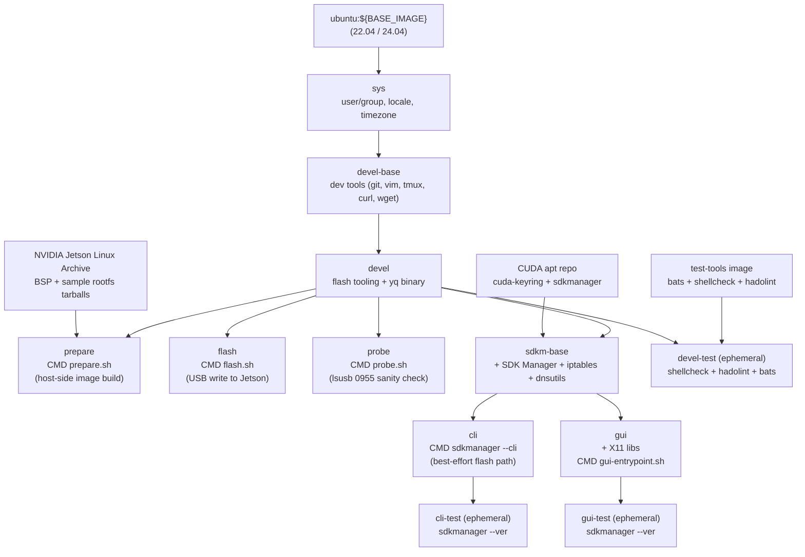

# Jetson Orin 工廠燒錄容器

[](https://github.com/ycpss91255-docker/jetson_sdk_manager/actions/workflows/main.yaml) [](../LICENSE)

容器化的 NVIDIA Jetson Linux（L4T）工廠燒錄流程，支援 Jetson Orin 系列裝置（AGX Orin、Orin NX、Orin Nano）。將官方 BSP archive 中的 `l4t_initrd_flash.sh --no-flash` / `--flash-only` 包裝為兩個可重現的 Docker stage。建構於 [`ycpss91255-docker/base`](https://github.com/ycpss91255-docker/base) 之上。本 repo（以及 URL 與 badge 所用的標準 slug）為 **`jetson_sdk_manager`**。

**[English](../README.md)** | **[繁體中文](README.zh-TW.md)** | **[简体中文](README.zh-CN.md)** | **[日本語](README.ja.md)**

> 英文版 [README.md](../README.md) 為權威版本；如有出入以英文為準。

---

## 支援版本

目前本 repo **只支援單一** JetPack / L4T release：

| JetPack | L4T release | 狀態 |
|---|---|---|
| 6.2.2 | R36.5.0（`r36_release_v5.0`） | 支援（唯一） |

其他 JetPack 版本**尚未**接好。新增一個只需改一個檔案：在 [`config/jetson/_l4t_mapping.yaml`](config/jetson/_l4t_mapping.yaml) 的 `jetpack_to_l4t` 下新增一筆（從 [Jetson Linux Archive](https://developer.nvidia.com/embedded/jetson-linux-archive) 取得 L4T release + BSP / rootfs URL），然後重建。見 [設定 `jetson.yaml`](#設定-jetsonyaml)。

---

## 目錄

- [支援版本](#支援版本)
- [開始之前](#開始之前)
- [TL;DR](#tldr)
- [前置需求](#前置需求)
- [設定 `jetson.yaml`](#設定-jetsonyaml)
- [快速開始](#快速開始)
- [驗證狀態](#驗證狀態)
- [兩條燒錄路徑](#兩條燒錄路徑)
- [Stages](#stages)
- [Clean 指令](#clean-指令)
- [SDK Manager（cli / gui）](#sdk-managercli--gui)
- [持久化資料](#持久化資料)
- [架構](#架構)
- [Smoke Tests](#smoke-tests)
- [目錄結構](#目錄結構)
- [疑難排解](#疑難排解)

---

## 開始之前

> **首次燒錄的預期條件（請先讀一次）：**
> - **Host**：一台 x86_64 **Linux** 機器（不是 Mac 上的 VM，flash 階段也不能用 WSL）。
> - **Data dir 檔案系統**：`./data/jetson_l4t/` 必須位於 **ext4 / xfs / btrfs** 上。在 repo 根目錄用 `df -T .` 確認；若 `Type` 是 `ntfs` / `exfat` / `fuseblk` / `vfat`，見 [前置需求](#前置需求) 的 bind-mount 修正。
> - **一條 USB-C 線**，接在 host 與 Jetson 前面板的 port 之間。
> - **時間**：端到端大約 **40 分鐘**（`prepare` 約 30 分鐘 + `flash` 約 10 分鐘），外加一次性的 BSP 下載。
>
> **首次使用的兩道關卡 —— 第一條指令前請務必確認兩者：**
> 1. **使用真正的 `git clone`，不要下載 ZIP。** 本 repo 以 Git subtree 形式把共用模板放在 `.base/` 下；GitHub 的「Download ZIP」會漏掉它，build 會壞。請用 `git` clone。
> 2. **你能不加 `sudo` 直接跑 `docker`。** 用 `docker run --rm hello-world` 驗證。若需要 `sudo`，把自己加入 `docker` group（`sudo usermod -aG docker "$USER"`，然後登出再登入）。
>
> **下文用語：**
> - **APX / recovery（REC）** —— Jetson 的 Boot ROM USB 燒錄模式。開機時按住 **REC** 鍵即可進入；host 隨後會看到板子為 USB `0955:7xxx`。本 README 中「APX recovery」與「recovery mode（REC）」是同一件事。
> - 在 **NetworkManager** host 上（多數筆電 / 桌機），`./script/nm_flash_guard.sh auto` 實質上是**必要**的 —— 沒有它，NM 會在燒錄途中拆掉 USB 傳輸。見 [快速開始](#快速開始) 下方的 [NetworkManager 說明](#快速開始)。

## TL;DR

最順的路徑，以 AGX Orin devkit 燒錄到 eMMC 為例。（其他 preset 步驟相同；見 [設定 `jetson.yaml`](#設定-jetsonyaml)。）

```bash
./script/host_setup.sh                                # 每次開機一次:qemu + nfsd + USB 調整(在 host 上跑)
./script/init_data_dirs.sh                            # 首次才需要：以你的身分(非 root)預建 data/ 掛載點
ln -sf config/jetson/agx-orin-emmc.yaml jetson.yaml   # 選一個 preset

make run -- -t prepare    # 階段 1：下載 BSP + 產生燒錄 image（約 30 分鐘）
# 將 Jetson 進入 APX recovery（REC）：斷電、按住 REC、接電、放開
./script/nm_flash_guard.sh auto   # 防止 NetworkManager 拆掉 USB 傳輸;板子開機後自動還原
make run -- -t flash      # 階段 2：寫入 Jetson（約 10 分鐘）

# ...或在 Jetson 已進入 APX recovery（REC）的情況下,一條指令跑完兩階段:
make run -- -t prepare && ./script/nm_flash_guard.sh auto && make run -- -t flash
```

> `./script/host_setup.sh` 一次跑完每次開機要做的 host 前置(見 [前置需求](#前置需求));`make run` 首次會自動 build 缺少的 stage image。想看有解說的完整流程——各 stage 的 `make build`、首次開機裝 `nvidia-jetpack`、headless 連線、中斷續跑——見 [快速開始](#快速開始)。兩種燒錄機制有何不同,見 [兩條燒錄路徑](#兩條燒錄路徑)。

## 前置需求

- **Host OS**：x86_64 Linux。
- **Docker Engine** >= v20.10.6。
- **Repo 所在的 host 檔案系統須為 ext4 / xfs / btrfs。** `apply_binaries.sh` 會在 rootfs 樹中產生 setuid binary（`sudo`）和 root 擁有的檔案。NTFS / exFAT / `fuseblk` / FAT 會在解壓時靜默丟掉 setuid 與 ownership，燒錄完成的 Jetson 開機後 `sudo` 拒絕啟動。`prepare.sh` 偵測到路徑落在這些檔案系統上會以 action 訊息中止；請先將 repo 移到別處（或 bind-mount 一個 ext4 目錄覆蓋 `./data/jetson_l4t/`）再重跑。
- **每次開機的 host 設定 — `./script/host_setup.sh`。** 在連接 Jetson 前於 host 上執行。一條指令會註冊 **QEMU binfmt**(`prepare` 跑 BSP 的 ARM64 工具)、載入 **`nfsd`** 模組(`flash` 透過本地 NFS export 把 payload 餵給 Jetson 的 initrd —— 無 `iptables` / `usb-gadget` forwarding)、關閉 **USB autosuspend**、把 **`usbfs` buffer** 拉到 2048 MB(後兩者避免 `tegrarcm_v2` / NFS bulk write 燒到一半卡住)、並**把燒錄 export 路徑 `/srv/jetson_l4t` 橋接進 host mount namespace**(kernel `nfsd` 從 host namespace 提供此 export,而僅存在於容器內的 bind mount 在那裡原本不可見)。這些重開機後都會重置,所以每次開機要再跑一次。兩件它**不會**幫你做的:
  - **持久化 `nfsd`**(下次開機免再載):`echo nfsd | sudo tee /etc/modules-load.d/nfsd.conf`。
  - **per-device autosuspend 覆寫**,若某個 port 仍把裝置 park(Jetson 進 APX 後用 `lsusb -t` 找路徑):`echo on | sudo tee /sys/bus/usb/devices/<bus>-<port>/power/control`。

  漏跑的症狀:沒 QEMU → `prepare` 出現 `chroot: ... Exec format error`;沒 `nfsd` → `flash` 出現 `RPC: Program not registered` / `Return value 114`;沒做 `/srv/jetson_l4t` 橋接 → Jetson 的 initrd `mount.nfs` 失敗並出現 `No such file or directory`。`prepare` 只需要 QEMU 那一步。

  **兩種不同的「Error 114」原因 —— 別搞混。**（a）**在 `flash` 一開始**就出現的 `Error 114` 加上 `RPC: Program not registered` / `NFS server is not running`，代表 host 的 `nfsd` 模組沒載入 —— 用 `host_setup.sh`（或 `sudo modprobe nfsd`）修正。（b）**傳輸進行到一半**才以 `Error 114` / `NFS server` 失敗的卡死，幾乎都是 **NetworkManager** 把 USB 鏈路拆掉，而非 `nfsd` —— 用 `./script/nm_flash_guard.sh auto` 修正。見 [疑難排解](#疑難排解) 中對應的兩條。
- **NetworkManager host 上的 `./script/nm_flash_guard.sh auto` —— 實質必要。** 多數筆電 / 桌機都跑 NetworkManager，它會對 Jetson 的 USB gadget 介面做 DHCP 探測，並在燒錄途中把鏈路拆掉。在 `make run -- -t flash` 前跑 `nm_flash_guard.sh auto`；它會在燒錄期間把該介面標記為 unmanaged，並在板子開機後自動還原 NM。只有在你確認 host 不跑 NetworkManager 時才可略過。
- **Jetson 進入 APX recovery（REC）**（僅 `flash` 階段需要；`prepare` 不需連 Jetson）。

## 設定 `jetson.yaml`

頂層的 `jetson.yaml` 是指向 `config/jetson/` 下某個 preset 的 symlink。挑一個符合你的 board + 儲存目標：

| Preset | 板子 | 儲存 |
|---|---|---|
| `agx-orin-emmc.yaml` | AGX Orin devkit | eMMC (`mmcblk0p1`) |
| `agx-orin-nvme.yaml` | AGX Orin devkit | NVMe (`nvme0n1p1`) |
| `agx-orin-usb.yaml` | AGX Orin devkit | USB SSD (`sda1`) |
| `orin-nx-nvme.yaml` | Orin NX devkit-super | NVMe |
| `orin-nano-nvme.yaml` | Orin Nano devkit-super | NVMe |
| `orin-nano-sd.yaml` | Orin Nano devkit-super | microSD（透過 USB reader） |

切換 preset 重新建立 symlink 即可：

```bash
ln -sf config/jetson/orin-nx-nvme.yaml jetson.yaml
```

每個 preset 設定：

- `jetpack.version` — 透過 `config/jetson/_l4t_mapping.yaml` 解析為 L4T release 版本及 BSP / rootfs 下載 URL。
- `hardware.board` — alias 對應到 NVIDIA `--target` 名稱。
- `storage.device` — alias 對應到 storage mode（eMMC 為 `internal`，NVMe / USB / SD 為 `external`）以及 Jetson recovery initrd 被告知寫入的預設 kernel device 路徑。
- `user.{username,password,hostname,autologin}` — 透過 `l4t_create_default_user.sh` 預先建立預設 user，首次開機跳過 OEM-config。preset 出廠帶有預設的 `jetson` / `jetson` 帳密；**首次登入後請更改密碼**（在裝置上 `passwd`），若板子日後會連上網路，燒錄前請先在這裡設成不同的密碼。
- `network`（選用）— 預設 DHCP；設定 `method: static` 會安裝一份 `NetworkManager` system-connection profile。

**多卡槽 USB reader / 非預設 device 編號。** USB SSD 或 microSD reader 在非預設 LUN 上曝出（典型是空卡槽 enumerate 為 `sda`，卡實際落在 `sdb`）時，加上 `storage.device_path` 覆蓋 alias 解析出的 kernel device：

```yaml
storage:
  device: usb
  device_path: sdb1      # 覆蓋 usb alias 預設的 sda1
```

要找對 device_path 值：先把儲存裝置接上 host，跑 `lsblk -d -o NAME,SIZE,VENDOR,MODEL,TRAN`。Jetson recovery initrd 多數情況下 enumeration 與 host 一致。若第一次燒錄仍以 `Error opening /dev/sd*: No medium found` 中止，換下一個字母（`sdb1` → `sdc1`）— 見 [疑難排解](#error-error-opening-devsda-no-medium-foundmicrosd-透過-usb-reader)。把 `device_path` 與 `storage.device: emmc`（internal mode）同時設定會在驗證階段被拒絕。

完整 schema 與註解見 `config/jetson/_example.yaml`。

**要新增 preset 尚未支援的 JetPack 版本**：編輯 `config/jetson/_l4t_mapping.yaml`，在 `jetpack_to_l4t` 下新增條目（從 [Jetson Linux Archive](https://developer.nvidia.com/embedded/jetson-linux-archive) 取得 `l4t_release` 及 `bsp_url` / `rootfs_url`），然後重建 prepare / flash image。

## 快速開始

> **`make run` 之前：** 每次開機先跑一次 `./script/host_setup.sh`(QEMU binfmt、`nfsd`、USB 調整 —— 見 [前置需求](#前置需求)),首次再跑 `./script/init_data_dirs.sh`(否則 Docker daemon 會以 root 建立 `data/` 掛載目錄,容器內的非 root 使用者將無法存取)。

```bash
./script/host_setup.sh      # 每次開機一次:QEMU binfmt + nfsd + USB 調整(在 host 上跑)
./script/init_data_dirs.sh  # 首次才需要
ln -sf config/jetson/agx-orin-emmc.yaml jetson.yaml

# 階段 1 — host 端產生 image（不需連 Jetson）
make build -- -t prepare
make run -- -t prepare

# 階段 2 — 寫入 Jetson
# Jetson 進入 APX recovery：斷電、按住 REC、接電、放開。
make build -- -t probe   # 一次只能 build 一個 stage（最後的 -t 生效），分開 build
make build -- -t flash
make run -- -t probe     # 確認 Jetson 在 APX (exit 0 = ready to flash)
./script/nm_flash_guard.sh auto   # 見下方「NetworkManager」說明
make run -- -t flash
```

在跑 NetworkManager 的 host 上（多數筆電 / 桌機），燒錄可能在中途以一個誤導性的 `NFS server` / `Error 114` 失敗卡住：NM 試圖對 Jetson 的 USB gadget 介面做 DHCP、逾時，並在傳輸途中移除位址。`./script/nm_flash_guard.sh auto` 會在燒錄期間把該介面標記為 unmanaged，接著**在板子以已開機裝置（`0955:7020`）重新 enumerate 的那一刻自動重新啟用 NM** —— host 隨即取得 `192.168.55.x`，你就能 SSH 進去，無需手動 `enable`。即使燒錄中止，一個 timeout（預設 1800 秒，可用第一個參數覆寫）也會還原 NM。`disable` / `enable` / `around` / `status` 等子指令見 [`nm_flash_guard.sh`](script/nm_flash_guard.sh)。

Jetson 從新燒錄的 OS 開機後，從 NVIDIA OTA apt repository 安裝 JetPack 其他元件：

```bash
sudo apt update
sudo apt install -y nvidia-jetpack
```

安裝 CUDA、cuDNN、TensorRT、VPI、多媒體 API、container runtime 等。與 SDK Manager 推送的套件集相同，只是改由 Jetson 自行拉取。

### 首次連線（USB，免設定網路）

燒錄進去的 L4T rootfs 內建 NVIDIA 的 USB device-mode 服務，所以 Jetson 會在燒錄用的同一條 USB-C 線上固定以 **`192.168.55.1`** 對外，**不需要** `jetson.yaml` 的 `network:` 設定：

```bash
ssh <username>@192.168.55.1     # 帳號 / 密碼來自 jetson.yaml 的 user.* 區塊
```

> 若你用預設的 `jetson` / `jetson` 帳密燒錄，請現在就在裝置上用 `passwd` **更改密碼** —— 預設值眾所周知，而板子可透過 USB（以及任何已設定的網路）連到。

Host 端會自動在 USB 網路介面配上 `192.168.55.x`（用 `ip a` 確認）。這條鏈路與選用的 [`network:`](#設定-jetsonyaml) 區塊（透過 NetworkManager 設定 Jetson 的乙太 / Wi-Fi）互相獨立、可並存。`192.168.55.1` 是 L4T 內建寫死的，無法從本 repo 更改。

### 中斷後續跑

每個階段會將進度記錄在 `data/jetson_l4t/.../.prepared.yaml`。重新執行 `make run -- -t prepare` 會略過已完成步驟（BSP 下載、rootfs 解壓、`apply_binaries.sh`、user 建立、image 產生）。若 JetPack / board 改變，會被偵測為 mismatch 並以 action 訊息中止，提示執行 `./script/clean.sh l4t`。

## 驗證狀態

對於「真正燒錄過」與「僅知道能 build 與驗證」要誠實區分。

**CI 證明了什麼（且僅此而已）：** 每個 stage 的 image build、`shellcheck` + `hadolint` lint、`bats` smoke 套件，以及 `sdkmanager --ver`。**CI 不會跑真正的燒錄** —— CI 中沒有接 Jetson 硬體，所以不會在那裡執行端到端燒錄、NFS serve 或 eMMC write。只有 hardware-in-the-loop 測試才能涵蓋的步驟，見 [TEST.md 中的 HITL-ONLY 路徑](test/TEST.md)。

各 preset 狀態：

| Preset | 狀態 |
|---|---|
| `agx-orin-emmc.yaml` | 已於硬體驗證 2026-06，JetPack 6.2.2 |
| `agx-orin-nvme.yaml` | 僅 config 驗證 |
| `agx-orin-usb.yaml` | 僅 config 驗證 |
| `orin-nx-nvme.yaml` | 僅 config 驗證 |
| `orin-nano-nvme.yaml` | 僅 config 驗證 |
| `orin-nano-sd.yaml` | 僅 config 驗證 |

「僅 config 驗證」表示該 preset 能解析、能解開 alias、能 build 燒錄 image，但對該 board + storage 的完整 `flash` 階段尚未在真實硬體上確認。各 preset 機制相同，所以僅 config 驗證的 preset 預期可正常運作；只是尚未端到端簽核。

## 兩條燒錄路徑

本 repo 提供兩種燒錄 Jetson 的方式。**工廠燒錄是文件記載的預設路徑**；SDK Manager 則是 best-effort 的替代方案。

| | **工廠燒錄**（`prepare` / `flash` / `probe`） | **SDK Manager**（`cli` / `gui`） |
|---|---|---|
| 狀態 | **預設**。CI 只證明 build + lint + bats（**無**真正燒錄）；`agx-orin-emmc` 已於硬體端到端驗證（見 [驗證狀態](#驗證狀態)） | Best-effort。CI 只 build + smoke `sdkmanager --ver`；真正的 SDK Manager 燒錄**從不**經 CI 驗證 |
| NVIDIA 登入 | 不需要 | **需要**（session 持久化於 `data/nvsdkm`） |
| 模式 | 可腳本化 / headless / 可離線快取 | 互動式元件挑選 + host 開發工具 |
| 機制 | 透過 `tegrarcm_v2` USB 連線跑 `l4t_initrd_flash.sh` —— 無 device-mode forwarding | SDK Manager 的 NFS + `iptables` + USB device-mode forwarding |

**prepare** stage 使用 BSP 自帶的 `l4t_initrd_flash.sh --no-flash` 於 host 端產生燒錄 image（不需 Jetson、不需 NVIDIA 登入）;**flash** stage 以 `--flash-only` 寫入 —— Jetson 透過 `tegrarcm_v2` USB 連線開機進一個精簡 initrd,再從這條鏈路上的本地 NFS export 拉取 image。這需要 host 載入 `nfsd` 模組(見 [前置需求](#前置需求)),但**不需** `iptables` 或 `usb-gadget` device-mode forwarding。

**SDK Manager 並_不是_「在 Docker 內壞掉」** —— 這是本 repo 早先的說法、現已撤回。眾所周知的 [Flashing-99% 卡死](https://forums.developer.nvidia.com/t/docker-sdk-manager-flash-nx-struck-at-99/365066) 其實是 **host 的 NetworkManager** 對 USB gadget 鏈路做 DHCP 探測並把它拆掉所致（[#48](https://github.com/ycpss91255-docker/jetson_sdk_manager/issues/48)），已由 [`nm_flash_guard.sh`](script/nm_flash_guard.sh) 修正;而 *"Device mode forwarding host setup failed"* 那一步只是缺了 `iptables` + `dnsutils`，現已收進 `sdkm-base`。搭配 [共用的 host 前置](#前置需求)（`host_setup.sh`、`nm_flash_guard.sh auto`）並登入 NVIDIA 帳號後，SDK Manager 即可燒錄 —— 見 [SDK Manager（cli / gui）](#sdk-managercli--gui)。工廠燒錄之所以仍是預設,是因為它不需登入且可腳本化 / 可離線。

## Stages

| Stage | 用途 | 需連 Jetson |
|---|---|---|
| `devel` | 燒錄工具（`l4t_initrd_flash.sh` 依賴）。`make build` 預設 target。 | 否 |
| `devel-test` | Lint（`shellcheck` + `hadolint`）+ bats smoke tests。僅 CI。 | 否 |
| `prepare` | 階段 1 — 下載 BSP + sample rootfs、`apply_binaries.sh`、`l4t_create_default_user.sh`、`l4t_initrd_flash --no-flash`。 | 否 |
| `flash` | 階段 2 — `l4t_initrd_flash --flash-only`。 | **是**，APX recovery |
| `probe` | 診斷。掃 USB 找 NVIDIA vendor `0955`，標註每個裝置是否在 recovery 範圍，沒有 Jetson 在 APX 時 exit 非 0。flash 前跑一下確認連線, 不用承擔整個 flash 流程。 | 建議 |
| `sdkm-base` | `cli` / `gui` 共用的 SDK Manager 層（`sdkmanager` + `iptables` + `dnsutils`）。不直接執行。讓 `devel` 保持精簡。 | 否 |
| `cli` | SDK Manager **headless CLI** —— best-effort 的替代燒錄路徑（`sdkmanager --cli`）。工廠 `prepare`/`flash` stage 仍是受支援的預設。 | 燒錄時需要 |
| `cli-test` | `sdkmanager --ver` sanity check。僅 CI。 | 否 |
| `gui` | SDK Manager **GUI** —— best-effort 燒錄 + JetPack 目錄瀏覽器。見 [SDK Manager（cli / gui）](#sdk-managercli--gui)。 | 燒錄時需要 |
| `gui-test` | `sdkmanager --ver` sanity check。僅 CI。 | 否 |

## Clean 指令

`script/clean.sh` 透過一次性 `alpine:3` 容器操作 `./data/jetson_l4t/`，不需 host 端工具。

| 指令 | 效果 |
|---|---|
| `./script/clean.sh build` | 只移除產生的燒錄 image（`tools/kernel_flash/images/`）。 |
| `./script/clean.sh rootfs` | 只移除 `rootfs/`，保留 BSP 與已下載的 tarball。 |
| `./script/clean.sh l4t` | 移除整個 `Linux_for_Tegra/` 樹（BSP + rootfs + image）。保留 tarball。 |
| `./script/clean.sh all` | l4t + 移除 `data/downloads/` tarball。 |

當 `prepare.sh` 報 JetPack 版本 mismatch 時，執行 `./script/clean.sh l4t` 重置。

## SDK Manager（cli / gui）

工廠 `prepare` / `flash` stage 是受支援的預設。SDK Manager 以兩個 **best-effort** stage 提供給偏好 NVIDIA 自家工具、或想瀏覽 JetPack `.deb` 目錄的使用者：`cli`（`sdkmanager --cli`）與 `gui`（圖形化客戶端）。兩者都建構於 `sdkm-base` 之上，後者補上 SDK Manager 在 Docker 內做 device-mode forwarding 所需的 `iptables` + `dnsutils`。

```bash
make build -- -t gui    # 或：-t cli
make run -- -t gui      # 或：-t cli
```

Best-effort 意味著：CI 會 build 這些 stage 並 smoke `sdkmanager --ver`，但真正的 SDK Manager 燒錄是手動的，且可能隨 NVIDIA 上游漂移。要讓 GUI/CLI 燒錄成功，請先比照工廠路徑做好相同的 host 前置 —— `./script/host_setup.sh` 與 `./script/nm_flash_guard.sh auto` —— 並登入你的 NVIDIA Developer 帳號。`gui` entrypoint 會印出含這些步驟的 banner，接著（互動模式下）等你按 Enter 才啟動；`-t gui` 之後額外的位置參數會被轉發給 `sdkmanager-gui`（接在 `--no-sandbox` 之後）。GUI 模式需要 host 上的 X11 session（由 base template 自動轉發）。

GUI 模式需要 host 上的 X11 session；base template 會自動偵測 `$DISPLAY` 並轉發 X11 socket 與 `XAUTHORITY`。

## 持久化資料

`./data/` 下的每個路徑都會 bind-mount 進容器（gitignored）。

| Host 路徑 | 容器路徑 | 用途 |
|---|---|---|
| `./data/jetson_l4t/` | `/srv/jetson_l4t` | BSP + rootfs + 產生的燒錄 image（工廠燒錄流程）。**必須是 ext4 / xfs / btrfs。** |
| `./data/downloads/` | `${HOME}/Downloads/nvidia/sdkm_downloads` | 快取的 tarball（BSP + sample rootfs），與 SDK Manager 共用。 |
| `./data/nvsdkm/` | `${HOME}/.nvsdkm` | SDK Manager 登入 session 快取。僅 `cli` / `gui` stage。 |
| `./data/nvidia_sdk/` | `${HOME}/nvidia/nvidia_sdk` | SDK Manager 管理的 SDK 安裝目錄。僅 `cli` / `gui` stage。 |
| `./jetson.yaml` | `/etc/jetson.yaml`（唯讀） | 使用者設定，被 `prepare.sh` / `flash.sh` / `gui-entrypoint.sh` 讀取。 |

## 架構



## Smoke Tests

詳見 [TEST.md](test/TEST.md)。

```bash
make build test
```

`devel-test` stage 對 `devel` image 跑 bats 測試；兩個 `sdkmanager` 斷言會在此被 skip（只在於 `cli` / `gui` image 內重跑 bats 時才會執行）。

## 目錄結構

```text
jetson_sdk_manager/
├── jetson.yaml -> config/jetson/agx-orin-emmc.yaml   # symlink；切換 preset
├── compose.yaml                 # Docker Compose（衍生，gitignored）
├── Dockerfile                   # sys → devel-base → devel → {prepare, flash, probe, sdkm-base → cli/gui}
├── Makefile -> .base/script/docker/Makefile
├── .base/                       # 共用模板（git subtree）
├── data/                        # 持久化狀態（gitignored）
│   ├── jetson_l4t/              #   BSP + rootfs + 燒錄 image
│   ├── downloads/               #   BSP / rootfs tarball
│   ├── nvsdkm/                  #   SDK Manager 登入 session（cli/gui）
│   └── nvidia_sdk/              #   SDK Manager 安裝目錄（cli/gui）
├── config/
│   ├── docker/setup.conf        # 執行期設定 — source of truth
│   ├── jetson/                  # 燒錄 preset 與 schema
│   │   ├── _example.yaml        #   含註解的 canonical schema
│   │   ├── _l4t_mapping.yaml    #   JetPack → L4T release / URL（build-time）
│   │   └── *.yaml               #   各 board / storage 的 preset
│   └── packages/                # gui stage 的 X11 lib 清單（按 Ubuntu codename）
├── doc/
│   ├── adr/                     # 架構決策記錄
│   ├── changelog/CHANGELOG.md
│   ├── test/TEST.md
│   ├── Flash_Workflow.md        # prepare/flash 階段深入說明
│   ├── README.zh-TW.md
│   ├── README.zh-CN.md
│   └── README.ja.md
├── script/
│   ├── prepare.sh               # 階段 1 entrypoint
│   ├── flash.sh                 # 階段 2 entrypoint
│   ├── clean.sh                 # Volume 清理指令
│   ├── gui-entrypoint.sh        # SDK Manager GUI 啟動器 + best-effort banner
│   ├── lib/                     # yaml / download / volume / errors helpers
│   ├── host_setup.sh            # 一次性 per-boot host 前置(qemu/nfsd/USB)
│   ├── init_data_dirs.sh        # 首次以非 root 建立 data/
│   ├── entrypoint.sh            # 容器 entrypoint（logging tee）
│   ├── build.sh -> ../.base/script/docker/wrapper/build.sh
│   ├── run.sh   -> ../.base/script/docker/wrapper/run.sh
│   ├── exec.sh  -> ../.base/script/docker/wrapper/exec.sh
│   ├── stop.sh  -> ../.base/script/docker/wrapper/stop.sh
│   ├── setup.sh -> ../.base/script/docker/wrapper/setup.sh
│   ├── setup_tui.sh -> ../.base/script/docker/wrapper/setup_tui.sh
│   └── prune.sh -> ../.base/script/docker/wrapper/prune.sh
├── test/smoke/orin_install_env.bats
├── .github/workflows/main.yaml
└── .gitignore
```

## 疑難排解

### `prepare.sh` 中止：「L4T_ROOT ... is on ntfs/exfat/fuseblk」

`apply_binaries.sh` 會產生 setuid binary（`sudo`）和 root 擁有的檔案。NTFS / exFAT / `fuseblk` / FAT 會靜默丟掉這兩者，產生的 Jetson 開機後 `sudo` 拒絕啟動。請將 repo 移到 ext4 / xfs / btrfs 分割區，或 bind-mount 一個 ext4 目錄覆蓋 `./data/jetson_l4t/`：

```bash
sudo mkdir -p /var/lib/jetson_l4t
sudo mount --bind /var/lib/jetson_l4t ./data/jetson_l4t
```

Bind-mount target 不必在系統碟上 — 任何 ext4 / xfs / btrfs 分割區內的目錄都可以，包含第二顆 SSD 或已掛載的資料碟。選一個剩餘空間夠的（一次完整 prepare 約需 15 GB）：

```bash
sudo mkdir -p /media/<ext4-mount>/jetson_l4t
sudo mount --bind /media/<ext4-mount>/jetson_l4t ./data/jetson_l4t
```

兩種 bind mount 都不會 persistent；重開機後跑 `make run -- -t prepare` 前要再 mount 一次。

僅供診斷用途，`JETSON_ALLOW_NON_UNIX_FS=1` 把 abort 降為警告：

```bash
JETSON_ALLOW_NON_UNIX_FS=1 make run -- -t prepare
```

**此 flag 不能在非 unix 檔案系統上產出可用的 flash**。NVIDIA `apply_binaries.sh` 自己會用 `find rootfs/etc/passwd -user root -group root` 檢查 rootfs ownership，sample rootfs 解壓到錯誤的 owner 之後它會在第 7/10 步自行 abort。這道 escape hatch 只是讓 maintainer 能跑到那一步實證失敗模式，不是繞過 filesystem 限制的方法。

### `prepare.sh` 中止：volume mismatch

`.prepared.yaml` marker 顯示 volume 是為其他 JetPack / board 準備的，與目前 `jetson.yaml` 選擇的不同。清掉重跑：

```bash
./script/clean.sh l4t
make run -- -t prepare
```

### `chroot: failed to run command 'dpkg': Exec format error`

Host kernel 無法執行 ARM64 binary。註冊 QEMU binfmt interpreter：

```bash
docker run --rm --privileged multiarch/qemu-user-static --reset -p yes
```

每次開機執行一次。

### `Could not detect a board` / Jetson 未進入 recovery

`flash.sh` 會檢查 `lsusb` 是否出現 NVIDIA VID `0955` + recovery PID（`7023` / `7223` / `7423` / `7523` / `7e19`），若無則中止。可以單獨跑 `probe` stage 做同樣檢查 — 測試不同線材 / port 時不用每次都跑完整 flash 流程：

```bash
make run -- -t probe
```

它會列出 bus 上所有 NVIDIA-vendor 裝置, 標註哪些在 recovery 範圍, 且只有至少一個在 recovery 時才 exit 0。

進入 recovery mode 步驟：

1. 斷電。
2. 用 USB-C 線連接 Jetson **前面板**（按鈕側）與 host。
3. 按住 **REC**（中間按鈕）。
4. 接電（或按 Power）。
5. 約 2 秒後放開 REC。

在 host 驗證：

```bash
lsusb | grep -i 'NVIDIA Corp'
```

| 輸出 | 狀態 |
|---|---|
| `0955:7023` / `7223` / `7423` / `7523` / `7e19` NVIDIA Corp. APX | Jetson 進入 recovery（可以開始 flash） |
| `0955:<其他 PID>` | 已開機進 OS — 重新進入 recovery |
| （無輸出） | 未偵測到 — 換線 / 換 port / 直連（不要用 hub） |

Recovery mode 走 USB 2.0（480 Mbps），這是正常的 — APX 模式下 USB 3 controller 不啟用。

### `clnt_create: RPC: Program not registered` / `NFS server is not running` / `Error 114`

`flash` 階段的 `l4t_initrd_flash.sh` 透過本地 NFS export 把燒錄 payload 餵給 Jetson 的 initrd,但容器與 host 共用 kernel,而 host 沒載入 `nfsd` 模組:

```
 * Not starting NFS kernel daemon: no support in current kernel.
clnt_create: RPC: Program not registered
NFS server is not running
make: *** [Makefile:41: run] Error 114
```

在 host 上(不是容器內)載入它,再重跑 flash:

```bash
sudo modprobe nfsd
make run -- -t flash
```

用 `echo nfsd | sudo tee /etc/modules-load.d/nfsd.conf` 讓它重開機後仍生效。見 [前置需求](#前置需求)。`flash.sh` 現在會先檢查並以相同指引提早中止。

### 燒錄中途卡住 /「Flashing - 99%」/ `mount.nfs: No such file or directory`

容器內的燒錄（任一路徑）卡在中途，幾乎都是 **host 的 NetworkManager** 對 Jetson 的 USB gadget 介面做 DHCP 探測、逾時，並在傳輸途中移除位址所致 —— 這正是 [#48](https://github.com/ycpss91255-docker/jetson_sdk_manager/issues/48) 追查出的根因。燒錄前跑 `./script/nm_flash_guard.sh auto`（它會把該介面標記為 unmanaged，接著在板子開機後重新啟用 NM）。若你看到的是 `mount.nfs: ... No such file or directory`，則是缺了 host 端的 `/srv/jetson_l4t` 橋接 —— `./script/host_setup.sh` 會把它設好（步驟 5/5）。

### SDK Manager:「Device mode forwarding host setup failed」

這**不是** Docker 的根本限制（早先的 README 曾這麼說 —— 那是錯的）。SDK Manager 的 `device_mode_host_setup.sh` 需要 `iptables`（NAT MASQUERADE）與 `dig`（一個 DNS 可達性探測）;兩者現在都包含在 `sdkm-base` 層，所以 `cli` / `gui` stage 能通過這一步。若仍失敗，確認你已跑過 `./script/host_setup.sh` + `./script/nm_flash_guard.sh auto` 並已登入你的 NVIDIA Developer 帳號。背景：[#48](https://github.com/ycpss91255-docker/jetson_sdk_manager/issues/48)。

### `ERROR: might be timeout in USB write` / `Return value 3`

Boot ROM 通訊在 USB bulk transfer 時卡住：

```
Sending bct_br
ERROR: might be timeout in USB write.
Error: Return value 3
```

前次燒錄中斷遺留的 USB endpoint 狀態。需要**硬體** power-cycle 重新進入 APX recovery——斷電、按住 REC、接電、放開(`tegrarcm_v2 --reboot recovery` 不夠)。

同時確認本次開機已跑過 `./script/host_setup.sh`——它會拉高 USB buffer 並關閉 autosuspend(見 [前置需求](#前置需求))。

### `Error: Error opening /dev/sda: No medium found`（microSD 透過 USB reader）

多卡槽 combo reader 會把每個卡槽當作獨立 LUN，而 `usb` alias 預設對到 `sda1`。空卡槽 enumerate 為 `sda` 而卡實際在 `sdb` 時，燒錄在還沒碰到卡之前就中止：

```bash
$ lsblk -d -o NAME,SIZE,VENDOR,MODEL,TRAN
sda    0B  Generic-  SD/MMC          usb     # 空槽
sdb  117.8G Generic-  Micro SD/M2    usb     # 卡實際在這
```

**找對 `device_path`**（host enumeration 多數情況下與 Jetson recovery initrd 一致，但不保證）：

1. 把儲存裝置按燒錄時的 USB 接法接上 host。
2. 跑 `lsblk -d -o NAME,SIZE,VENDOR,MODEL,TRAN`；`SIZE` 對應你的卡 / SSD 那一個就是目標 device。
3. 在 `jetson.yaml` 設 `storage.device_path: <name>1`（例如 `sdb1`）— partition `1` 是 `l4t_initrd_flash.sh` 預期的。

若第一次嘗試仍同樣失敗，Jetson initrd 在 bus 上 enumerate 的順序與 host 不同；換下一個字母（`sdb1` → `sdc1`）。完整 override 語義見 [設定 `jetson.yaml`](#設定-jetsonyaml)。

其他變通方案（依推薦度排序）：

1. 用單槽 microSD reader — 永遠 enumerate 為 `sda`，符合 alias 預設。
2. 把卡移到對應 `/dev/sda` 的槽（必要時用 microSD-to-SD 轉接卡）。

### 燒錄到 APP partition 卡住（external storage）

USB ethernet 在大量持續傳輸時偶爾會在 APP partition 解壓階段卡住，~12 分鐘後 timeout 失敗。解法：

1. 改燒到 **eMMC**（`storage.device: emmc`），然後在 Jetson 上 `sudo apt install nvidia-jetpack`。
2. 用 **NVMe SSD** — PCIe 直寫比 USB-ethernet 解壓快。
3. Jetson 完全 power-cycle 後重試。
