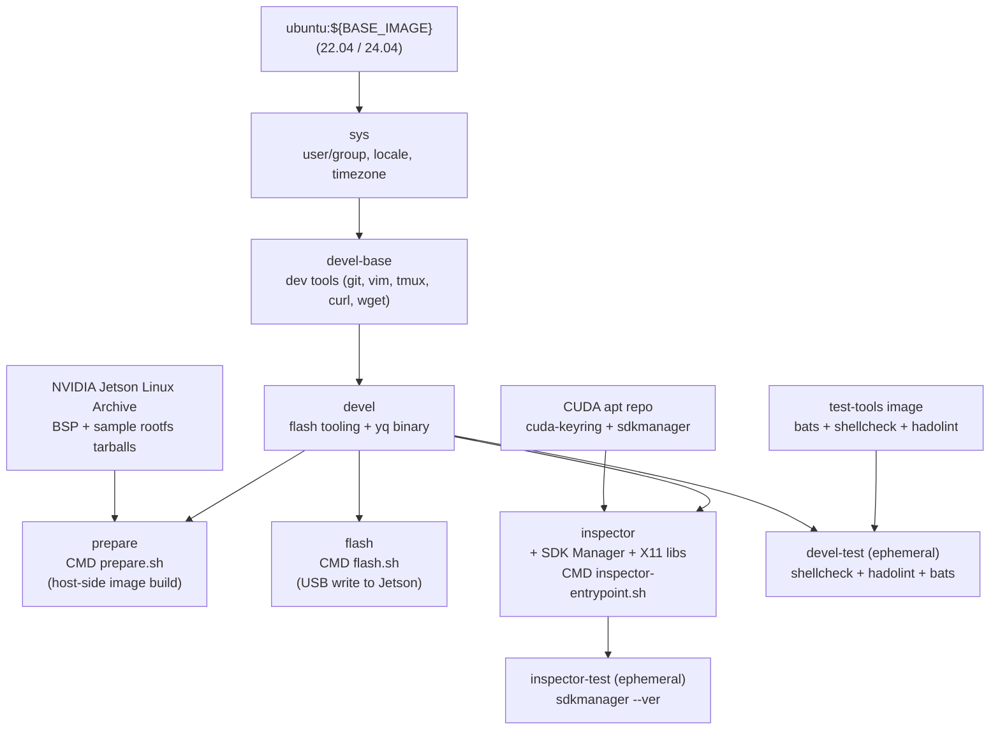

# Jetson Orin 工廠燒錄容器

[](https://github.com/ycpss91255-docker/jetson_sdk_manager/actions/workflows/main.yaml) [](../LICENSE)

容器化的 NVIDIA Jetson Linux（L4T）工廠燒錄流程，支援 Jetson Orin 系列裝置（AGX Orin、Orin NX、Orin Nano）。將官方 BSP archive 中的 `l4t_initrd_flash.sh --no-flash` / `--flash-only` 包裝為兩個可重現的 Docker stage。建構於 [`ycpss91255-docker/base`](https://github.com/ycpss91255-docker/base) 之上。

**[English](../README.md)** | **[繁體中文](README.zh-TW.md)** | **[简体中文](README.zh-CN.md)** | **[日本語](README.ja.md)**

---

## 目錄

- [TL;DR](#tldr)
- [為什麼用工廠燒錄而非 SDK Manager](#為什麼用工廠燒錄而非-sdk-manager)
- [前置需求](#前置需求)
- [設定 `jetson.yaml`](#設定-jetsonyaml)
- [快速開始](#快速開始)
- [Stages](#stages)
- [Clean 指令](#clean-指令)
- [Inspector（SDK Manager GUI）](#inspectorsdk-manager-gui)
- [持久化資料](#持久化資料)
- [架構](#架構)
- [Smoke Tests](#smoke-tests)
- [目錄結構](#目錄結構)
- [疑難排解](#疑難排解)

---

## TL;DR

```bash
ln -sf config/jetson/agx-orin-emmc.yaml jetson.yaml   # 選一個 preset

make run -- -t prepare    # 階段 1：下載 BSP + 產生燒錄 image（約 30 分鐘）
# 將 Jetson 進入 APX recovery（按住 REC + 點 RESET）
make run -- -t flash      # 階段 2：寫入 Jetson（約 10 分鐘）
```

Jetson 首次開機後，於裝置上安裝 JetPack 元件：

```bash
sudo apt update && sudo apt install -y nvidia-jetpack
```

## 為什麼用工廠燒錄而非 SDK Manager

NVIDIA SDK Manager 的 GUI 與 `--cli` 流程，是透過在 host 上跑 NFS server、將 rootfs 經由 USB device-mode 匯出至裝置，並使用 `iptables` 橋接 host 網路堆疊來完成燒錄。在 Docker 內（即使加上 `--privileged --network host`）這個組合無法可靠運作：NFS server 綁定不穩、容器內 `iptables` 規則不一定能影響 host nftables、`usb-gadget` device-mode forwarding 失敗。典型症狀就是 [Flashing - 99% 卡死](https://forums.developer.nvidia.com/t/docker-sdk-manager-flash-nx-struck-at-99/365066)，NVIDIA 官方 Docker image 也有同樣問題。

本 repo 直接繞過此路徑：**prepare** stage 使用 BSP 自帶的 `l4t_initrd_flash.sh --no-flash` 於 host 端產生燒錄 image（不需 Jetson、不需 NFS、不需 `iptables`）；**flash** stage 再透過單純的 `tegrarcm_v2` USB 連線以 `--flash-only` 寫入。

SDK Manager 仍保留於 **`inspector`** stage，用途是瀏覽 JetPack 的元件目錄、查詢有哪些 `.deb` 套件。其 Install 按鈕在 Docker 內仍然失效；entrypoint 會印 banner 提醒這點。

## 前置需求

- **Host OS**：x86_64 Linux。
- **Docker Engine** >= v20.10.6。
- **Repo 所在的 host 檔案系統須為 ext4 / xfs / btrfs。** `apply_binaries.sh` 會在 rootfs 樹中產生 setuid binary（`sudo`）和 root 擁有的檔案。NTFS / exFAT / `fuseblk` / FAT 會在解壓時靜默丟掉 setuid 與 ownership，燒錄完成的 Jetson 開機後 `sudo` 拒絕啟動。`prepare.sh` 偵測到非 unix FS 會以 action 訊息中止；請將 repo 移到 ext4 / xfs / btrfs 分割區，或 bind-mount 一個 ext4 目錄覆蓋 `./data/jetson_l4t/`。
- **QEMU binfmt** — prepare 階段執行 BSP 中的 ARM64 工具需要：

  ```bash
  docker run --rm --privileged multiarch/qemu-user-static --reset -p yes
  ```

  每次開機後執行一次。透過 Docker 註冊 ARM64 翻譯至 kernel，不需安裝 host 套件。

- **USB host buffer** — `tegrarcm_v2` bulk write 偶爾會卡在預設的 16 MB。每次開機調整一次：

  ```bash
  echo 2048 | sudo tee /sys/module/usbcore/parameters/usbfs_memory_mb
  ```

- **USB auto-suspend** — 連接 Jetson 的 port 必須關閉 auto-suspend，否則 `tegrarcm_v2` 可能在寫入過程中因 kernel 把裝置 park 而卡住。最簡便是本次開機全域關掉：

  ```bash
  echo -1 | sudo tee /sys/module/usbcore/parameters/autosuspend
  ```

  若只想針對單一裝置（Jetson 進 APX recovery 後用 `lsusb -t` 找路徑，對應到 `/sys/bus/usb/devices/<bus>-<port>/`）：

  ```bash
  echo on | sudo tee /sys/bus/usb/devices/<bus>-<port>/power/control
  ```
- **Jetson 進入 APX recovery**（僅 `flash` 階段需要；`prepare` 不需連 Jetson）。

## 設定 `jetson.yaml`

頂層的 `jetson.yaml` 是指向 `config/jetson/` 下某個 preset 的 symlink。挑一個符合你的 board + 儲存目標：

| Preset | 板子 | 儲存 |
|---|---|---|
| `agx-orin-emmc.yaml` | AGX Orin devkit | eMMC (`mmcblk0p1`) |
| `agx-orin-nvme.yaml` | AGX Orin devkit | NVMe (`nvme0n1p1`) |
| `agx-orin-usb.yaml` | AGX Orin devkit | USB SSD (`sda1`) |
| `orin-nx-nvme.yaml` | Orin NX devkit-super | NVMe |
| `orin-nano-nvme.yaml` | Orin Nano devkit-super | NVMe |
| `orin-nano-sd.yaml` | Orin Nano devkit-super | microSD（透過 USB reader） |

切換 preset 重新建立 symlink 即可：

```bash
ln -sf config/jetson/orin-nx-nvme.yaml jetson.yaml
```

每個 preset 設定：

- `jetpack.version` — 透過 `config/jetson/_l4t_mapping.yaml` 解析為 L4T release 版本及 BSP / rootfs 下載 URL。
- `hardware.board` — alias 對應到 NVIDIA `--target` 名稱。
- `storage.device` — alias 對應到 storage mode（eMMC 為 `internal`，NVMe / USB / SD 為 `external`）以及 external mode 下 Jetson recovery initrd 看到的預設 kernel device 路徑。
- `user.{username,password,hostname,autologin}` — 透過 `l4t_create_default_user.sh` 預先建立預設 user，首次開機跳過 OEM-config。
- `network`（選用）— 預設 DHCP；設定 `method: static` 會在 rootfs 內安裝 `NetworkManager` system-connection profile。

**多卡槽 USB reader / 非預設 device 編號。** USB SSD 或 microSD reader 在非預設 LUN 上曝出（典型是空卡槽 enumerate 為 `sda`，卡實際落在 `sdb`）時，加上 `storage.device_path` 覆蓋 alias 解析出的 kernel device：

```yaml
storage:
  device: usb
  device_path: sdb1      # 覆蓋 usb alias 預設的 sda1
```

要找對 device_path 值：先把儲存裝置接上 host，跑 `lsblk -d -o NAME,SIZE,VENDOR,MODEL,TRAN`。Jetson recovery initrd 多數情況下 enumeration 與 host 一致。若第一次燒錄仍以 `Error opening /dev/sd*: No medium found` 中止，換下一個字母（`sdb1` → `sdc1`）— 見 [疑難排解](#error-error-opening-devsda-no-medium-foundmicrosd-透過-usb-reader)。把 `device_path` 與 `storage.device: emmc`（internal mode）同時設定會在驗證階段被拒絕。

完整 schema 與註解見 `config/jetson/_example.yaml`。

**要新增 JetPack 版本**：編輯 `config/jetson/_l4t_mapping.yaml`，在 `jetpack_to_l4t` 下新增條目（從 [Jetson Linux Archive](https://developer.nvidia.com/embedded/jetson-linux-archive) 取得 `l4t_release` 及 `bsp_url` / `rootfs_url`），然後重建 prepare / flash image。

## 快速開始

> **首次使用：** 在 `make run` 之前先執行 `./script/init_data_dirs.sh`。略過此步驟會讓 Docker daemon 以 root 建立 `data/` 掛載目錄，容器內的非 root 使用者將無法存取。

```bash
./script/init_data_dirs.sh
ln -sf config/jetson/agx-orin-emmc.yaml jetson.yaml

# 階段 1 — host 端產生 image（不需連 Jetson）
make build -- -t prepare
make run -- -t prepare

# 階段 2 — 寫入 Jetson
# Jetson 進入 APX recovery：斷電、按住 REC、接電、放開。
# 在 host 驗證：`lsusb | grep 0955` 應出現如 0955:7023 NVIDIA Corp APX
make build -- -t flash
make run -- -t flash
```

Jetson 從新燒錄的 OS 開機後，從 NVIDIA OTA apt repository 安裝 JetPack 其他元件：

```bash
sudo apt update
sudo apt install -y nvidia-jetpack
```

安裝 CUDA、cuDNN、TensorRT、VPI、多媒體 API、container runtime 等。與 SDK Manager 推送的套件集相同，只是改由 Jetson 自行拉取。

### 中斷後續跑

每個階段會將進度記錄在 `data/jetson_l4t/.../.prepared.yaml`。重新執行 `make run -- -t prepare` 會略過已完成步驟（BSP 下載、rootfs 解壓、`apply_binaries.sh`、user 建立、image 產生）。若 JetPack / board 改變，會被偵測為 mismatch 並以 action 訊息中止，提示執行 `./script/clean.sh l4t`。

## Stages

| Stage | 用途 | 需連 Jetson |
|---|---|---|
| `devel` | 燒錄工具（`l4t_initrd_flash.sh` 依賴）。`make build` 預設 target。 | 否 |
| `devel-test` | Lint（`shellcheck` + `hadolint`）+ bats smoke tests。僅 CI。 | 否 |
| `prepare` | 階段 1 — 下載 BSP + sample rootfs、`apply_binaries.sh`、`l4t_create_default_user.sh`、`l4t_initrd_flash --no-flash`。 | 否 |
| `flash` | 階段 2 — `l4t_initrd_flash --flash-only`。 | **是**，APX recovery |
| `inspector` | SDK Manager GUI，用於瀏覽 JetPack 元件目錄。Install 按鈕在 Docker 內無作用 — 見 [Inspector](#inspectorsdk-manager-gui)。 | 否 |
| `inspector-test` | `sdkmanager --ver` sanity check。僅 CI。 | 否 |

## Clean 指令

`script/clean.sh` 透過一次性 `alpine:3` 容器操作 `./data/jetson_l4t/`，不需 host 端工具。

| 指令 | 效果 |
|---|---|
| `./script/clean.sh build` | 只移除產生的燒錄 image（`tools/kernel_flash/images/`）。 |
| `./script/clean.sh rootfs` | 只移除 `rootfs/`，保留 BSP 與已下載的 tarball。 |
| `./script/clean.sh l4t` | 移除整個 `Linux_for_Tegra/` 樹（BSP + rootfs + image）。保留 tarball。 |
| `./script/clean.sh all` | l4t + 移除 `data/downloads/` tarball。 |

當 `prepare.sh` 報 JetPack 版本 mismatch 時，執行 `./script/clean.sh l4t` 重置。

## Inspector（SDK Manager GUI）

`inspector` stage 內含 NVIDIA SDK Manager，但用途是**目錄瀏覽器**，不是燒錄工具。可查 JetPack 各版本含哪些 `.deb` 套件，或在不執行 `apt install nvidia-jetpack` 的情況下單獨下載某個 `.deb`。

```bash
make build -- -t inspector
make run -- -t inspector
```

Entrypoint 印出 banner 說明 Install 按鈕為何在 Docker 內失效，互動模式下會等待按 Enter 才啟動 GUI。如需傳遞參數給 `sdkmanager-gui`，透過 `make run` 的位置參數即可。

GUI 模式需要 host 上的 X11 session；base template 會自動偵測 `$DISPLAY` 並轉發 X11 socket 與 `XAUTHORITY`。

## 持久化資料

`./data/` 下的每個路徑都會 bind-mount 進容器（gitignored）。

| Host 路徑 | 容器路徑 | 用途 |
|---|---|---|
| `./data/jetson_l4t/` | `/srv/jetson_l4t` | BSP + rootfs + 產生的燒錄 image（工廠燒錄流程）。**必須是 ext4 / xfs / btrfs。** |
| `./data/downloads/` | `${HOME}/Downloads/nvidia/sdkm_downloads` | 快取的 tarball（BSP + sample rootfs），與 SDK Manager 共用。 |
| `./data/nvsdkm/` | `${HOME}/.nvsdkm` | SDK Manager 登入 session 快取。僅 inspector stage。 |
| `./data/nvidia_sdk/` | `${HOME}/nvidia/nvidia_sdk` | SDK Manager 管理的 SDK 安裝目錄。僅 inspector stage。 |
| `./jetson.yaml` | `/etc/jetson.yaml`（唯讀） | 使用者設定，被 `prepare.sh` / `flash.sh` / `inspector-entrypoint.sh` 讀取。 |

## 架構



## Smoke Tests

詳見 [TEST.md](test/TEST.md)。

```bash
make build test
```

`devel-test` stage 對 `devel` image 跑 bats 測試；兩個 `sdkmanager` 斷言會在此被 skip（只在於 `inspector` image 內重跑 bats 時才會執行）。

## 目錄結構

```text
jetson_sdk_manager/
├── jetson.yaml -> config/jetson/agx-orin-emmc.yaml   # symlink；切換 preset
├── compose.yaml                 # Docker Compose（衍生，gitignored）
├── Dockerfile                   # sys → devel-base → devel → {prepare, flash, inspector}
├── Makefile -> .base/script/docker/wrapper/Makefile
├── .base/                       # 共用模板（git subtree）
├── data/                        # 持久化狀態（gitignored）
│   ├── jetson_l4t/              #   BSP + rootfs + 燒錄 image
│   ├── downloads/               #   BSP / rootfs tarball
│   ├── nvsdkm/                  #   SDK Manager 登入 session（inspector）
│   └── nvidia_sdk/              #   SDK Manager 安裝目錄（inspector）
├── config/
│   ├── docker/setup.conf        # 執行期設定 — source of truth
│   ├── jetson/                  # 燒錄 preset 與 schema
│   │   ├── _example.yaml        #   含註解的 canonical schema
│   │   ├── _l4t_mapping.yaml    #   JetPack → L4T release / URL（build-time）
│   │   └── *.yaml               #   各 board / storage 的 preset
│   └── packages/                # inspector 的 X11 lib 清單（按 Ubuntu codename）
├── doc/
│   ├── adr/                     # 架構決策記錄
│   ├── changelog/CHANGELOG.md
│   ├── test/TEST.md
│   ├── Flash_Workflow.md        # prepare/flash 階段深入說明
│   ├── README.zh-TW.md
│   ├── README.zh-CN.md
│   └── README.ja.md
├── script/
│   ├── prepare.sh               # 階段 1 entrypoint
│   ├── flash.sh                 # 階段 2 entrypoint
│   ├── clean.sh                 # Volume 清理指令
│   ├── inspector-entrypoint.sh  # SDK Manager GUI 啟動器 + 警示 banner
│   ├── lib/                     # yaml / download / volume / errors helpers
│   ├── init_data_dirs.sh        # 首次以非 root 建立 data/
│   ├── entrypoint.sh            # 容器 entrypoint（logging tee）
│   ├── build.sh -> ../.base/script/docker/wrapper/build.sh
│   ├── run.sh   -> ../.base/script/docker/wrapper/run.sh
│   ├── exec.sh  -> ../.base/script/docker/wrapper/exec.sh
│   ├── stop.sh  -> ../.base/script/docker/wrapper/stop.sh
│   ├── setup.sh -> ../.base/script/docker/wrapper/setup.sh
│   ├── setup_tui.sh -> ../.base/script/docker/wrapper/setup_tui.sh
│   └── prune.sh -> ../.base/script/docker/wrapper/prune.sh
├── test/smoke/orin_install_env.bats
├── .github/workflows/main.yaml
└── .gitignore
```

## 疑難排解

### `prepare.sh` 中止：「L4T_ROOT ... is on ntfs/exfat/fuseblk」

`apply_binaries.sh` 會產生 setuid binary（`sudo`）和 root 擁有的檔案。NTFS / exFAT / `fuseblk` / FAT 會靜默丟掉這兩者，產生的 Jetson 開機後 `sudo` 拒絕啟動。請將 repo 移到 ext4 / xfs / btrfs 分割區，或 bind-mount 一個 ext4 目錄覆蓋 `./data/jetson_l4t/`：

```bash
sudo mkdir -p /var/lib/jetson_l4t
sudo mount --bind /var/lib/jetson_l4t ./data/jetson_l4t
```

Bind-mount target 不必在系統碟上 — 任何 ext4 / xfs / btrfs 分割區內的目錄都可以，包含第二顆 SSD 或已掛載的資料碟。選一個剩餘空間夠的（一次完整 prepare 約需 15 GB）：

```bash
sudo mkdir -p /media/<ext4-mount>/jetson_l4t
sudo mount --bind /media/<ext4-mount>/jetson_l4t ./data/jetson_l4t
```

兩種 bind mount 都不會 persistent；重開機後跑 `make run -- -t prepare` 前要再 mount 一次。

僅供診斷用途，`JETSON_ALLOW_NON_UNIX_FS=1` 把 abort 降為警告：

```bash
JETSON_ALLOW_NON_UNIX_FS=1 make run -- -t prepare
```

**此 flag 不能在非 unix 檔案系統上產出可用的 flash**。NVIDIA `apply_binaries.sh` 自己會用 `find rootfs/etc/passwd -user root -group root` 檢查 rootfs ownership，sample rootfs 解壓到錯誤的 owner 之後它會在第 7/10 步自行 abort。這道 escape hatch 只是讓 maintainer 能跑到那一步實證失敗模式，不是繞過 filesystem 限制的方法。

### `prepare.sh` 中止：volume mismatch

`.prepared.yaml` marker 顯示 volume 是為其他 JetPack / board 準備的，與目前 `jetson.yaml` 選擇的不同。清掉重跑：

```bash
./script/clean.sh l4t
make run -- -t prepare
```

### `chroot: failed to run command 'dpkg': Exec format error`

Host kernel 無法執行 ARM64 binary。註冊 QEMU binfmt interpreter：

```bash
docker run --rm --privileged multiarch/qemu-user-static --reset -p yes
```

每次開機執行一次。

### `Could not detect a board` / Jetson 未進入 recovery

`flash.sh` 會檢查 `lsusb` 是否出現 NVIDIA VID `0955` + recovery PID（`7023` / `7223` / `7423` / `7523` / `7e19`），若無則中止。

進入 recovery mode 步驟：

1. 斷電。
2. 用 USB-C 線連接 Jetson **前面板**（按鈕側）與 host。
3. 按住 **REC**（中間按鈕）。
4. 接電（或按 Power）。
5. 約 2 秒後放開 REC。

在 host 驗證：

```bash
lsusb | grep 0955
```

| 輸出 | 狀態 |
|---|---|
| `0955:7023 NVIDIA Corp. APX` | AGX Orin 進入 recovery |
| `0955:7223 NVIDIA Corp. APX` | Orin NX / Nano 進入 recovery |
| `0955:xxxx`（其他 PID） | 正常開機 — 重新進入 recovery |
| （無輸出） | 未偵測到 — 換線 / 換 port / 直連（不要用 hub） |

Recovery mode 走 USB 2.0（480 Mbps），這是正常的 — APX 模式下 USB 3 controller 不啟用。

### `ERROR: might be timeout in USB write` / `Return value 3`

Boot ROM 通訊在 USB bulk transfer 時卡住：

```
Sending bct_br
ERROR: might be timeout in USB write.
Error: Return value 3
```

前次燒錄中斷遺留的 USB endpoint 狀態。需要**硬體**斷電 — `tegrarcm_v2 --reboot recovery` 不夠：

1. Jetson 完全斷電。
2. 按住 **Recovery**。
3. 接電。
4. 2–3 秒後放開 Recovery。

同時確認本次開機已套用 [前置需求](#前置需求) 中的 USB buffer size 調整。

### `Error: Error opening /dev/sda: No medium found`（microSD 透過 USB reader）

多卡槽 combo reader 會把每個卡槽當作獨立 LUN，而 `usb` alias 預設對到 `sda1`。空卡槽 enumerate 為 `sda` 而卡實際在 `sdb` 時，燒錄在還沒碰到卡之前就中止：

```bash
$ lsblk -d -o NAME,SIZE,VENDOR,MODEL,TRAN
sda    0B  Generic-  SD/MMC          usb     # 空槽
sdb  117.8G Generic-  Micro SD/M2    usb     # 卡實際在這
```

**找對 `device_path`**（host enumeration 多數情況下與 Jetson recovery initrd 一致，但不保證）：

1. 把儲存裝置按燒錄時的 USB 接法接上 host。
2. 跑 `lsblk -d -o NAME,SIZE,VENDOR,MODEL,TRAN`；`SIZE` 對應你的卡 / SSD 那一個就是目標 device。
3. 在 `jetson.yaml` 設 `storage.device_path: <name>1`（例如 `sdb1`）— partition `1` 是 `l4t_initrd_flash.sh` 預期的。

若第一次嘗試仍同樣失敗，Jetson initrd 在 bus 上 enumerate 的順序與 host 不同；換下一個字母（`sdb1` → `sdc1`）。完整 override 語義見 [Configure `jetson.yaml`](#configure-jetsonyaml)。

其他變通方案（依推薦度排序）：

1. 用單槽 microSD reader — 永遠 enumerate 為 `sda`，符合 alias 預設。
2. 把卡移到對應 `/dev/sda` 的槽（必要時用 microSD-to-SD 轉接卡）。

### 燒錄到 APP partition 卡住（external storage）

USB ethernet 在大量持續傳輸時偶爾會在 APP partition 解壓階段卡住，~12 分鐘後 timeout 失敗。解法：

1. 改燒到 **eMMC**（`storage.device: emmc`），然後在 Jetson 上 `sudo apt install nvidia-jetpack`。
2. 用 **NVMe SSD** — PCIe 直寫比 USB-ethernet 解壓快。
3. Jetson 完全 power-cycle 後重試。
